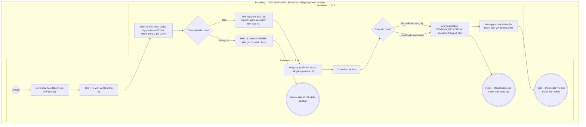

# LT-W04-US01 - Tạo đăng ký gói mới tại quầy

## Preconditions
- Lễ tân có tài khoản hoạt động và đang làm việc tại chi nhánh quầy tiếp đón.
- Hội viên đã có hồ sơ cá nhân (`ACTIVE`) trên hệ thống.
- Chi nhánh có các gói tập đang mở bán (`ACTIVE`).

## Trigger
- Lễ tân bấm nút **Tạo đăng ký** tại menu W04 hoặc nút Quick Action tại Dashboard W01.
- Màn hình liên quan: Web Lễ tân — W04 Đăng ký & gia hạn, modal **Tạo đăng ký gói mới tại quầy**.

## Main Flow

1. Lễ tân mở form **Tạo đăng ký gói mới tại quầy**.
2. Lễ tân tra cứu hội viên theo Số điện thoại hoặc Họ tên.
3. Lễ tân chọn Gói đăng ký theo nhu cầu của khách.
4. SYS kiểm tra tự động:
   - Nếu mua gói PT hoặc Combo: Kiểm tra hội viên đã có gói Gym còn hiệu lực hay chưa. Nếu chưa có, SYS chặn và thông báo: *"Khách hàng bắt buộc phải có gói Gym đang hiệu lực mới được đăng ký gói PT"*.
   - Nếu mua gói Gym: Kiểm tra khách hàng đã có gói Gym đang hiệu lực hay chưa để tránh trùng lặp 2 gói hiệu lực cùng lúc.
5. Lễ tân chọn **Ngày bắt đầu** hiệu lực; SYS tự động tính **Ngày kết thúc dự kiến** (đối với gói tính theo ngày/Combo = Ngày bắt đầu + Thời hạn ngày; đối với gói tính theo buổi vô thời hạn thì không có ngày kết thúc, hiển thị là `--`) và nạp giá niêm yết.
6. Lễ tân nhập **Mã giảm giá** (nếu khách có mã voucher) và bấm Áp dụng để trừ tiền.
7. Lễ tân lựa chọn một trong hai thao tác hoàn tất:
   - **Xác nhận lưu đăng ký**: Lưu bản ghi đăng ký ở trạng thái `PENDING_PAYMENT` (Chờ thanh toán 100%), không mở modal thanh toán ngay.
   - **Lưu đăng ký và thu tiền**: Lưu bản ghi đăng ký và tự động chuyển tiếp mở ngay modal **Ghi nhận thanh toán** (W08) với đầy đủ thông tin prefill để thu tiền 100% ngay tại quầy.
8. SYS tạo đăng ký (`PENDING_PAYMENT`), snapshot giá/thông số bán và lưu audit log.
   - **Quy trình luân chuyển trạng thái hợp đồng:**
     * **Khởi tạo:** Đơn đăng ký mới tạo luôn ở trạng thái `Chờ thanh toán` (`PENDING_PAYMENT`). Ở trạng thái này chưa cho phép gán PT phụ trách.
     * **Sau khi thanh toán đủ 100%:**
       + Nếu `Ngày bắt đầu` (`start_date`) sau ngày hiện tại (`> ngày hiện tại`): chuyển sang trạng thái `Chưa đến ngày hiệu lực` (`SCHEDULED`).
       + Nếu `Ngày bắt đầu` (`start_date`) là hôm nay hoặc đã đến hạn (`<= ngày hiện tại`): chuyển sang trạng thái `Đang hiệu lực` (`ACTIVE`).
     * **Quyền gán PT phụ trách:** Ngay khi đơn chuyển sang `Chưa đến ngày hiệu lực` (`SCHEDULED`), Lễ tân/QTV hoặc Hội viên đã được phép chọn/gán PT phụ trách ngay, miễn là đã hoàn tất thanh toán 100%.
     * **Tự động kích hoạt khi đến hạn:** Đến đúng ngày bắt đầu (`start_date <= ngày hiện tại`), hệ thống tự động chuyển trạng thái đơn đăng ký thành `Đang hiệu lực` (`ACTIVE`).
9. SYS xử lý điều hướng tương ứng:
   - Nếu bấm **Xác nhận lưu đăng ký**: SYS đóng modal, hiển thị thông báo thành công và cập nhật bảng danh sách.
   - Nếu bấm **Lưu đăng ký và thu tiền**: SYS đóng modal đăng ký và tự động mở modal **Ghi nhận thanh toán** đã prefill sẵn đơn đăng ký vừa tạo.

### Field-level specification — modal Tạo đăng ký gói mới tại quầy
| Field / control | Loại UI Control | State | Required | Conditional / dynamic | Source / validation |
| :--- | :--- | :--- | :--- | :--- | :--- |
| Hội viên | `Search Combobox` | `USER-INPUT` | required | `TRIGGER`: Kích hoạt kiểm tra điều kiện gói Gym hiện có | Tra cứu realtime theo SĐT trong `MEMBER_PROFILES` |
| Gói đăng ký | `Select Dropdown` | `USER-INPUT` | required | `TRIGGER`: Kiểm tra điều kiện gói PT và nạp giá | Danh mục gói đang mở bán của chi nhánh |
| Ngày bắt đầu | `Date Picker` | `USER-INPUT` | required | `TRIGGER`: Mốc tính ngày kết thúc | Mặc định hôm nay (`DD/MM/YYYY`) |
| Ngày kết thúc dự kiến [AUTO] | `Readonly Text` | `READONLY (AUTO-FILL)` | conditional | `CONDITIONAL` | • Hiện ngày kết thúc khi gói tính theo ngày (`GYM_TIME`, `COMBO`): Tự động tính = `Ngày bắt đầu` + `Thời hạn gói`. • Hiển thị `--` khi gói tính theo buổi (`PT_SESSION`, `GYM_SESSION`): Không giới hạn số ngày (vô thời hạn về thời gian, chỉ kết thúc khi dùng hết số buổi). |
| Giá gốc niêm yết | `Currency Readonly` | `READONLY (PREFILL)` | required | `DYNAMIC` | Giá niêm yết của gói tại chi nhánh |
| Mã giảm giá / Voucher | `Textbox + Nút [Áp dụng]` | `USER-INPUT` | optional | `Không` | Mã khuyến mãi của khách |
| Tiền giảm trừ [AUTO] | `Currency Readonly` | `READONLY (AUTO-FILL)` | optional | `DYNAMIC` | Số tiền giảm tương ứng từ voucher |
| Tổng tiền cần thu 100% | `Currency Readonly (Bold)` | `READONLY (AUTO-FILL)` | required | `DYNAMIC` | Số tiền thực thu bắt buộc thanh toán đủ |

## Alternate Flows
- Khách có voucher hợp lệ: Lễ tân áp mã giảm giá, số tiền cần thu được trừ trực tiếp.
- Khách hủy đăng ký: Đóng modal, không tạo bản ghi.
- **Lưu đăng ký và thu tiền ngay (AF-03)**: Lễ tân bấm `[Lưu đăng ký và thu tiền]`, SYS lưu đăng ký `PENDING_PAYMENT` và tự động mở modal Ghi nhận thanh toán với thông tin đơn vừa tạo.

## Exception Flows
- Mua gói PT khi chưa có gói Gym còn hạn: Chặn lưu và báo lỗi.
- Đã có gói Gym hiệu lực: Chặn đăng ký gói Gym trùng và gợi ý chuyển sang Gia hạn.

## Activity Diagram — Swimlane
**Trigger:** Lễ tân chọn Tạo đăng ký gói mới trong menu W04.

