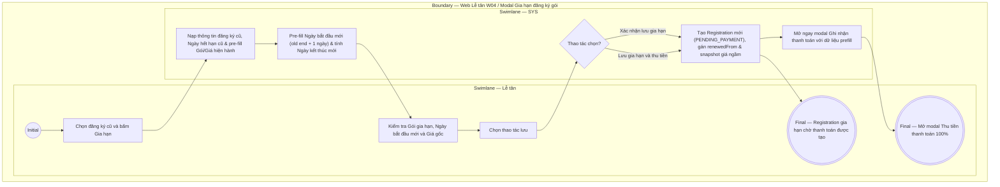

# LT-W04-US02 - Gia hạn đăng ký gói

## Preconditions
- Lễ tân đã đăng nhập, hội viên có một đăng ký gói trước đó (`Registration` cũ) thuộc chi nhánh được phân quyền (branch scope).
- Gói gia hạn đang ở trạng thái mở bán (`ACTIVE`).

## Trigger
- Lễ tân bấm nút **Gia hạn** tại dòng đăng ký gói trên màn hình W04 Đăng ký & gia hạn.
- Màn hình liên quan: Web Lễ tân — W04 Đăng ký & gia hạn, modal **Gia hạn đăng ký gói**.

## Main Flow

1. Lễ tân chọn **Gia hạn** từ một đăng ký hiện tại của hội viên.
2. SYS nạp thông tin Hội viên, Registration cũ và hiển thị Ngày hết hạn cũ.
3. SYS tự động pre-fill **Gói gia hạn** theo gói cũ (Lễ tân có thể chọn gói khác nếu muốn hoặc nếu gói cũ đã ngừng bán).
4. SYS tự động pre-fill **Giá gốc hiện hành** theo bảng giá niêm yết mới nhất của gói.
5. SYS tự động tính **Ngày bắt đầu mới**:
   - Nếu gói cũ **còn hạn**: Mặc định = `Ngày hết hạn cũ + 1 ngày` (đảm bảo tính liên tục, không bị gián đoạn quyền lợi).
   - Nếu gói cũ **đã hết hạn**: Mặc định = `Ngày hiện tại + 1 ngày`.
6. SYS tự động tính toán **Ngày kết thúc mới** dựa trên Ngày bắt đầu mới và thời hạn sử dụng của gói (với gói tính theo buổi vô thời hạn thì không có ngày kết thúc, hiển thị là `--`).
7. Lễ tân lựa chọn một trong hai thao tác hoàn tất:
   - **Xác nhận lưu gia hạn**: Lưu bản ghi gia hạn ở trạng thái `PENDING_PAYMENT` (Chờ thanh toán 100%), không mở modal thanh toán ngay.
   - **Lưu gia hạn và thu tiền**: Lưu bản ghi gia hạn và tự động chuyển tiếp mở ngay modal **Ghi nhận thanh toán** (W08) với đầy đủ thông tin prefill để thu tiền 100% ngay tại quầy.
8. SYS tạo bản ghi đăng ký gia hạn mới (`Registration` ở trạng thái `PENDING_PAYMENT`), liên kết ngầm với lượt đăng ký cũ (`renewedFrom`), lưu snapshot giá/quyền lợi và tự động ghi nhận Chi nhánh bán ngầm.
9. SYS xử lý điều hướng tương ứng:
   - Nếu bấm **Xác nhận lưu gia hạn**: SYS đóng modal, hiển thị thông báo thành công và cập nhật bảng danh sách.
   - Nếu bấm **Lưu gia hạn và thu tiền**: SYS đóng modal gia hạn và tự động mở modal **Ghi nhận thanh toán** đã prefill sẵn đơn gia hạn vừa tạo.

### Field-level specification — modal Gia hạn đăng ký gói
| Field / control | Loại UI Control | State | Required | Conditional / dynamic | Source / validation |
| :--- | :--- | :--- | :--- | :--- | :--- |
| Registration cũ / Hội viên | `Readonly Text` | `READONLY (PREFILL)` | required | Không | Prefill thông tin Hội viên và Mã đăng ký cũ từ bản ghi được chọn |
| Gói gia hạn | `Select Dropdown` | `USER-INPUT (PREFILL)` | required | `TRIGGER`: Mặc định nạp gói cũ, Lễ tân có thể chọn gói khác; điều khiển tính toán Ngày kết thúc mới và Giá gốc | Mặc định gói cũ nếu còn `ACTIVE`; Lễ tân có thể chọn gói khác trong danh mục gói đang mở bán |
| Ngày hết hạn cũ | `Readonly Text / Date` | `READONLY (PREFILL)` | required | Không | Ngày kết thúc của đăng ký cũ (định dạng `DD/MM/YYYY`; hiển thị `-- (Vô thời hạn)` nếu đăng ký cũ là gói theo buổi) |
| Ngày bắt đầu mới | `Date Picker` | `USER-INPUT (AUTO-FILL)` | required | `TRIGGER`: Làm mốc tính toán Ngày kết thúc mới | SYS tự động tính toán mặc định: • **Nếu gói cũ có thời hạn và còn hạn**: Mặc định = `Ngày hết hạn cũ + 1 ngày` • **Nếu gói cũ đã hết hạn hoặc là gói theo buổi**: Mặc định = `Ngày hiện tại` (Lễ tân có thể điều chỉnh tùy chọn qua ô chọn ngày) |
| Ngày kết thúc mới [AUTO] | `Readonly Text / Date` | `READONLY (AUTO-FILL)` | conditional | `CONDITIONAL` | • Hiện ngày kết thúc khi gói tính theo ngày (`GYM_TIME`, `COMBO`): Tự động tính = `Ngày bắt đầu mới` + `Thời hạn gói`. • Hiển thị `--` khi gói tính theo buổi (`PT_SESSION`, `GYM_SESSION`): Không giới hạn số ngày (vô thời hạn về thời gian, chỉ kết thúc khi dùng hết số buổi). |
| Giá gốc hiện hành | `Currency Readonly Text (VND)` | `READONLY (PREFILL)` | required | `DYNAMIC`: Luôn hiển thị; tự động nạp theo *Gói gia hạn* (`TRIGGER`) được chọn | Snapshot từ `PACKAGE.price` của gói gia hạn |

- **Business rules / logic:**
  - **Thanh toán 100%**: Đăng ký gia hạn mới tạo ở trạng thái **`PENDING_PAYMENT` (Chờ thanh toán)**. Phải thanh toán đủ 100% trong 1 lần duy nhất để kích hoạt gói, tuyệt đối không có công nợ hay đóng tiền nhiều lần.
  - **Chi nhánh bán & PT phụ trách**: Chi nhánh bán và thông tin liên kết `renewedFrom` được hệ thống xử lý ngầm. Với gói PT/Combo gia hạn, PT phụ trách không chọn trên modal mà sẽ do hội viên chọn trên mobile app sau khi thanh toán 100%.
  - **Quy tắc tính Ngày bắt đầu mới**:
    + **Khi gói cũ còn hạn** (`ACTIVE` / `Sắp hết hạn`): Mặc định nối tiếp ngay sau ngày kết thúc của gói cũ (`Ngày bắt đầu mới = Ngày hết hạn cũ + 1 ngày`).
    + **Khi gói cũ đã hết hạn** (`EXPIRED`): Mặc định bắt đầu từ ngày mai (`Ngày bắt đầu mới = Ngày hiện tại + 1 ngày`).
    + Lễ tân có thể tùy chỉnh lại ngày bắt đầu này theo nhu cầu thực tế của hội viên. Số buổi PT gói mới không cộng dồn vào số buổi gói cũ.

## Alternate Flows

### AF-01 - Tùy chỉnh Ngày bắt đầu mới
1. Lễ tân điều chỉnh Ngày bắt đầu mới qua ô chọn ngày (Date Picker) theo yêu cầu cụ thể của hội viên.
2. SYS tự động tính toán lại Ngày kết thúc mới tương ứng với thời hạn của gói.

### AF-02 - Lưu gia hạn và thu tiền ngay
1. Lễ tân bấm nút **[Lưu gia hạn và thu tiền]**.
2. SYS xác thực và lưu hợp đồng gia hạn ở trạng thái `PENDING_PAYMENT`.
3. SYS đóng modal gia hạn và tự động mở modal **Ghi nhận thanh toán** (W08) với thông tin đăng ký gia hạn vừa tạo được prefill sẵn sàng để thu tiền.

## Exception Flows
- Gói cũ đã ngừng bán và không chọn gói gia hạn thay thế: SYS chặn không cho tạo gia hạn.

## Activity Diagram — Swimlane
**Trigger:** Lễ tân chọn Gia hạn tại một đăng ký gói trong menu W04.

