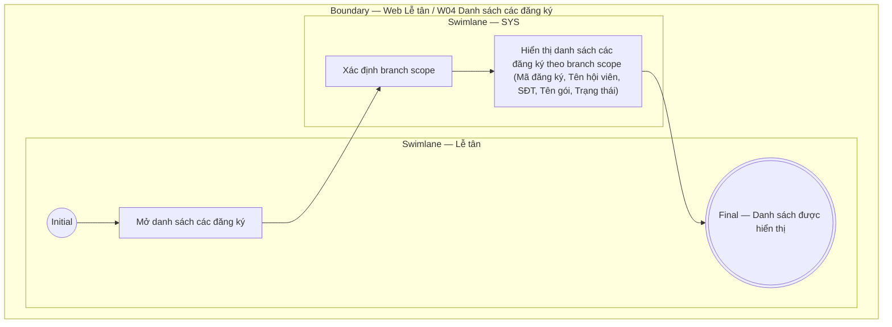

# LT-W04-US03 - Xem danh sách các đăng ký

## Preconditions
- Lễ tân đã đăng nhập, branch scope của Lễ tân đã được xác định.

## Trigger
- Lễ tân mở menu W04 hoặc chọn **Đăng ký & gia hạn**.
- Màn hình liên quan: Web Lễ tân — W04 Đăng ký & gia hạn.

## Main Flow

1. Lễ tân mở danh sách các đăng ký.
2. SYS xác định branch scope của Lễ tân.
3. SYS hiển thị danh sách các đăng ký gói theo branch scope (Mã đăng ký, Tên hội viên, SĐT, Tên gói, Ngày bắt đầu, Ngày kết thúc, Trạng thái đăng ký).

- **Business rules / logic:**
  - Chỉ trả dữ liệu thuộc role và branch scope của Lễ tân.
  - Danh sách là read-only; các thao tác Tạo đăng ký gói mới hay Gia hạn sử dụng các User Story tương ứng.

## Exception Flows
- Lỗi tải dữ liệu: hiển thị thông báo lỗi.

## Activity Diagram — Swimlane
**Trigger:** Lễ tân mở Danh sách các đăng ký trong menu W04.

