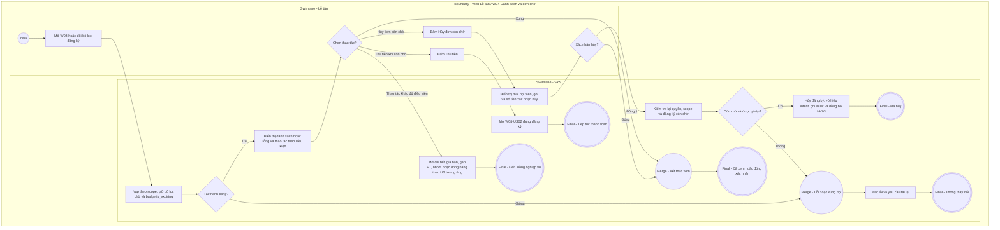

# LT-W04-US03 - Xem danh sách các đăng ký

## Preconditions
- Lễ tân đã đăng nhập, branch scope của Lễ tân đã được xác định.

## Trigger
- Lễ tân mở menu W04 hoặc chọn **Đăng ký & gia hạn**.
- Màn hình liên quan: Web Lễ tân — W04 Đăng ký & gia hạn.

## Quy tắc sắp hết hạn
- Gói đã thanh toán, đang có hiệu lực và chưa hết hạn: theo thời gian còn <= 4 ngày, theo buổi còn <= 3 buổi; Combo dùng OR giữa các quyền lợi áp dụng. Nguồn hiển thị là is_expiring và display_status do SYS/API tính; status nội bộ ACTIVE vẫn dùng cho kiểm tra quyền tập. Không tạo enum/field DB mới và không tự tính ngưỡng riêng trên UI.

## Main Flow

1. Lễ tân mở danh sách các đăng ký.
2. SYS xác định branch scope của Lễ tân.
3. SYS hiển thị thanh Search & Filter Bar và danh sách các đăng ký gói trong chi nhánh thỏa mãn các tiêu chí lọc.
4. Lễ tân có thể sử dụng bộ lọc **Tình trạng gán PT** để lọc nhanh các gói PT/COMBO chưa có PT phụ trách.
5. Lễ tân xem các thông tin chi tiết trên từng dòng đăng ký hoặc thực hiện các thao tác nhanh (`[Chi tiết]`, `[Gán PT]`, `[Gia hạn]`, `[Thu tiền]`).

### Field-level specification — Bảng danh sách đăng ký gói (Data Grid View & Filter Bar)
| Field / control | Loại UI Control | State | Required | Conditional / dynamic | Source / validation |
| :--- | :--- | :--- | :--- | :--- | :--- |
| Ô tìm kiếm đăng ký | `Textbox (Search Input)` | `USER-INPUT` | optional | Không | Lễ tân gõ từ khóa: mã ĐK, họ tên HV, SĐT, tên gói để lọc nhanh danh sách thời gian thực |
| Bộ lọc trạng thái đăng ký | `Select Dropdown` | `USER-INPUT` | optional | Không | Mặc định `Tất cả`; các tùy chọn: `Tất cả`, `Chờ thanh toán`, `Chưa đến ngày hiệu lực`, `Đang hiệu lực`, `Đang đóng băng`, `Sắp hết hạn`, `Đã hết hạn`, `Đã hủy` |
| Bộ lọc tình trạng gán PT | `Select Dropdown` | `USER-INPUT` | optional | Không | Mặc định `Tất cả`; các tùy chọn: `Tất cả`, `Chưa gán PT` (lọc các đơn gói PT/COMBO chưa có HLV phụ trách), `Đã gán PT` (lọc các đơn đã phân công PT) |
| Mã | `Readonly Text` | `READONLY` | required | Không | SYS tự động sinh duy nhất từ `REGISTRATION.code` (ví dụ: "DK001", "DK002"); hiển thị văn bản mã đăng ký |
| Hội viên | `Readonly Text` | `READONLY` | required | Không | Tên hội viên chữ đậm, dòng phụ bên dưới hiển thị `{Mã HV} · {Chi nhánh}` (ví dụ: "Nguyễn Văn An" "HV001 · Quận 1") |
| Gói đăng ký | `Readonly Text` | `READONLY` | required | Không | Tên gói đăng ký niêm yết từ `PACKAGE.name` (ví dụ: "Gói 3 tháng", "Gói PT 20 buổi") |
| Kỳ hiệu lực | `Readonly Text / Date` | `READONLY` | required | `DYNAMIC` | • Với gói có thời hạn ngày (`GYM_TIME`, `COMBO`): Khoảng ngày hiệu lực `{start_date} - {end_date}` theo định dạng `DD/MM/YYYY`. • Với gói tính theo buổi vô thời hạn (`PT_SESSION`, `GYM_SESSION`): Hiển thị `Từ {start_date}` (không giới hạn số ngày). |
| Số tiền | `Currency Readonly Text (VND)` | `READONLY` | required | Không | Tổng giá trị thanh toán 100% của gói từ `REGISTRATION.price` (ví dụ: "1.350.000 đ", "3.800.000 đ"); hệ thống thanh toán 100% 1 lần duy nhất, không có công nợ |
| PT phụ trách | `Readonly Text` | `READONLY` | required | `DYNAMIC`: theo loại gói và trạng thái phân công | • Nếu là gói GYM: Hiển thị dấu gạch ngang `--` • Nếu là gói có PT (gói PT hoặc COMBO):   + Đã phân công PT: Hiển thị `{Tên PT} ({Mã PT})` (ví dụ: "Nguyễn Văn Thể (PT001)")   + Chưa phân công PT: Hiển thị `Chưa có PT phụ trách` |
| Trạng thái | `Status Badge` | `READONLY` | required | `DYNAMIC`: theo trạng thái record | Hiển thị badge viền màu trực quan: `Đang hiệu lực` (viền xanh lá), `Đang đóng băng` (badge xanh băng tuyết `❄️ Đang đóng băng`), `Chưa đến ngày hiệu lực` (viền xanh dương/info), `Chờ thanh toán` (viền vàng cam), `Đã hết hạn` (viền xám), `Đã hủy` (viền đỏ) |
| Thao tác | `Action Buttons` | `USER-INPUT` | required | `DYNAMIC`: hiển thị nút theo loại gói và trạng thái | • Với gói PT 1 Kèm nhiều (`GROUP_1_N` / `GROUP_PT`) ở trạng thái `Đang hiệu lực` hoặc `Chưa đến ngày hiệu lực`: Bổ sung nút **`[Mời vào nhóm (X/Y)]`** hiển thị số lượng thành viên thực tế trên số lượng tối đa của nhóm để mở modal Quản lý thành viên nhóm PT • Với gói PT/COMBO chưa có HLV phụ trách (ở trạng thái `Đang hiệu lực` hoặc `Chưa đến ngày hiệu lực` sau khi đã thanh toán 100%): Bổ sung nút nổi bật **`[Gán PT]`** (`LT-W04-US05`) để mở nhanh modal Gán PT phụ trách • Khi `Đang hiệu lực`, `Đang đóng băng` hoặc `Chưa đến ngày hiệu lực`: Nút `Chi tiết` (mở sidebar drawer `LT-W04-US04`) và Nút viền xanh `Gia hạn` (`LT-W04-US02`) • Khi `Chờ thanh toán`: Nút nền vàng nổi bật `Thu tiền` (mở nhanh modal thanh toán 100% W08), Nút viền đỏ **`[Hủy đơn]`** (mở modal xác nhận hủy đơn đăng ký chưa thanh toán), và Nút `Chi tiết` • Khi `Đã hết hạn`: Nút `Chi tiết` và Nút `Gia hạn` |

| Nút Hủy đơn | Action Button | USER-INPUT | conditional | CONDITIONAL: hiện khi đăng ký còn chờ trong scope; ẩn khi đã thanh toán hoặc đã hủy | Mở xác nhận AF-02; không phụ thuộc hạn QR. |
| Nút Đóng băng gói | Action Button | USER-INPUT | conditional | CONDITIONAL: hiện khi đã trả đủ, hiện có hiệu lực ACTIVE/Sắp hết hạn và đủ điều kiện W04-US06; ẩn khi chưa trả, SCHEDULED, FROZEN, EXPIRED, CANCELLED hoặc đã hẹn đóng băng | Sắp hết hạn từ API, không đổi status nội bộ. |

- **Thông tin khi bấm nút [Chi tiết] (Sidebar Drawer chi tiết lượt đăng ký gói):**
  - Mở sidebar drawer xem chi tiết lượt đăng ký gói (`LT-W04-US04`) gồm 4 khối: Thông tin hội viên, Chi tiết gói tập, Trạng thái thanh toán 100% và **Tiến độ / Số buổi sử dụng** (kèm 2 thanh Progress bar Gym & PT trực quan).
  - Bảng danh sách Data Grid View không hiển thị cột tiến độ số buổi hay các cột công nợ để giữ giao diện bảng luôn thoáng và đồng nhất.

- **Business rules / logic:**
  - Hệ thống áp dụng nguyên tắc **thanh toán 100% 1 lần duy nhất**, không tồn tại khái niệm công nợ hay ghi nhận thanh toán thiếu.
  - Chỉ trả dữ liệu thuộc chi nhánh của Lễ tân.
  - Dữ liệu trên bảng danh sách là chỉ đọc (`READONLY`); các thao tác tạo mới hay gia hạn mở modal tương ứng.
  - Bộ lọc "Tình trạng gán PT" giúp Lễ tân nhanh chóng rà soát các hợp đồng PT/Combo vừa bán để phân công PT kịp thời cho hội viên.
  - Bấm nút **[Gán PT]** mở modal phân công HLV phụ trách trực tiếp (`LT-W04-US05`).
  - Bấm nút **[Mời vào nhóm]** đối với gói PT hình thức 1 Kèm nhiều (`GROUP_1_N`): Mở modal "Quản lý thành viên nhóm PT" để xem danh sách thành viên hiện tại và mời thêm học viên vào nhóm. Số lượng thành viên nhóm (gồm 1 Trưởng nhóm đại diện đứng tên gói + các thành viên được mời) bắt buộc phải $\le$ số học viên tối đa của gói (`max_group_members`). Khi nhóm đã đủ học viên tối đa, hệ thống vô hiệu hóa chức năng thêm thành viên và hiển thị cảnh báo nhóm đã đầy.
  - Bấm nút **[Chi tiết]** tại từng dòng để xem thông tin chi tiết và tiến độ sử dụng dịch vụ của hội viên.

## Alternate Flows
### AF-01 - Tiếp tục thanh toán đăng ký chờ
- Bấm Thu tiền mở W08-US02 đúng đăng ký. QR còn hạn được tải lại; QR hết hạn có thể tạo mới. Đăng ký vẫn chờ sau 15 phút và sau 3 ngày, không tự hủy.

### AF-02 - Hủy đăng ký còn chờ
1. Lễ tân bấm Hủy đơn trong scope; SYS mở xác nhận hiển thị Mã ĐK, Hội viên, Tên gói, Số tiền (READONLY, required, nguồn đăng ký được chọn; không có input).
2. Xác nhận hủy: SYS kiểm tra lại quyền/scope và đăng ký còn chờ, chuyển CANCELLED, vô hiệu intent, ghi audit; cập nhật W04 và HV03 cùng đăng ký. Không tạo/xóa payment hay phiếu thu.
3. Đóng hộp xác nhận không thay đổi dữ liệu. Hủy đơn khả dụng bất kỳ lúc nào còn chờ, kể cả QR hết hạn; không áp dụng cho gói đã thanh toán.

## Exception Flows
- Đã thanh toán hoặc đã hủy trong lúc xác nhận: tải lại trạng thái và từ chối hủy đơn chờ; không ghi đè kết quả thanh toán. Sai scope/quyền: từ chối.

- Lỗi tải dữ liệu: hiển thị thông báo lỗi.

## Activity Diagram — Swimlane
**Trigger:** Lễ tân mở Danh sách các đăng ký trong menu W04.

