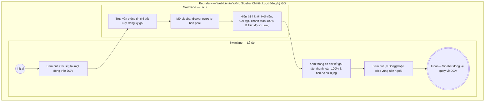

# LT-W04-US04 - Xem chi tiết lượt đăng ký gói

## Preconditions
- Lễ tân đã đăng nhập hệ thống Web quản lý, có quyền xem danh sách và chi tiết đăng ký trong chi nhánh.
- Đăng ký gói tập đã tồn tại trên hệ thống và đang hiển thị trên bảng danh sách (Data Grid View).

## Trigger
- Lễ tân bấm nút **Chi tiết** tại một dòng đăng ký trên bảng Data Grid View của menu W04.
- Màn hình liên quan: Web Lễ tân — W04 Đăng ký & gia hạn, sidebar drawer **Chi tiết Lượt Đăng ký Gói**.

## Main Flow

1. Lễ tân bấm nút **Chi tiết** tại một dòng đăng ký trên Data Grid View.
2. SYS mở sidebar drawer **Chi tiết Lượt Đăng ký Gói** trượt từ cạnh phải màn hình.
3. SYS truy vấn thông tin chi tiết của lượt đăng ký gói được chọn.
16: 4. SYS hiển thị thông tin chi tiết phân bổ theo các khối trực quan:
17:    - Header: Mã đăng ký, Badge trạng thái gói và nút Đóng.
18:    - Khối Hội viên: Avatar, Họ tên, Mã HV, SĐT và Chi nhánh hội viên.
19:    - Khối Gói tập: Tên gói, Phân loại gói, Kỳ hiệu lực, Chi nhánh áp dụng và Nhân viên tiếp nhận.
20:    - Khối Thanh toán 100%: Giá trị gói, Trạng thái thanh toán 100% (Phương thức, Thời gian thanh toán hoặc nút Thu tiền ngay nếu đang chờ thanh toán).
21:    - Khối Quyền lợi & tiến độ sử dụng: Tiến độ ngày tập Gym (kèm progress bar xanh lá) và tiến độ buổi tập PT (kèm progress bar cam).
22:    - Khối Thành viên nhóm PT 1-Nhiều (chỉ áp dụng đối với gói PT hình thức 1 Kèm nhiều): Hiển thị tiến độ sĩ số nhóm (`X / Y học viên`), danh sách thành viên và nút `[Quản lý thành viên nhóm]`.
23: 5. Lễ tân xem các thông tin chi tiết và tiến độ sử dụng dịch vụ của hội viên để giải đáp thắc mắc hoặc tư vấn tại quầy.
4. SYS hiển thị thông tin chi tiết phân bổ theo các khối trực quan:
   - Header: Mã đăng ký, Badge trạng thái gói và nút Đóng.
   - Khối Hội viên: Avatar, Họ tên, Mã HV, SĐT và Chi nhánh hội viên.
   - Khối Gói tập: Tên gói, Phân loại gói, Kỳ hiệu lực, Chi nhánh áp dụng và Nhân viên tiếp nhận.
   - Khối Thanh toán 100%: Giá trị gói, Trạng thái thanh toán 100% (Phương thức, Thời gian thanh toán hoặc nút Thu tiền ngay nếu đang chờ thanh toán).
   - Khối Quyền lợi & tiến độ sử dụng: Tiến độ ngày tập Gym (kèm progress bar xanh lá) và tiến độ buổi tập PT (kèm progress bar cam).
   - Khối Thành viên nhóm PT 1-Nhiều (chỉ áp dụng đối với gói PT hình thức 1 Kèm nhiều): Hiển thị tiến độ sĩ số nhóm (`X / Y học viên`), danh sách thành viên và nút `[Quản lý thành viên nhóm]`.
5. Lễ tân xem các thông tin chi tiết và tiến độ sử dụng dịch vụ của hội viên để giải đáp thắc mắc hoặc tư vấn tại quầy.
6. Lễ tân bấm nút **✕ Đóng** hoặc click vùng nền ngoài để đóng sidebar drawer.

### Field-level specification — sidebar Chi tiết Lượt Đăng ký Gói
| Field / control | Loại UI Control | State | Required | Conditional / dynamic | Source / validation |
| :--- | :--- | :--- | :--- | :--- | :--- |
| Mã đăng ký | `Readonly Text` | `READONLY` | required | Không | Lấy từ `REGISTRATION.code` (ví dụ: "DK010"); hiển thị chữ to nổi bật trên header |
| Trạng thái gói | `Status Badge` | `READONLY` | required | `DYNAMIC`: theo trạng thái gói | Hiển thị badge viền màu trực quan: `Đang hiệu lực` (viền xanh lá), `Đang đóng băng` (badge xanh băng tuyết `❄️ Đang đóng băng`), `Chờ thanh toán` (viền vàng cam), `Đã hết hạn` (viền xám), `Đã hủy` (viền đỏ) |
| Hội viên | `Readonly Text` | `READONLY` | required | Không | Lấy từ `MEMBER_PROFILE.full_name` kèm avatar chữ cái viết tắt (ví dụ: avatar "TB", họ tên "Trần Thị Bình") |
| Mã HV & SĐT | `Readonly Text` | `READONLY` | required | Không | Hiển thị cú pháp `{MEMBER_PROFILE.code} · {MEMBER_PROFILE.phone}` (ví dụ: "HV002 · 0908 111 222") |
| Chi nhánh hội viên | `Readonly Text` | `READONLY` | required | Không | Tên chi nhánh sinh hoạt của hội viên từ `BRANCH.name` (ví dụ: "Quận 1") |
| Tên gói tập | `Readonly Text` | `READONLY` | required | Không | Tiêu đề gói niêm yết từ `PACKAGE.name` (ví dụ: "Combo Gym 3 tháng + PT 10 buổi") |
| Phân loại gói | `Readonly Text / Badge` | `READONLY` | required | `DYNAMIC`: theo loại gói | Badge hiển thị loại hình: `GYM`, `PT`, hoặc `COMBO` |
| Kỳ hiệu lực | `Readonly Text / Date` | `READONLY` | required | `DYNAMIC` | • Với gói có thời hạn ngày (`GYM_TIME`, `COMBO`): Hiển thị khoảng ngày `Kỳ hiệu lực: {start_date} - {end_date}` theo định dạng `DD/MM/YYYY`. • Với gói tính theo buổi vô thời hạn (`PT_SESSION`, `GYM_SESSION`): Hiển thị `Kỳ hiệu lực: Từ {start_date} (Vô thời hạn)`. |
| Chi nhánh áp dụng | `Readonly Text` | `READONLY` | required | Không | Danh sách chi nhánh được phép sử dụng gói (ví dụ: "Quận 1" hoặc "Toàn hệ thống") |
| Nhân viên tiếp nhận | `Readonly Text` | `READONLY` | required | Không | Họ tên nhân viên tạo đăng ký từ `ACCOUNT.full_name` (ví dụ: "Lê Văn Lễ Tân") |
| Số tiền gói (100%) | `Currency Readonly Text (VND)` | `READONLY` | required | Không | Giá trị trọn gói 100% từ `REGISTRATION.price` (ví dụ: "3.200.000 đ"); hệ thống thu đủ 100% 1 lần duy nhất, không áp dụng công nợ |
| Trạng thái thanh toán | `Readonly Text / Badge` | `READONLY` | required | `DYNAMIC`: theo trạng thái thanh toán 100% | • Khi đã thanh toán: Hiển thị badge xanh `Đã thanh toán 100%`, phương thức (`Tiền mặt` hoặc `Chuyển khoản`) và ngày giờ hoàn tất thanh toán • Khi chưa thanh toán: Hiển thị badge vàng `Chờ thanh toán 100%` kèm cụm nút **`[Thu tiền ngay]`** và **`[Hủy đơn đăng ký]`** |
| Quyền tập Gym | `Readonly Text + Progress Bar` | `READONLY` | conditional | `CONDITIONAL`: • **Hiện khi**: `Loại gói = GYM` hoặc `COMBO` • **Ẩn khi**: `Loại gói = PT` • **Khi `Chờ thanh toán` (`PENDING_PAYMENT`)**: Hiển thị thông báo chờ kích hoạt, thời hạn niêm yết (`X ngày`) và số lượt check-in `0 lượt (Chưa kích hoạt)`; **tuyệt đối KHÔNG hiển thị thanh progress bar hay số ngày đã qua**. • **Khi `Chưa đến ngày hiệu lực` (`SCHEDULED`)**: Hiển thị thông báo đã thanh toán 100% chờ ngày hiệu lực; không trừ ngày trôi qua trước ngày bắt đầu. • **Khi `Đang hiệu lực` (`ACTIVE`)**: Hiển thị số ngày còn lại (ví dụ: "Còn 78 ngày"), thanh Progress bar xanh lá thể hiện tỷ lệ ngày đã trôi qua, thông tin chi tiết: "Đã trôi qua: X ngày · Tổng hạn: Y ngày", kèm tổng số lượt check-in thực tế. • **Khi `Đã hủy` (`CANCELLED`)**: Hiển thị thông báo gói đã bị hủy. | Tra cứu từ thông tin gói đăng ký, thời gian bắt đầu/kết thúc và lượt check-in thực tế |
| Quyền huấn luyện PT | `Readonly Text + Progress Bar` | `READONLY` | conditional | `CONDITIONAL`: • **Hiện khi**: `Loại gói = PT` hoặc `COMBO` • **Ẩn khi**: `Loại gói = GYM` • **Khi `Chờ thanh toán` (`PENDING_PAYMENT`)**: Hiển thị tổng số buổi niêm yết theo gói (`X buổi (Chưa kích hoạt)`), HLV phụ trách "Chờ kích hoạt thanh toán"; **tuyệt đối KHÔNG hiển thị thanh progress bar buổi đã tập hay nút Gán PT**. • **Khi `Đang hiệu lực` (`ACTIVE`) hoặc `Chưa đến ngày hiệu lực` (`SCHEDULED`)**: Hiển thị số buổi còn lại (ví dụ: "Còn 6 buổi"), thanh Progress bar cam thể hiện tỷ lệ buổi tập hoàn thành, thông tin chi tiết: "Đã tập: X buổi · Tổng cấp: Y buổi", thông tin HLV: "HLV phụ trách: {Tên PT} ({Mã PT})" nếu đã phân công, hoặc "Chưa có PT phụ trách" kèm nút **`[Gán PT phụ trách]`** nếu chưa phân công (cho phép gán ngay khi thanh toán đủ 100%). | Tra cứu từ hợp đồng đăng ký, snapshot số buổi và lịch tập PT |
| Thành viên nhóm PT 1-Nhiều | `Table / Card List + Action Button` | `READONLY / USER-INPUT` | conditional | `CONDITIONAL`: • **Hiện khi**: Gói là PT hình thức 1 Kèm nhiều (`GROUP_1_N` / `GROUP_PT`) • **Ẩn khi**: Gói 1 Kèm 1 (`ONE_ON_ONE`) hoặc gói chỉ có Gym | Hiển thị sĩ số nhóm `{X}/{Y} học viên`, danh sách gồm Trưởng nhóm và các thành viên được mời kèm nút **`[Quản lý thành viên nhóm]`** mở modal thao tác thêm/xóa học viên |
| Khối Đóng băng & Chuyển nhượng | `Action Buttons Group + History Table` | `USER-INPUT / READONLY` | conditional | `CONDITIONAL`: • **Hiện khi**: Gói đang bị đóng băng (`is_frozen = true`) hoặc hợp đồng ở trạng thái `ACTIVE` / `SCHEDULED` hoặc đã từng có lịch sử đóng băng • **Ẩn khi**: Gói ở trạng thái `PENDING_PAYMENT` hoặc `CANCELLED` mà chưa từng đóng băng | Gồm nút `[Đóng băng gói]`, `[Chuyển nhượng gói]`, hoặc nút `[Mở đóng băng trước hạn]` khi đang bị đóng băng; kèm bảng **Lịch sử các đợt đóng băng** (Thời gian, Số ngày, Lý do, Trạng thái, Người duyệt) |
| Khối Lịch sử chuyển nhượng gói | `Table` | `READONLY` | conditional | `CONDITIONAL`: • **Hiện khi**: Hợp đồng đã từng phát sinh giao dịch chuyển nhượng (`transfers.length > 0`) • **Ẩn khi**: Hợp đồng chưa từng chuyển nhượng | Bảng hiển thị: Ngày chuyển, Người chuyển nhượng, Người nhận chuyển nhượng, Phí chuyển nhượng, Lý do, Người thực hiện |

- **Business rules / logic:**
  - Hệ thống áp dụng chính sách **thanh toán 100% 1 lần duy nhất** để kích hoạt gói tập; không tồn tại khái niệm công nợ, nợ tồn hay thanh toán trả góp nhiều lần.
  - **Nguyên tắc kích hoạt quyền lợi & tiến độ sử dụng**: Hội viên chỉ bắt đầu có quyền lợi và tính tiến độ sử dụng sau khi hoàn tất thanh toán 100%. Khi đăng ký ở trạng thái `PENDING_PAYMENT` (Chờ thanh toán 100%), hệ thống khóa toàn bộ tiến độ: không tính ngày trôi qua, không hiển thị thanh progress bar, không cho phép check-in hay đặt lịch PT, và ẩn hoàn toàn khối thao tác đóng băng / chuyển nhượng gói.
  - **Quản lý thành viên nhóm PT 1-Nhiều**: Đối với gói tập có hình thức huấn luyện 1 Kèm nhiều (`GROUP_1_N`), drawer hiển thị khối danh sách thành viên nhóm với badge trạng thái tham gia của từng người (`Đã tham gia`, `Chờ phản hồi`). Tổng số thành viên trong nhóm (gồm 1 Trưởng nhóm đại diện đứng tên gói + các thành viên được mời) không được vượt quá số học viên tối đa của gói (`max_group_members`). Bấm nút `[Quản lý thành viên nhóm]` để mở modal cho phép mời thêm học viên (nếu còn chỗ) hoặc xóa thành viên khỏi nhóm.
  - Toàn bộ các trường dữ liệu trên sidebar drawer là chỉ đọc (`READONLY`), phục vụ tra cứu chi tiết thông tin gói và quyền lợi của hội viên tại quầy lễ tân.
  - Không cần kiểm tra lại branch scope khi mở drawer vì danh sách trên Data Grid View vốn dĩ đã được hệ thống phân quyền lọc sẵn theo chi nhánh của Lễ tân.
  - Tiến độ ngày tập Gym được hệ thống tự động tính toán theo thời gian thực đối với hợp đồng `ACTIVE`: `Số ngày đã qua = Ngày hiện tại - Ngày bắt đầu` và `Số ngày còn lại = Ngày kết thúc - Ngày hiện tại`.
  - Tiến độ buổi tập PT được cập nhật tự động sau mỗi buổi tập PT được xác nhận kép hoàn thành giữa Hội viên và Huấn luyện viên.
  - Hiển thị động theo loại gói:
    + Gói `GYM`: Ẩn hoàn toàn khối Quyền huấn luyện PT.
    + Gói `PT`: Ẩn hoàn toàn khối Quyền tập Gym.
    + Gói `COMBO`: Hiển thị song song cả 2 khối Gym và PT.

## Alternate Flows

### AF-01 - Đóng Drawer
1. Lễ tân bấm nút **✕ Đóng** trên góc phải sidebar hoặc click chuột vào vùng nền mờ bên ngoài.
2. SYS đóng sidebar drawer và giữ nguyên vị trí dòng dữ liệu trên bảng Data Grid View.

## Exception Flows
- Không tải được dữ liệu chi tiết (lỗi mạng hoặc bản ghi bị xóa): SYS hiển thị thông báo lỗi và nút **Thử lại** ngay trên sidebar.

## Activity Diagram — Swimlane
**Trigger:** Lễ tân bấm nút Chi tiết tại một dòng đăng ký trên bảng Data Grid View của menu W04.

