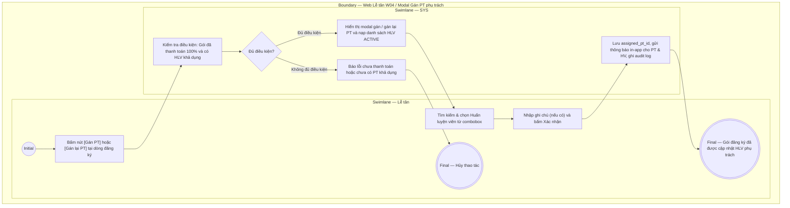

# LT-W04-US05 - Gán PT phụ trách cho gói đăng ký tại quầy

## Preconditions
- Lễ tân đã đăng nhập hệ thống, trong phạm vi branch scope quầy tiếp đón.
- Gói đăng ký là gói PT hoặc COMBO thuộc chi nhánh của Lễ tân, đã hoàn tất thanh toán 100% (ở trạng thái `ACTIVE`, `SCHEDULED`, hoặc `FROZEN`).
- Theo quy định hệ thống: Phân công và gán lại PT phụ trách do Lễ tân / QTV thực hiện trực tiếp tại quầy mà không cần PT duyệt trước.

## Trigger
- Lễ tân bấm nút **[Gán PT]** (khi gói chưa có PT) hoặc nút **[Gán lại PT]** (khi gói đã có PT) trên dòng đăng ký tại Data Grid View menu W04 (hoặc trong drawer chi tiết đăng ký sau khi thu tiền).
- Màn hình liên quan: Web Lễ tân — W04 Đăng ký & gia hạn, modal **Gán PT phụ trách** / **Gán lại PT phụ trách**.

## Main Flow

1. Lễ tân bấm nút **[Gán PT]** tại dòng đăng ký gói PT hoặc COMBO đã thanh toán đủ 100% (chưa có HLV).
2. SYS mở modal **Gán PT phụ trách**.
3. SYS tự động nạp thông tin đăng ký: Mã đăng ký, Hội viên, Gói đăng ký, Chi nhánh.
4. SYS nạp danh sách các Huấn luyện viên đang hoạt động (`ACTIVE`) tại chi nhánh của Lễ tân vào Combobox chọn PT.
5. Lễ tân tư vấn và chọn Huấn luyện viên phụ trách phù hợp với yêu cầu/nguyện vọng của hội viên.
6. Lễ tân nhập ghi chú phân công (nếu có).
7. Lễ tân bấm nút **Xác nhận gán PT**.
8. SYS lưu `assigned_pt_id` vào hợp đồng `REGISTRATIONS`, gán trực tiếp quyền phụ trách cho PT mà không cần PT chấp thuận, gửi thông báo in-app cho Huấn luyện viên và Hội viên, ghi audit log và đóng modal.
9. SYS cập nhật hiển thị dòng đăng ký: Cột `PT phụ trách` cập nhật tên HLV, nút thao tác tự động chuyển thành **[Gán lại PT]**.

### Field-level specification — modal Gán PT phụ trách
| Field / control | Loại UI Control | State | Required | Conditional / dynamic | Source / validation |
| :--- | :--- | :--- | :--- | :--- | :--- |
| Mã đăng ký | `Readonly Text` | `READONLY (PREFILL)` | required | `Không` | Mã đăng ký từ `REGISTRATIONS.reg_code` |
| Hội viên | `Readonly Text` | `READONLY (PREFILL)` | required | `Không` | Thông tin hội viên `{Họ tên} ({Mã HV} · {SĐT})` |
| Gói đăng ký | `Readonly Text` | `READONLY (PREFILL)` | required | `Không` | Tên gói đăng ký |
| Chi nhánh | `Readonly Text` | `READONLY (PREFILL)` | required | `Không` | Chi nhánh quầy đang làm việc |
| HLV phụ trách hiện tại | `Readonly Text` | `READONLY (PREFILL)` | conditional | `CONDITIONAL` | **Hiện khi** mở modal từ nút [Gán lại PT] (gói đã có HLV phụ trách). **Ẩn khi** mở modal từ nút [Gán PT] (gói chưa có HLV phụ trách). |
| Huấn luyện viên phụ trách | `Select Dropdown (Searchable)` | `USER-INPUT` | required | `Không` | Lễ tân tìm kiếm & chọn HLV `ACTIVE` tại chi nhánh. Khi gán lại: không được chọn trùng HLV hiện tại. |
| Ghi chú phân công | `Textarea` | `USER-INPUT` | optional | `Không` | Ghi chú nguyện vọng hoặc lý do điều chuyển HLV |

## Alternate Flows

### AF-01 - Hủy Thao Tác
1. Lễ tân chọn **Hủy** hoặc nút **✕** trên modal.
2. SYS đóng modal và giữ nguyên trạng thái HLV phụ trách của gói đăng ký.

### AF-02 - Gán Lại PT Phụ Trách
1. Lễ tân bấm nút **[Gán lại PT]** tại dòng đăng ký hoặc trong drawer chi tiết của gói đã có HLV phụ trách.
2. SYS mở modal tiêu đề **Gán lại PT phụ trách**, hiển thị trường `HLV phụ trách hiện tại` và nhãn `Chọn HLV phụ trách mới`.
3. Lễ tân chọn HLV mới từ danh sách HLV active tại chi nhánh (khác HLV hiện tại) và nhập lý do điều chuyển.
4. Lễ tân bấm **Xác nhận gán lại PT**.
5. SYS cập nhật `assigned_pt_id` mới trực tiếp, ghi audit log `PT_REASSIGNED`, gửi thông báo in-app cho HLV cũ, HLV mới và Hội viên, đóng modal và cập nhật DataGrid.

## Exception Flows
- **Chưa thanh toán đủ 100%:** SYS chặn gán PT đối với các gói chưa thanh toán thành công.
- **Chọn trùng PT hiện tại:** Khi gán lại, Lễ tân chọn đúng HLV đang phụ trách, SYS hiển thị cảnh báo *"Vui lòng chọn HLV khác với HLV hiện tại"* và không cho lưu.
- **Không có Huấn luyện viên khả dụng:** Chi nhánh không có PT nào đang ở trạng thái `ACTIVE`. SYS thông báo *"Không tìm thấy HLV khả dụng tại chi nhánh"* và vô hiệu hóa nút xác nhận.

## Activity Diagram — Swimlane
**Trigger:** Lễ tân bấm nút Gán PT hoặc Gán lại PT tại dòng đăng ký gói trong menu W04.

