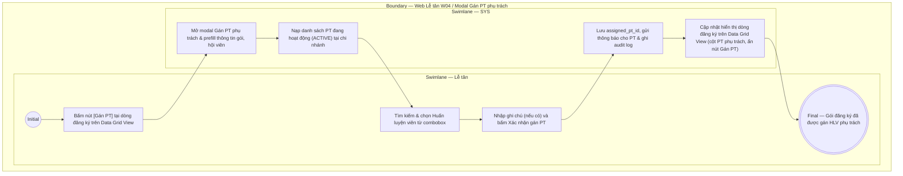

# LT-W04-US05 - Gán PT phụ trách cho gói đăng ký

## Preconditions
- Lễ tân đã đăng nhập hệ thống, trong phạm vi branch scope.
- Gói đăng ký là gói PT hoặc COMBO thuộc chi nhánh của Lễ tân, chưa có PT phụ trách (`assigned_pt_id` đang để trống).

## Trigger
- Lễ tân bấm nút **[Gán PT]** trên dòng đăng ký tại Data Grid View menu W04 (hoặc bấm nút **[Gán PT phụ trách]** trong sidebar Chi tiết đăng ký `LT-W04-US04`).
- Màn hình liên quan: Web Lễ tân — W04 Đăng ký & gia hạn, modal **Gán PT phụ trách**.

## Main Flow

1. Lễ tân bấm nút **[Gán PT]** tại một dòng đăng ký gói PT hoặc COMBO trên bảng Data Grid View.
2. SYS mở modal **Gán PT phụ trách**.
3. SYS tự động nạp sẵn (prefill) thông tin đăng ký: Mã đăng ký, Hội viên, Gói đăng ký, Chi nhánh.
4. SYS nạp danh sách các Huấn luyện viên đang hoạt động (`ACTIVE`) tại chi nhánh của Lễ tân vào Combobox chọn PT.
5. Lễ tân tìm kiếm theo tên, SĐT hoặc mã PT và chọn Huấn luyện viên phụ trách mong muốn theo yêu cầu/nguyện vọng của hội viên.
6. Lễ tân nhập ghi chú phân công (nếu có).
7. Lễ tân bấm nút **Xác nhận gán PT**.
8. SYS lưu `assigned_pt_id` vào thông tin đăng ký gói (`REGISTRATION`), chuyển tình trạng sang "Đã gán PT", gửi thông báo cho Huấn luyện viên được gán, ghi audit log và đóng modal.
9. SYS cập nhật hiển thị dòng đăng ký trên Data Grid View: Cột `PT phụ trách` cập nhật tên HLV, nút `[Gán PT]` tự động ẩn đi trên dòng đó.

### Field-level specification — modal Gán PT phụ trách
| Field / control | Loại UI Control | State | Required | Conditional / dynamic | Source / validation |
| :--- | :--- | :--- | :--- | :--- | :--- |
| Mã đăng ký | `Readonly Text` | `READONLY (PREFILL)` | required | Không | SYS tự động nạp theo mã đăng ký đang chọn từ `REGISTRATION.code` (ví dụ: "DK010") |
| Hội viên | `Readonly Text` | `READONLY (PREFILL)` | required | Không | SYS tự động nạp thông tin hội viên `{Họ tên} ({Mã HV} · {SĐT})` từ `MEMBER_PROFILE` (ví dụ: "Trần Thị Bình (HV002 · 0908 111 222)") |
| Gói đăng ký | `Readonly Text` | `READONLY (PREFILL)` | required | Không | SYS tự động nạp tên gói đăng ký từ `PACKAGE.name` (ví dụ: "Combo Gym 3 tháng + PT 10 buổi") |
| Chi nhánh | `Readonly Text` | `READONLY (PREFILL)` | required | Không | SYS tự động nạp chi nhánh áp dụng của gói tập từ `BRANCH.name` (ví dụ: "Quận 1") |
| Huấn luyện viên phụ trách | `Select Dropdown (Searchable)` | `USER-INPUT` | required | Không | Lễ tân gõ SĐT, Họ tên hoặc Mã PT để tìm kiếm & chọn HLV; chỉ nạp danh sách HLV có trạng thái `ACTIVE` và thuộc chi nhánh của Lễ tân (`branch scope`) |
| Ghi chú phân công | `Textarea` | `USER-INPUT` | optional | Không | Lễ tân nhập ghi chú tự do cho việc phân công (nguyện vọng hội viên, yêu cầu chuyên môn, tối đa 255 ký tự) |

- **Business rules / logic:**
  - Chức năng này hỗ trợ Lễ tân gán trực tiếp Huấn luyện viên cho hội viên khi đăng ký tại quầy hoặc khi hội viên nhờ hỗ trợ do không sử dụng ứng dụng di động.
  - Sau khi được gán PT phụ trách, gói tập này sẽ đủ điều kiện xuất hiện trong dropdown chọn gói khi đặt lịch tại menu **W06 · Lịch tập & buổi PT** (`LT-W06-US02`).
  - Mỗi đăng ký gói PT/COMBO chỉ gắn duy nhất 1 Huấn luyện viên phụ trách cố định.
  - Thao tác gán PT thành công sẽ gửi thông báo đến Huấn luyện viên qua ứng dụng Mobile PT và lưu vết audit log tài khoản Lễ tân thực hiện.

## Alternate Flows

### AF-01 - Hủy Thao Tác
1. Lễ tân chọn **Hủy** hoặc nút **✕** trên modal.
2. SYS đóng modal và giữ nguyên trạng thái gói đăng ký chưa gán PT.

## Exception Flows
- Không có Huấn luyện viên khả dụng: Chi nhánh không có PT nào đang ở trạng thái hoạt động (`ACTIVE`). SYS hiển thị thông báo "Không tìm thấy HLV khả dụng tại chi nhánh" và vô hiệu hóa nút xác nhận.
- Đăng ký đã có PT phụ trách trước đó (do hội viên tự chọn qua app mobile đồng thời): SYS từ chối thao tác, thông báo "Gói đăng ký đã được gán HLV phụ trách" và nạp lại dữ liệu mới nhất.

## Activity Diagram — Swimlane
**Trigger:** Lễ tân bấm nút Gán PT tại dòng đăng ký gói trong menu W04.

