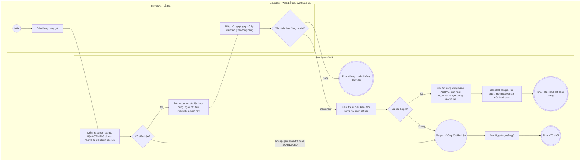

# LT-W04-US06 - Đóng băng gói tập tại quầy

## Preconditions
- Lễ tân có tài khoản hoạt động và đang làm việc tại chi nhánh.
- Gói đã thanh toán đủ 100%, hiện đang có hiệu lực ACTIVE (bao gồm hiển thị Sắp hết hạn từ is_expiring), còn thời hạn bảo lưu, chưa đóng băng. Không áp dụng cho gói chưa trả hoặc chưa đến ngày hiệu lực SCHEDULED.
- Hội viên đến quầy hoặc liên hệ phòng gym nhờ đóng băng gói tập tạm thời.

## Trigger
- Lễ tân bấm nút **[Đóng băng gói]** tại dòng đăng ký gói trong menu W04.
- Màn hình liên quan: Web Lễ tân — W04 Đăng ký & gia hạn, modal **Đóng băng gói tập**.

## Main Flow

1. Lễ tân bấm nút **[Đóng băng gói]** tại hợp đồng đăng ký của hội viên.
2. SYS kiểm tra lại thanh toán, hiệu lực hiện tại và quyền/scope trước khi mở modal **Đóng băng gói tập**; kiểm tra lại một lần nữa khi xác nhận.
3. SYS hiển thị thông tin gói hiện tại: Mã đăng ký, Hội viên, Thời hạn hiện tại.
4. SYS hiển thị **Ngày bắt đầu đóng băng** ở trạng thái chỉ đọc (`READONLY`), mặc định và cố định là ngày hiện tại (áp dụng đóng băng lập tức).
5. Lễ tân nhập **Số ngày tạm dừng / đóng băng** (tối đa bằng số ngày còn lại của gói tính từ hôm nay) HOẶC chọn **Ngày mở lại dự kiến** (hệ thống tự động đồng bộ 2 chiều).
6. Lễ tân nhập **Lý do đóng băng** theo thông tin hội viên cung cấp.
7. Lễ tân bấm **Xác nhận đóng băng**.
8. SYS ghi nhận đợt bảo lưu với `status = 'ACTIVE'`, kích hoạt `is_frozen = true` trên hợp đồng, cộng lùi hạn gói và ghi audit/thông báo.
9. SYS đóng modal, cập nhật hiển thị `❄️ Đang đóng băng` trên danh sách đăng ký.

### Field-level specification — modal Đóng băng gói tập
| Field / control | Loại UI Control | State | Required | Conditional / dynamic | Source / validation |
| :--- | :--- | :--- | :--- | :--- | :--- |
| Thông tin hợp đồng | `Readonly Text Group` | `READONLY (PREFILL)` | required | `Không` | Mã ĐK, Họ tên hội viên, Thời hạn hiện tại (`dd/MM/yyyy - dd/MM/yyyy`) |
| Ngày bắt đầu đóng băng | `Date Box` | `READONLY (PREFILL)` | required | `Không` | Mặc định và cố định ngày hiện tại; không cho phép sửa ngày tương lai |
| Số ngày tạm dừng / đóng băng | `Number Box` | `USER-INPUT` | required | `TRIGGER` | Mặc định 7 (hoặc tối đa số ngày còn lại nếu $< 7$); min: 1, max: số ngày còn lại của gói tính từ hôm nay |
| Ngày mở lại dự kiến | `Date Box` | `USER-INPUT` | required | `DYNAMIC` | Tự động đồng bộ 2 chiều với Số ngày đóng băng; min: `Hôm nay + 1`, max: `Ngày hết hạn hiện tại` |
| Lý do đóng băng | `Textarea` | `USER-INPUT` | required | `Không` | Lý do hội viên nhờ đóng băng (tối đa 255 ký tự) |

## Alternate Flows

### AF-01 - Hủy thao tác
1. Lễ tân chọn `Hủy` hoặc icon `✕`.
2. SYS đóng modal, không thay đổi gói.

## Exception Flows
- Gói chưa thanh toán hoặc ngày bắt đầu còn ở tương lai (SCHEDULED): ẩn nút, từ chối cả khi gọi thao tác trực tiếp. Cùng điều kiện cho QTV, Lễ tân và Hội viên; không có ngoại lệ quyền staff.
- Gói hiển thị Sắp hết hạn vẫn được bảo lưu nếu hiện đang có hiệu lực, đã trả đủ và thỏa các điều kiện còn lại; không đổi status ACTIVE thành enum DB mới.
- Gói đã hết hạn: SYS chặn thao tác và thông báo gói không còn hạn để đóng băng.
- Số ngày đóng băng vượt quá số ngày còn lại: SYS chặn và báo lỗi số ngày đóng băng không hợp lệ.

## Activity Diagram — Swimlane
**Trigger:** Lễ tân bấm nút Đóng băng gói trong menu W04.

