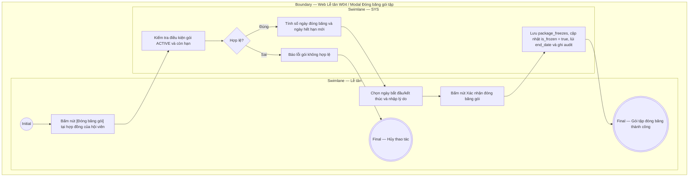

# LT-W04-US06 - Đóng băng gói tập tại quầy

## Preconditions
- Lễ tân có tài khoản hoạt động và đang làm việc tại chi nhánh.
- Gói đăng ký của hội viên đang ở trạng thái hoạt động (`ACTIVE`) và còn hạn sử dụng.
- Hội viên đến quầy hoặc liên hệ phòng gym nhờ đóng băng gói tập tạm thời.

## Trigger
- Lễ tân bấm nút **[Đóng băng gói]** tại dòng đăng ký gói trong menu W04.
- Màn hình liên quan: Web Lễ tân — W04 Đăng ký & gia hạn, modal **Đóng băng gói tập**.

## Main Flow

1. Lễ tân bấm nút **[Đóng băng gói]** tại hợp đồng đăng ký của hội viên.
2. SYS mở modal **Đóng băng gói tập**.
3. SYS hiển thị thông tin gói hiện tại: Mã đăng ký, Hội viên, Tên gói, Ngày kết thúc cũ.
4. Lễ tân chọn **Ngày bắt đầu đóng băng** và **Ngày kết thúc đóng băng**.
5. SYS tự động tính **Số ngày đóng băng** và **Ngày hết hạn mới** của gói (`Ngày hết hạn cũ` + `Số ngày đóng băng`).
6. Lễ tân nhập **Lý do đóng băng** theo thông tin hội viên cung cấp.
7. Lễ tân bấm **Xác nhận đóng băng gói**.
8. SYS ghi nhận đóng băng vào bảng `package_freezes`, cập nhật cờ `is_frozen = true`, cộng lùi ngày hết hạn `end_date`, gửi thông báo in-app cho hội viên và ghi audit log.
9. SYS cập nhật trạng thái gói trên bảng dữ liệu là `ĐANG ĐÓNG BĂNG`.

### Field-level specification — modal Đóng băng gói tập
| Field / control | Loại UI Control | State | Required | Conditional / dynamic | Source / validation |
| :--- | :--- | :--- | :--- | :--- | :--- |
| Thông tin hợp đồng | `Readonly Text Group` | `READONLY (PREFILL)` | required | `Không` | Mã ĐK, Họ tên hội viên, Tên gói, Ngày kết thúc cũ |
| Ngày bắt đầu đóng băng | `Date Picker` | `USER-INPUT` | required | `TRIGGER`: Mốc bắt đầu đóng băng | Mặc định hôm nay; $\ge$ hôm nay |
| Ngày kết thúc đóng băng | `Date Picker` | `USER-INPUT` | required | `TRIGGER`: Mốc kết thúc đóng băng | Bắt buộc $>$ Ngày bắt đầu đóng băng |
| Số ngày đóng băng [AUTO] | `Readonly Text` | `READONLY (AUTO-FILL)` | required | `DYNAMIC` | Tự động tính = Số ngày khoảng cách + 1 |
| Ngày hết hạn gói mới [AUTO] | `Readonly Text (Bold)` | `READONLY (AUTO-FILL)` | required | `DYNAMIC` | = `Ngày kết thúc cũ` + `Số ngày đóng băng` |
| Lý do đóng băng | `Textarea` | `USER-INPUT` | required | `Không` | Lý do hội viên nhờ đóng băng (tối đa 255 ký tự) |

## Alternate Flows
- Lễ tân chọn `Hủy`: Đóng modal, không thay đổi gói.

## Exception Flows
- Gói đã hết hạn: SYS chặn thao tác và thông báo gói không còn hạn để đóng băng.
- Ngày kết thúc $\le$ Ngày bắt đầu: SYS báo lỗi validation ngày không hợp lệ.

## Activity Diagram — Swimlane
**Trigger:** Lễ tân bấm nút Đóng băng gói trong menu W04.

