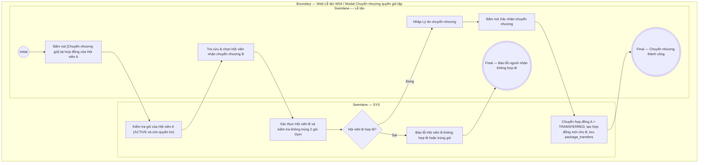

# LT-W04-US07 - Chuyển nhượng quyền gói tập tại quầy

## Preconditions
- Lễ tân có tài khoản hoạt động tại chi nhánh.
- Gói tập của Hội viên A đang còn hiệu lực (`ACTIVE`) và còn thời hạn hoặc số buổi tập khả dụng.
- Hội viên B (người nhận) đã có hồ sơ cá nhân (`ACTIVE`) trên hệ thống.

## Trigger
- Lễ tân bấm nút **[Chuyển nhượng gói]** tại dòng đăng ký của Hội viên A trong menu W04.
- Màn hình liên quan: Web Lễ tân — W04 Đăng ký & gia hạn, modal **Chuyển nhượng quyền gói tập**.

## Main Flow

1. Lễ tân bấm nút **[Chuyển nhượng gói]** tại hợp đồng đăng ký của Hội viên A.
2. SYS mở modal **Chuyển nhượng quyền gói tập**.
3. SYS hiển thị thông tin gói chuyển nhượng của Hội viên A (Tên gói, số ngày/buổi còn lại).
4. Lễ tân tra cứu và chọn **Hội viên B** (người nhận chuyển nhượng) theo SĐT.
5. SYS kiểm tra điều kiện của Hội viên B (không bị trùng 2 gói Gym hiệu lực cùng lúc).
6. Lễ tân nhập **Lý do chuyển nhượng** (chuyển giao/tặng quyền sử dụng cho bạn bè/người thân miễn phí, không thu phí chuyển nhượng).
7. Lễ tân bấm **Xác nhận chuyển nhượng**.
8. SYS thực hiện:
   - Chuyển hợp đồng của Hội viên A sang trạng thái `TRANSFERRED`.
   - Sinh hợp đồng mới cho Hội viên B kế thừa nguyên vẹn quyền lợi còn lại của gói.
   - Lưu bản ghi vào bảng `package_transfers` và ghi audit log.
9. SYS đóng modal, hiển thị thông báo thành công và cập nhật danh sách đăng ký.

### Field-level specification — modal Chuyển nhượng quyền gói tập
| Field / control | Loại UI Control | State | Required | Conditional / dynamic | Source / validation |
| :--- | :--- | :--- | :--- | :--- | :--- |
| Thông tin gói chuyển nhượng | `Readonly Text Group` | `READONLY (PREFILL)` | required | `Không` | Mã hợp đồng, Họ tên Hội viên A, Tên gói, Quyền lợi còn lại |
| Hội viên nhận chuyển nhượng (B) | `Search Combobox` | `USER-INPUT` | required | `TRIGGER`: Kiểm tra điều kiện gói của Hội viên B | Tra cứu theo SĐT trong `MEMBER_PROFILES`; bắt buộc khác Hội viên A |
| Lý do chuyển nhượng | `Textarea` | `USER-INPUT` | required | `Không` | Ghi chú lý do chuyển nhượng (tối đa 255 ký tự; placeholder: "Tặng / chuyển quyền sử dụng cho bạn bè/người thân...") |

## Alternate Flows
- Lễ tân chọn `Hủy`: Đóng modal, giữ nguyên hợp đồng cũ của Hội viên A.

## Exception Flows
- Hội viên B trùng với Hội viên A: Chặn lưu và báo lỗi.
- Hội viên B đang có gói Gym hiệu lực song song: Cảnh báo không cho phép 2 gói Gym hiệu lực đồng thời.

## Activity Diagram — Swimlane
**Trigger:** Lễ tân bấm nút Chuyển nhượng gói trong menu W04.

