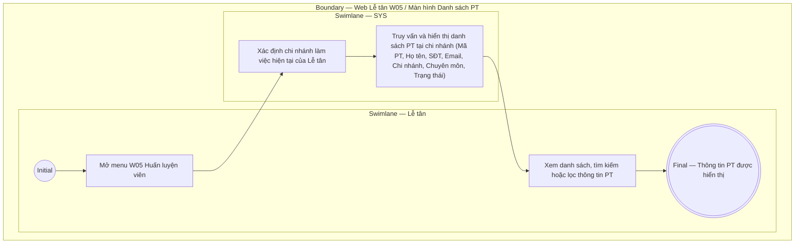

# LT-W05-US01 - Xem danh sách PT

## Preconditions
- Lễ tân đã đăng nhập hệ thống Web Paradise Gym.
- Chi nhánh làm việc hiện tại của Lễ tân đã được xác định (`branch scope`).

## Trigger
- Lễ tân mở menu W05 hoặc chọn **Huấn luyện viên**.
- Màn hình liên quan: Web Lễ tân — W05 Huấn luyện viên.

## Main Flow

1. Lễ tân truy cập menu **Huấn luyện viên** (W05) trên thanh điều hướng Web Lễ tân.
2. SYS xác định chi nhánh làm việc hiện tại của Lễ tân.
3. SYS truy vấn và hiển thị danh sách các huấn luyện viên đang công tác tại chi nhánh theo dạng bảng (Data Grid View).
4. Lễ tân tra cứu danh sách, tìm kiếm theo tên hoặc lọc trạng thái để lấy thông tin liên hệ và chuyên môn phục vụ tư vấn cho hội viên.

### Field-level specification — Bảng danh sách huấn luyện viên (Data Grid View)
| Field / control | Loại UI Control | State | Required | Conditional / dynamic | Source / validation |
| :--- | :--- | :--- | :--- | :--- | :--- |
| Mã PT | `Readonly Text` | `READONLY` | required | Không | SYS sinh tự động duy nhất từ `PT_PROFILE.code` (ví dụ: "PT001", "PT002") |
| Họ và tên | `Readonly Text` | `READONLY` | required | Không | Họ và tên của huấn luyện viên từ `PT_PROFILE.full_name` (ví dụ: "Nguyễn Văn Hùng") |
| Số điện thoại | `Readonly Text (Phone)` | `READONLY` | required | Không | Số điện thoại định danh duy nhất của PT từ `PT_PROFILE.phone` (ví dụ: "0909 888 777") |
| Email | `Readonly Text` | `READONLY` | optional | Không | Địa chỉ email của PT từ `PT_PROFILE.email` (ví dụ: "pt.hung@paradise.vn"); hiển thị `--` nếu chưa cập nhật |
| Chi nhánh phục vụ | `Readonly Text` | `READONLY` | required | Không | Tên chi nhánh nơi Lễ tân và PT đang cùng công tác từ `BRANCH.name` (ví dụ: "Quận 1") |
| Chuyên môn / Ghi chú | `Readonly Text` | `READONLY` | optional | Không | Tóm tắt chuyên môn, chứng chỉ thể hình từ `PT_PROFILE.specialty` (ví dụ: "Cardio & Thể hình, NASM"); hiển thị `--` nếu để trống |
| Trạng thái | `Status Badge` | `READONLY` | required | `DYNAMIC`: theo trạng thái record | Hiển thị badge trực quan theo trạng thái: `Đang hoạt động` (xanh lá), `Ngừng hoạt động` (vàng/xám), `Đã lưu trữ` (đỏ) |

- **Business rules / logic:**
  - Màn hình dành cho Lễ tân hoạt động ở chế độ **chỉ đọc hoàn toàn (`READONLY`)**. Lễ tân không có quyền thêm mới, chỉnh sửa thông tin hoặc đổi trạng thái PT (các thao tác quản trị nhân sự này thuộc thẩm quyền của Quản trị viên tại `QTV-W05`).
  - Dữ liệu hiển thị được giới hạn nghiêm ngặt theo đúng chi nhánh mà Lễ tân đang trực thuộc (`branch scope`). Lễ tân không xem được PT thuộc chi nhánh khác.
  - Mục đích sử dụng: Tra cứu nhanh số điện thoại và thông tin kỹ năng/chuyên môn của PT để hỗ trợ hội viên đăng ký gói PT, ghép PT phụ trách hoặc tư vấn đặt lịch tại quầy.

## Exception Flows
- Lỗi tải dữ liệu: SYS hiển thị thông báo lỗi tải danh sách và nút bấm cho phép thử lại.

## Activity Diagram — Swimlane
**Trigger:** Lễ tân mở Danh sách PT trong menu W05.

