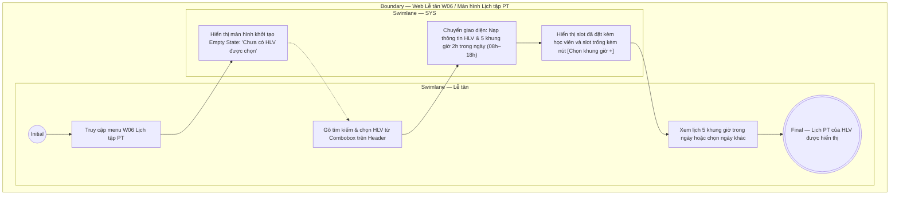

# LT-W06-US01 - Xem lịch PT

## Preconditions
- Lễ tân đã đăng nhập, branch scope của Lễ tân đã được xác định.

## Trigger
- Lễ tân mở menu W06 hoặc chọn **Lịch tập PT**.
- Màn hình liên quan: Web Lễ tân — W06 Lịch tập PT.

## Main Flow

1. Lễ tân truy cập menu **Lịch tập PT** (W06) trên thanh điều hướng Web Lễ tân.
2. Màn hình khởi tạo ở trạng thái chưa chọn HLV (**Empty State**):
   - Header hiển thị tiêu đề `Chọn HLV để xem lịch`, phụ đề `Khung làm việc cố định 08:00–18:00. Mỗi buổi mặc định kéo dài 2 giờ`.
   - Cung cấp **Combobox chọn HLV** tích hợp ô tìm kiếm (tìm theo tên, SĐT hoặc mã PT) ở góc phải Header.
   - Vùng nội dung chính hiển thị thông báo rỗng: Icon đồng hồ 🕒, tiêu đề `Chưa có HLV được chọn`, mô tả `Tìm theo tên hoặc số điện thoại, sau đó chọn một HLV để xem các buổi đã đặt và khung giờ còn trống`.
3. Lễ tân gõ từ khóa (Tên, SĐT hoặc Mã PT) và chọn một huấn luyện viên thuộc chi nhánh từ combobox.
4. Ngay khi chọn được HLV, màn hình chuyển sang giao diện xem lịch chi tiết:
   - Header hiển thị HLV đang chọn trên combobox (cho phép đổi HLV khác bất kỳ lúc nào).
   - Hiển thị bộ chọn ngày (Date picker / Calendar), mặc định chọn ngày hiện tại.
   - SYS nạp và hiển thị danh sách 5 khung giờ làm việc cố định trong ngày của PT (08:00 – 18:00, mỗi buổi kéo dài 2 giờ):
     - **08:00 – 10:00**
     - **10:00 – 12:00**
     - **12:00 – 14:00**
     - **14:00 – 16:00**
     - **16:00 – 18:00**
5. Tại từng khung giờ:
   - **Khung giờ đã có lịch đặt:** SYS hiển thị tên hội viên, mã gói PT sử dụng, trạng thái buổi tập (`Đã đặt`, `Chờ xác nhận hoàn thành`, `Hoàn thành`) và các nút thao tác tương ứng (`[Xác nhận hoàn thành]` `US03`, `[Hủy lịch]` `US04`).
   - **Khung giờ trống:** SYS hiển thị nhãn `Khung giờ trống` kèm nút CTA nổi bật **`[Chọn khung giờ +]`** (nhấn để mở modal Đặt lịch PT `US02`).
6. Lễ tân có thể đổi ngày qua Date picker để xem lịch các ngày khác hoặc chọn HLV khác từ combobox để chuyển lịch.

### Field-level specification — Màn hình Lịch tập PT (W06)
| Field / control | Loại UI Control | State | Required | Conditional / dynamic | Source / validation |
| :--- | :--- | :--- | :--- | :--- | :--- |
| Tìm theo tên, SĐT hoặc mã PT | `Textbox (Search Input)` | `USER-INPUT` | optional | Không | Lễ tân gõ từ khóa để lọc nhanh danh sách huấn luyện viên bên trong combobox |
| Chọn huấn luyện viên | `Select Dropdown (Searchable Combobox)` | `USER-INPUT` | required | `TRIGGER` | Đóng vai trò TRIGGER chính điều khiển hiển thị màn hình: nạp danh sách PT thuộc chi nhánh phục vụ (`branch scope`); khi chưa chọn hiển thị Empty State, khi đã chọn kích hoạt chuyển sang giao diện lịch chi tiết |
| Ngày xem lịch | `Date Picker / Calendar` | `USER-INPUT (PREFILL)` | conditional | `CONDITIONAL`: **Hiện khi** đã chọn HLV trên combobox; **Ẩn khi** chưa chọn HLV (Empty State) | Mặc định nạp ngày hiện tại (`TODAY`); Lễ tân có thể chọn ngày bất kỳ trong tuần/tháng để tra cứu lịch |
| Lưới 5 khung giờ làm việc | `Grid Container` | `READONLY` | conditional | `CONDITIONAL`: **Hiện khi** đã chọn HLV trên combobox; **Ẩn khi** chưa chọn HLV (Empty State) | Khung bố cục cố định 5 slot 2 tiếng (08:00–10:00, 10:00–12:00, 12:00–14:00, 14:00–16:00, 16:00–18:00) |
| Thẻ khung giờ trống | `Slot Card Component (Available)` | `USER-INPUT` | conditional | `CONDITIONAL`: **Hiện khi** trong ngày có khung giờ chưa có lịch đặt; **Ẩn khi** tất cả các khung giờ trong ngày đều đã kín lịch | Thẻ card viền nét đứt hiển thị nhãn `Khung giờ trống` kèm nút CTA màu xanh lá **`[Chọn khung giờ +]`** (nhấn để mở modal Đặt lịch PT `LT-W06-US02`) |
| Thẻ buổi tập — Trạng thái `Đã đặt` | `Booking Card Component (Booked Variant)` | `USER-INPUT / READONLY` | conditional | `CONDITIONAL`: **Hiện khi** trong ngày có buổi tập ở trạng thái `Đã đặt`; **Ẩn khi** trong ngày đó PT không có lịch nào `Đã đặt` | Thẻ card viền bo cong bên trái màu xanh dương; hiển thị Tên hội viên (chữ trắng đậm, ví dụ: "Trần Thị Bình"), Tên gói PT (xanh dương, ví dụ: "PT 20 buổi"), Trạng thái `Đã đặt` (xanh dương) và cụm 2 nút thao tác: Nút đỏ **`[Hủy lịch]`** (`LT-W06-US04`) và Nút **`[Xác nhận hoàn thành]`** (`LT-W06-US03`, nút màu xám khi chưa qua khung giờ buổi tập đó, chuyển sang màu xanh lá khi đã qua khung giờ buổi tập đó) |
| Thẻ buổi tập — Trạng thái `Chờ xác nhận hoàn thành` | `Booking Card Component (Awaiting Variant)` | `READONLY` | conditional | `CONDITIONAL`: **Hiện khi** trong ngày có buổi tập ở trạng thái `Chờ xác nhận hoàn thành`; **Ẩn khi** trong ngày đó PT không có lịch nào `Chờ xác nhận hoàn thành` | Thẻ card viền bo cong bên trái màu vàng cam; hiển thị Tên hội viên (chữ trắng đậm, ví dụ: "Trần Thị Bình"), Tên gói PT (vàng cam, ví dụ: "PT 20 buổi"), Trạng thái `Chờ xác nhận hoàn thành` (vàng cam); không có nút thao tác |
| Thẻ buổi tập — Trạng thái `Hoàn thành` | `Booking Card Component (Completed Variant)` | `READONLY` | conditional | `CONDITIONAL`: **Hiện khi** trong ngày có buổi tập ở trạng thái `Hoàn thành`; **Ẩn khi** trong ngày đó PT không có lịch nào `Hoàn thành` | Thẻ card viền bo cong bên trái màu xanh lá; hiển thị Tên hội viên (chữ trắng đậm, ví dụ: "Trần Thị Bình"), Tên gói PT (xanh lá, ví dụ: "PT 20 buổi"), Trạng thái `Hoàn thành` (xanh lá); không có nút thao tác |

- **Business rules / logic:**
  - Giao diện W06 ban đầu chỉ hiển thị duy nhất bộ điều khiển combobox tìm kiếm & chọn HLV cùng thông báo Empty State `Chưa có HLV được chọn`.
  - Chỉ khi một HLV cụ thể được chọn từ combobox, hệ thống mới nạp dữ liệu và chuyển màn hình sang giao diện chi tiết lịch của HLV đó.
  - Lịch làm việc cố định của PT là từ 08:00 đến 18:00, chia đều thành 5 ca 2 tiếng cố định; PT không tự tạo thêm hoặc sửa đổi các khung giờ này.
  - Mỗi khung giờ chỉ được phép có tối đa 1 buổi đặt lịch có hiệu lực tại một thời điểm.

## Exception Flows
- Không tìm thấy HLV phù hợp: Combobox báo "Không tìm thấy huấn luyện viên".
- Lỗi kết nối / tải dữ liệu lịch: SYS hiển thị thông báo lỗi và nút tải lại dữ liệu.

## Activity Diagram — Swimlane
**Trigger:** Lễ tân truy cập menu W06 và chọn HLV từ combobox để xem lịch.

