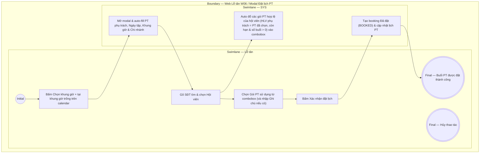

# LT-W06-US02 - Đặt lịch PT

## Preconditions
- Lễ tân đã mở xem lịch PT của HLV trên màn hình W06 (theo `LT-W06-US01`), đã chọn HLV trên combobox và chọn ngày trên Date picker.
- Hội viên đã có gói PT hoặc Combo Gym + PT hợp lệ (gói do HLV đã chọn phụ trách, còn hạn và số buổi PT còn lại > 0).

## Trigger
- Lễ tân bấm **Chọn khung giờ +** (hoặc Đặt lịch) tại một khung giờ trống trên màn hình lịch PT (W06).
- Màn hình liên quan: Web Lễ tân — W06 Lịch tập PT, modal **Đặt lịch PT**.

## Main Flow

1. Sau khi xem lịch PT (ở `LT-W06-US01`), Lễ tân chọn một khung giờ trống trên calendar và bấm **Chọn khung giờ +** (hoặc Đặt lịch).
2. SYS hiển thị modal **Đặt lịch PT** và tự động auto-fill các trường cố định:
   - **PT phụ trách**: Auto-fill dựa trên HLV đã chọn ở combobox ban đầu (`READONLY`).
   - **Ngày tập**: Auto-fill dựa trên ngày đã chọn trên Date picker (`READONLY`).
   - **Khung giờ**: Auto-fill dựa trên khung giờ đã chọn trên calendar (`READONLY`).
   - **Chi nhánh**: Auto-fill theo chi nhánh làm việc hiện tại (`READONLY`).
3. Lễ tân gõ SĐT để tìm kiếm và chọn **Hội viên**.
4. SYS tự động kiểm tra và đổ danh sách các gói của hội viên thỏa mãn điều kiện: là gói PT hoặc COMBO Gym+PT, đã được chọn PT phụ trách (và PT phụ trách chính là HLV đang xem lịch), gói còn trong hạn sử dụng và số buổi PT còn lại > 0 (`remaining_sessions > 0`).
5. Lễ tân chọn **Gói PT sử dụng** từ combobox và nhập Ghi chú cho buổi (nếu có).
6. Lễ tân bấm **Xác nhận đặt lịch**.
7. SYS tạo booking mới ở trạng thái `Đã đặt` (BOOKED) và cập nhật hiển thị khung giờ đó trên lịch PT.

### Field-level specification — modal Đặt lịch PT
| Field / control | Loại UI Control | State | Required | Conditional / dynamic | Source / validation |
| :--- | :--- | :--- | :--- | :--- | :--- |
| PT phụ trách | `Readonly Text` | `READONLY (PREFILL)` | required | Không | SYS nạp sẵn theo HLV đã chọn ở combobox ban đầu (ví dụ: "Nguyễn Văn Hùng (PT001)") |
| Ngày tập | `Readonly Text / Date` | `READONLY (PREFILL)` | required | Không | SYS nạp sẵn theo ngày đang chọn trên Date picker (ví dụ: "15/09/2026") |
| Khung giờ | `Readonly Text` | `READONLY (PREFILL)` | required | Không | SYS nạp sẵn theo khung giờ 2 tiếng đã chọn trên calendar (ví dụ: "08:00 - 10:00") |
| Chi nhánh | `Readonly Text` | `READONLY (PREFILL)` | required | Không | SYS nạp sẵn theo chi nhánh làm việc hiện tại (`branch scope`) |
| Hội viên | `Select Dropdown (Searchable)` | `USER-INPUT` | required | `TRIGGER` | Đóng vai trò TRIGGER: Lễ tân gõ SĐT hoặc Họ tên để tìm kiếm & chọn hội viên (`<Mã HV> - <Tên>`); khi chọn hội viên sẽ kích hoạt nạp danh sách gói của hội viên ở trường "Gói PT sử dụng" (chỉ lấy các gói PT hoặc COMBO mà hội viên đã chọn/được gán HLV phụ trách và PT được phân công chính là PT đang được chọn xem lịch ở combobox) |
| Gói PT sử dụng | `Select Dropdown` | `USER-INPUT` | required | `DYNAMIC`: nạp danh sách gói hợp lệ theo TRIGGER Hội viên | Danh sách luôn hiển thị; các tùy chọn thay đổi động theo hội viên được chọn: chỉ nạp các gói PT hoặc COMBO của hội viên đã được chọn PT phụ trách (HLV phụ trách gói trùng khớp với HLV đang xem lịch, gói còn hạn và số buổi PT còn lại > 0) |
| Ghi chú cho buổi | `Textarea` | `USER-INPUT` | optional | Không | Lễ tân nhập ghi chú tự do cho buổi tập (nếu có) |

- **Business rules / logic:**
  - Một khung giờ của HLV tại một thời điểm chỉ được đặt tối đa 1 booking duy nhất.
  - Dropdown "Gói PT sử dụng" là trường `DYNAMIC` phụ thuộc vào trường TRIGGER "Hội viên". Hệ thống chỉ nạp danh sách các gói thỏa mãn đồng thời các điều kiện:
    1. Là gói PT hoặc COMBO thuộc sở hữu của hội viên vừa được chọn.
    2. Đã được chọn/phân công PT phụ trách và PT đó chính là HLV đang được chọn xem lịch ở combobox ban đầu.
    3. Gói còn trong thời hạn sử dụng và số buổi PT còn lại > 0 (`remaining_sessions > 0`).
  - Đặt lịch thành công giữ chỗ buổi PT nhưng chưa trừ buổi; buổi tập chỉ chính thức bị trừ sau khi xác nhận kép hoàn thành ở `LT-W06-US03`.

## Alternate Flows

### AF-01 - Hủy Thao Tác
1. Lễ tân chọn **Hủy** hoặc nút **X**.
2. SYS đóng modal và giữ nguyên khung giờ trống.

## Activity Diagram — Swimlane
**Trigger:** Lễ tân bấm Chọn khung giờ + tại khung giờ trống trong menu W06.

