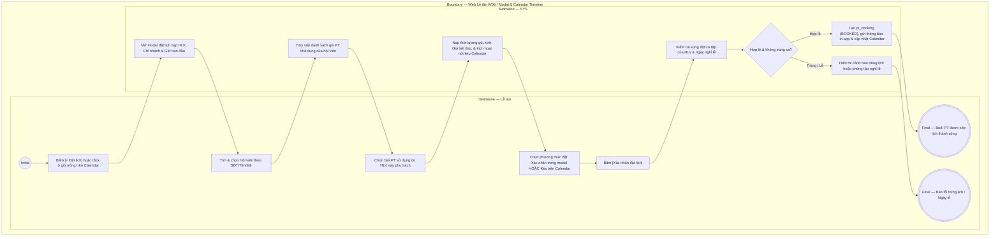

# LT-W06-US02 - Đặt lịch PT

## Preconditions
- Lễ tân đã mở xem lịch PT của HLV trên màn hình W06, đã chọn HLV trên combobox và chọn ngày trên Date picker.
- Ngày được chọn không thuộc danh sách Ngày nghỉ lễ của chi nhánh (`holidays`).
- Hội viên đã có gói PT hoặc Combo Gym + PT hợp lệ (được Lễ tân/QTV gán HLV này phụ trách, còn hạn, không bị đóng băng và số buổi PT còn lại > 0).

## Trigger
- Lễ tân bấm nút **[+ Đặt lịch]** trên thanh công cụ hoặc click chuột vào ô giờ trống bất kỳ trên giao diện Calendar timeline (lưới 30 phút, từ 06:00 đến 22:00).
- Màn hình liên quan: Web Lễ tân — W06 Lịch tập PT, Calendar Scheduler (dxScheduler) & modal **Đặt lịch PT**.

## Main Flow

1. Lễ tân chọn HLV và ngày tác nghiệp trên bộ lọc.
2. Lễ tân mở form đặt lịch bằng một trong 2 cách:
   - Cách 1: Bấm nút **[+ Đặt lịch]** trên thanh tác vụ.
   - Cách 2: Click trực tiếp vào một ô giờ trống trên Calendar timeline (hệ thống tự động lấy mốc giờ vừa click làm giờ bắt đầu dự kiến ban đầu).
3. SYS hiển thị modal **Đặt lịch PT mới** với thông tin HLV và Chi nhánh nạp sẵn. Các trường Thời lượng buổi tập và Giờ kết thúc ở trạng thái chờ xác định (`--:--`), nút **[📅 Kéo chọn giờ trên Calendar]** tạm thời vô hiệu hóa cho đến khi có gói tập.
4. Lễ tân tra cứu và chọn **Hội viên** theo SĐT, Họ tên hoặc Mã hội viên.
5. SYS tự động truy vấn và đổ danh sách các gói PT hoặc Combo hợp lệ của hội viên mà HLV này đang phụ trách (`status = ACTIVE`, còn hạn, không bị đóng băng và số buổi PT còn lại > 0).
6. Lễ tân chọn **Gói PT sử dụng**.
7. Ngay khi chọn gói:
   - SYS nạp chính xác **Thời lượng buổi tập (phút)** từ cấu hình của gói (`session_duration_minutes`, ví dụ: `60 phút`, `90 phút`, `120 phút`).
   - Tự động tính **Giờ kết thúc** = `Giờ bắt đầu` + `Thời lượng buổi tập`.
   - Nút **[📅 Kéo chọn giờ trên Calendar]** ở thanh toolbar đáy modal lập tức được kích hoạt sáng lên.
8. Lễ tân lựa chọn một trong 2 phương thức hoàn tất:
   - **Phương thức 1 (Xác nhận trực tiếp trong modal):** Lễ tân tinh chỉnh giờ bắt đầu trên dropdown (bước nhảy 15 phút), nhập Ghi chú buổi tập và bấm nút **[✓ Xác nhận đặt lịch]**.
   - **Phương thức 2 (Kéo chọn giờ trực quan trên Calendar):** Lễ tân bấm nút **[📅 Kéo chọn giờ trên Calendar]**. Modal tự động đóng lại; trên Calendar xuất hiện **Thẻ đặt lịch dự kiến** với chiều cao tương ứng chính xác thời lượng gói vừa chọn (30p = 1 ô, 60p = 2 ô, 90p = 3 ô, 120p = 4 ô) kèm tên Hội viên và Tên gói. Lễ tân nhấn giữ kéo thẻ lên/xuống hoặc click vào ô giờ trống để điều chỉnh giờ bắt đầu; thanh Floating Bar ở đáy màn hình hiển thị tóm tắt và nút **[✓ Xác nhận đặt lịch]**. Lễ tân bấm nút này để chốt lịch.
9. SYS kiểm tra không bị xung đột giờ với các ca tập khác của HLV trong ngày; tạo bản ghi booking ở trạng thái `Đã đặt` (`BOOKED`), gửi thông báo in-app cho HLV và Hội viên, xóa thẻ dự kiến và cập nhật timeline lịch tập.

### Field-level specification — modal Đặt lịch PT
| Field / control | Loại UI Control | State | Required | Conditional / dynamic | Source / validation |
| :--- | :--- | :--- | :--- | :--- | :--- |
| PT phụ trách | `Readonly Text` | `READONLY (PREFILL)` | required | `Không` | HLV đang xem lịch (ví dụ: "Nguyễn Văn Hùng (PT001)") |
| Chi nhánh phục vụ | `Readonly Text` | `READONLY (PREFILL)` | required | `Không` | Chi nhánh làm việc hiện tại của HLV |
| Hội viên | `Select Dropdown (Searchable)` | `USER-INPUT` | required | `TRIGGER`: Kích hoạt nạp danh sách gói PT hợp lệ | Lễ tân gõ SĐT, Họ tên hoặc Mã để tra cứu trong `MEMBER_PROFILES` |
| Gói PT sử dụng | `Select Dropdown` | `USER-INPUT` | required | `TRIGGER`: Kích hoạt nạp thời lượng gói và mở khóa nút Kéo chọn giờ | Gói PT/Combo của hội viên do HLV này phụ trách và còn số buổi khả dụng > 0 |
| Thời lượng buổi tập [AUTO] | `TextBox (readOnly)` | `READONLY (AUTO-FILL)` | required | `DYNAMIC` | Lấy từ `PACKAGES.session_duration_minutes` của gói được chọn (ví dụ: `60 phút (Theo cấu hình gói đã chọn)`); hiển thị dưới dạng ô nhập liệu readonly |
| Ngày tập | `DateBox` | `USER-INPUT` | required | `TRIGGER`: Nạp lại gói hợp lệ theo ngày & cập nhật thẻ lịch | Ngày tập (mặc định lấy ngày đang xem trên lịch); không trùng ngày nghỉ lễ |
| Giờ bắt đầu | `Select Dropdown` | `USER-INPUT` | required | `TRIGGER`: Tính giờ kết thúc & kiểm tra xung đột | Lễ tân chọn giờ bắt đầu linh động theo bước nhảy 15 phút (06:00 - 21:30) |
| Giờ kết thúc [AUTO] | `TextBox (readOnly)` | `READONLY (AUTO-FILL)` | required | `DYNAMIC` | Tự động tính = `Giờ bắt đầu` + `Thời lượng buổi tập`; hiển thị dưới dạng ô nhập liệu readonly (mặc định `--:--`) |
| Ghi chú cho buổi | `Textarea` | `USER-INPUT` | optional | `Không` | Lễ tân nhập mục tiêu bài tập hoặc dặn dò thể lực hội viên |

- **Business rules / logic:**
  - Lịch PT linh động theo giờ bắt đầu và thời lượng gói, không bị giới hạn trong 5 ca cố định.
  - Một khung giờ của HLV tại một thời điểm chỉ được đặt tối đa 1 booking duy nhất (tránh chồng chéo thời gian).
  - Đặt lịch thành công giữ chỗ buổi PT nhưng chưa trừ buổi; buổi tập chỉ chính thức bị trừ sau khi xác nhận kép hoàn thành ở `LT-W06-US03`.

## Alternate Flows

### AF-01 - Hủy Thao Tác
1. Lễ tân chọn **Hủy** trên modal hoặc nút **[✕ Hủy chọn]** trên thanh Floating Bar.
2. SYS đóng modal / gỡ bỏ thẻ dự kiến và giữ nguyên timeline hiện tại.

### AF-02 - Đổi Lại Gói Hoặc Thông Tin Khi Đang Kéo Trên Calendar
1. Khi đang ở chế độ kéo thẻ trên Calendar, Lễ tân bấm nút **[✏️ Đổi gói / thông tin]** trên Floating Bar.
2. SYS mở lại modal Đặt lịch PT với toàn bộ thông tin hội viên, gói và mốc giờ hiện tại để Lễ tân hiệu chỉnh.

## Exception Flows
- **Xung đột khung giờ:** Khung giờ chọn bị trùng hoặc đè lên một ca tập khác đã đặt trước của HLV. Khi kéo thả thẻ dự kiến trên Calendar đè lên ca đã có từ trước, hoặc click vào ô đã có lịch, SYS cảnh báo: *"Khung giờ này đã có lịch đặt từ trước. Thẻ lịch tự động quay về vị trí cũ!"*, hủy bỏ thao tác drop (`event.cancel = true`) và phục hồi thẻ về đúng vị trí cũ, tuyệt đối không cho phép đè hay chen chia đôi cột.
- **Ngày nghỉ lễ:** Nếu ngày chọn là ngày lễ đóng cửa phòng gym (`holidays`), SYS chặn thao tác đặt lịch.
- **Hội viên chưa có gói PT khả dụng:** Nếu hội viên được chọn không có gói PT nào còn hạn/còn buổi do HLV này phụ trách, SYS hiển thị thông báo đỏ và vô hiệu hóa các trường tiếp theo.

## Activity Diagram — Swimlane
**Trigger:** Lễ tân mở đặt lịch PT từ Calendar timeline hoặc danh sách ca trong menu W06.

