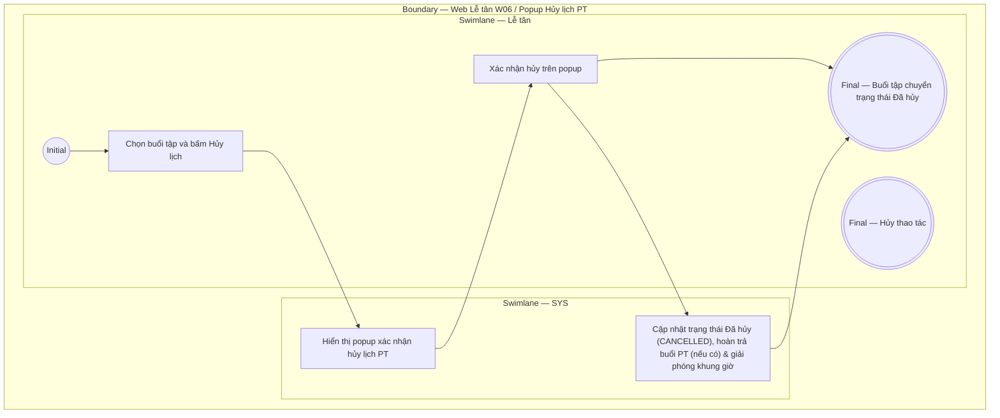

# LT-W06-US04 - Hủy lịch PT

## Preconditions
- Lễ tân đã đăng nhập, buổi tập PT chưa ở trạng thái `Hoàn thành` (COMPLETED).

## Trigger
- Lễ tân chọn nút **Hủy lịch** tại buổi tập trên màn hình lịch PT (W06).
- Màn hình liên quan: Web Lễ tân — W06 Lịch tập PT, popup **Xác nhận hủy lịch PT**.

## Main Flow

1. Lễ tân chọn buổi tập cần hủy trên màn hình lịch PT (W06) và bấm **Hủy lịch**.
2. SYS hiển thị popup xác nhận hủy lịch PT.
3. Lễ tân chọn **Xác nhận hủy**.
4. SYS cập nhật trạng thái buổi tập thành `Đã hủy` (CANCELLED), giải phóng khung giờ trên lịch PT và ghi audit log.
5. Nếu buổi tập từng bị trừ số buổi PT dở dang, SYS tự động hoàn trả lại 1 buổi vào gói tập của hội viên.

- **Business rules / logic:**
  - Hủy lịch PT giải phóng khung giờ để có thể đặt lịch mới.
  - Buổi tập đã hoàn thành không được phép hủy qua thao tác này.

## Alternate Flows

### AF-01 - Hủy Thao Tác
1. Lễ tân chọn **Hủy** trên popup xác nhận.
2. SYS đóng popup và giữ nguyên lịch PT hiện tại.

## Exception Flows
- Buổi tập đã hoàn thành: SYS từ chối thao tác hủy.

## Activity Diagram — Swimlane
**Trigger:** Lễ tân bấm Hủy lịch tại buổi tập trong menu W06.

