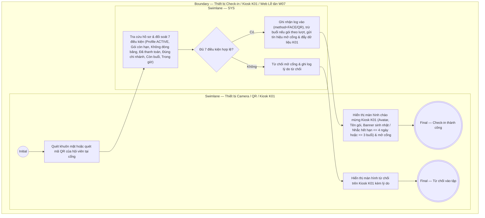

# LT-W07-US01 - Xử lý check-in tự động qua thiết bị

## Preconditions
- Hệ thống đã tích hợp và kết nối thành công với Camera nhận diện khuôn mặt / Đầu đọc mã QR / Kiosk hiển thị chào mừng (K01) tại chi nhánh.
- Hệ thống đã có dữ liệu hồ sơ hội viên (`MEMBER_PROFILES`) và các gói đăng ký (`REGISTRATIONS`).

## Trigger
- Hội viên tới phòng Gym và đưa khuôn mặt trước camera nhận diện, hoặc đưa mã QR trên app Mobile Hội viên trước máy quét QR tại cổng.
- Màn hình liên quan: Màn hình Kiosk chào mừng K01 và nhật ký thời gian thực trên Web Lễ tân — W07 Ra / Vào.

## Quy tắc sắp hết hạn
- Gói đã thanh toán, đang có hiệu lực và chưa hết hạn: theo thời gian còn <= 4 ngày, theo buổi còn <= 3 buổi; Combo dùng OR giữa các quyền lợi áp dụng. Nguồn hiển thị là is_expiring và display_status do SYS/API tính; status nội bộ ACTIVE vẫn dùng cho kiểm tra quyền tập. Không tạo enum/field DB mới và không tự tính ngưỡng riêng trên UI.

## Main Flow

1. Hội viên tới phòng Gym và thực hiện check-in qua 1 trong 2 thiết bị tự động:
   - **Khuôn mặt (Face Recognition):** Đứng trước camera nhận diện.
   - **Mã QR (QR Scanner):** Đưa mã QR trên màn hình app Mobile Hội viên trước đầu đọc QR.
2. Thiết bị gửi định danh khuôn mặt / mã QR tới SYS.
3. SYS tự động tra cứu hồ sơ và kiểm tra đối soát **7 điều kiện hợp lệ** để vào tập:
   - **ĐIỀU KIỆN 1**: `MEMBER_PROFILES` của hội viên đang ở trạng thái `ACTIVE` (Hoạt động).
   - **ĐIỀU KIỆN 2**: Hội viên sở hữu gói Gym còn hiệu lực thời hạn.
   - **ĐIỀU KIỆN 3**: Gói Gym không ở trạng thái bị đóng băng (`is_frozen = false`).
   - **ĐIỀU KIỆN 4**: Gói đăng ký đã được thanh toán 100% (không ở trạng thái `PENDING_PAYMENT`).
   - **ĐIỀU KIỆN 5**: Chi nhánh hiện tại nằm trong phạm vi chi nhánh được phép sử dụng của gói.
   - **ĐIỀU KIỆN 6**: Nếu gói Gym tính theo số buổi: Số buổi tập khả dụng còn lại (`remaining_sessions` > 0).
   - **ĐIỀU KIỆN 7**: Thời điểm quét nằm trong khung giờ hoạt động hàng ngày của chi nhánh.
4. Nếu **ĐỦ ĐIỀU KIỆN HỢP LỆ**:
   - SYS ghi nhận sự kiện `VÀO` (`direction` = `IN`, `checkin_method` = `FACE` hoặc `QR`).
   - Nếu gói Gym tính theo buổi: SYS trừ 1 buổi tập khả dụng (`remaining_sessions` = `remaining_sessions` - 1).
   - SYS gửi tín hiệu mở cổng / cửa cho hội viên vào tập.
   - SYS truyền dữ liệu hiển thị lên màn hình **Kiosk chào mừng K01**:
     * Hiển thị Avatar, Họ tên, Mã hội viên, Tên gói tập Gym đang dùng.
     * **Cảnh báo sắp hết hạn**: Nếu gói Gym có is_expiring = true (<= 4 ngày hoặc <= 3 buổi), Kiosk hiển thị thông báo nhắc nhở màu cam: *"Gói tập của bạn sẽ hết hạn trong X ngày nữa. Vui lòng liên hệ Lễ tân để gia hạn kịp thời!"* để Lễ tân mời chào gia hạn ngay tại quầy.
     * **Chúc mừng sinh nhật**: Nếu ngày check-in trùng với ngày sinh của hội viên (theo ngày/tháng sinh trong hồ sơ), Kiosk hiển thị banner rực rỡ với lời chúc: *"Chúc mừng sinh nhật [Họ tên]! Paradise Gym chúc bạn tuổi mới ngập tràn năng lượng và sức khỏe!"*.
5. Nếu **KHÔNG ĐỦ ĐIỀU KIỆN**:
   - SYS từ chối mở cửa.
   - SYS hiển thị màn hình từ chối trên Kiosk K01 kèm lý do (Gói hết hạn, Gói đang đóng băng, Chưa thanh toán, Sai chi nhánh, Hết số buổi, Ngoài giờ).
   - SYS ghi log sự kiện từ chối vào `access_logs`.

- **Business rules / logic:**
  - Hỗ trợ 3 phương thức check-in: Quét khuôn mặt, Quét mã QR trên app Mobile, và Lễ tân ghi nhận thủ công tại quầy (`LT-W07-US02`).
  - Màn hình Kiosk K01 đóng vai trò hỗ trợ Lễ tân nhận diện hội viên, phát hiện ngay hội viên sắp hết hạn (<= 4 ngày hoặc <= 3 buổi) và hội viên có sinh nhật hôm nay để chủ động tương tác.

- Cảnh báo K01 chọn nội dung theo nguyên nhân do SYS trả: còn X ngày hoặc còn Y buổi; Combo có thể hiển thị cả hai. Không hiển thị giá hay dữ liệu thanh toán; cảnh báo không tự từ chối check-in khi quyền tập còn hợp lệ.

## Exception Flows
- **Thiết bị mất kết nối / không nhận diện được:** Chuyển sang luồng xử lý thủ công tại quầy Lễ tân ở `LT-W07-US02`.

## Activity Diagram — Swimlane
**Trigger:** Hội viên quét khuôn mặt hoặc quét mã QR tại cổng chi nhánh.

