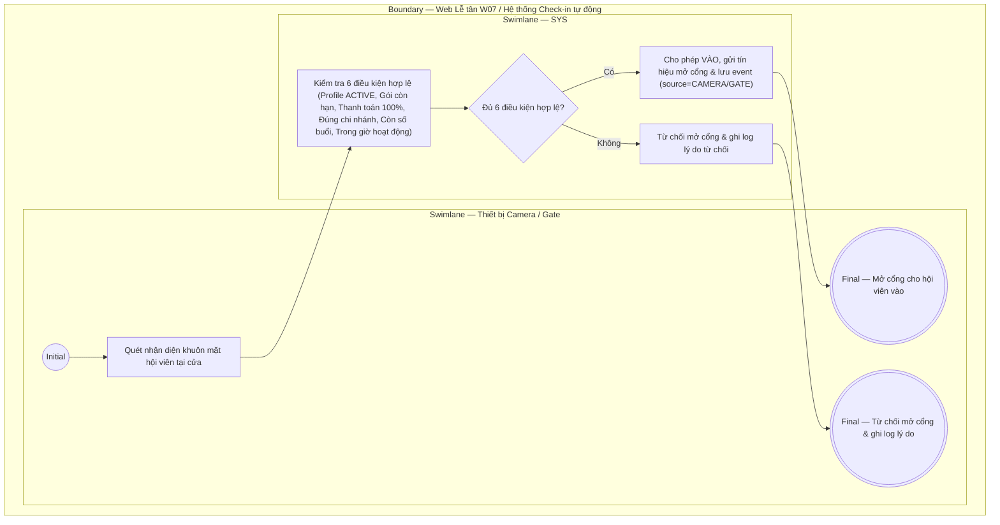

# LT-W07-US01 - Xử lý check-in tự động qua thiết bị

## Preconditions
- Hệ thống đã tích hợp và kết nối thành công với Camera / Thiết bị nhận diện khuôn mặt / Cổng kiểm soát ra vào tại chi nhánh.
- Hệ thống đã có dữ liệu hồ sơ hội viên (`MEMBER_PROFILE`) và các gói đăng ký (`Registration`).

## Trigger
- Hội viên tới phòng Gym và được Camera / thiết bị nhận diện quét tự động tại cửa.
- Màn hình liên quan: Tương tác sự kiện tự động giữa thiết bị và SYS (xem nhật ký thời gian thực trên Web Lễ tân — W07 Ra / Vào).

## Main Flow

1. Hội viên tới phòng Gym.
2. Camera / thiết bị nhận diện khuôn mặt / cổng kiểm soát tự động quét và nhận diện khuôn mặt hội viên.
3. SYS tự động nạp hồ sơ và kiểm tra đối soát **6 điều kiện hợp lệ** để vào tập:
   - **ĐIỀU KIỆN 1**: `MEMBER_PROFILE` của hội viên đang ở trạng thái `ACTIVE` (Hoạt động).
   - **ĐIỀU KIỆN 2**: Hội viên sở hữu gói Gym entitlement còn hiệu lực thời hạn.
   - **ĐIỀU KIỆN 3**: Gói đăng ký đã được thanh toán 100% (không ở trạng thái `PENDING_PAYMENT`).
   - **ĐIỀU KIỆN 4**: Chi nhánh hiện tại nằm trong phạm vi chi nhánh được phép sử dụng của gói.
   - **ĐIỀU KIỆN 5**: Nếu gói Gym tính theo số buổi: Số buổi tập khả dụng còn lại (`remaining_sessions` > 0).
   - **ĐIỀU KIỆN 6**: Thời điểm quét nằm trong khung giờ hoạt động hàng ngày của chi nhánh.
4. Nếu **ĐỦ ĐIỀU KIỆN HỢP LỆ**:
   - SYS ghi nhận sự kiện `VÀO` (`direction` = `IN`, `source` = `CAMERA` / `GATE`).
   - SYS gửi tín hiệu phát lệnh mở cổng / cửa cho hội viên vào tập.
5. Nếu **KHÔNG ĐỦ ĐIỀU KIỆN**:
   - SYS từ chối mở cửa.
   - SYS ghi log sự kiện từ chối kèm lý do từ chối cụ thể (Gói hết hạn, Chưa thanh toán, Sai chi nhánh, Hết số buổi, Ngoài giờ hoạt động).

- **Business rules / logic:**
  - Mọi sự kiện quét tự động qua thiết bị đều phải qua kiểm soát 6 điều kiện độc lập trước khi mở cổng.
  - Toàn bộ sự kiện thành công hay từ chối đều được lưu vết nhật ký tự động.

## Exception Flows
- Thiết bị mất kết nối / không nhận diện được khuôn mặt: Chuyển sang luồng xử lý thủ công tại `LT-W07-US02`.

## Activity Diagram — Swimlane
**Trigger:** Camera / Thiết bị quét tự động nhận diện hội viên tại cổng chi nhánh.

