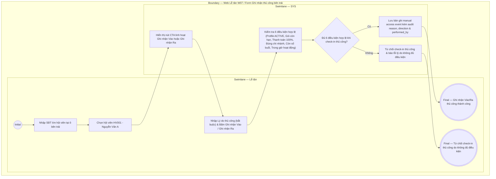

# LT-W07-US02 - Ghi nhận Vào/Ra thủ công

## Preconditions
- Lễ tân đã đăng nhập vào Web Lễ tân, mở menu **W07 · Ra / Vào** trong chi nhánh phục vụ.
- Hệ thống đã có dữ liệu hồ sơ hội viên (`MEMBER_PROFILE`) và các gói đăng ký (`Registration`).

## Trigger
- Thiết bị nhận diện gặp sự cố hoặc hội viên cần hỗ trợ check-in/out thủ công tại quầy.
- Màn hình liên quan: Web Lễ tân — W07 Ra / Vào, khu vực Ghi nhận thủ công (bên trái).

## Main Flow

1. Lễ tân thao tác tại khu vực **Ghi nhận Vào/Ra thủ công** (phần bên trái màn hình W07).
2. Lễ tân nhập SĐT hội viên vào ô `Tìm hội viên`.
3. SYS hiển thị danh sách hội viên gợi ý ➔ Lễ tân chọn đúng hội viên (ví dụ: `HV001 - Nguyễn Văn A`).
4. SYS kiểm tra trạng thái check-in hiện tại của hội viên để điều chỉnh nút CTA linh hoạt:
   - Nếu hội viên chưa vào: Nút CTA hiển thị là **`Ghi nhận Vào`**.
   - Nếu hội viên đang ở trạng thái đã vào mà chưa ra: Nút CTA tự động đổi thành **`Ghi nhận Ra`**.
5. Lễ tân nhập **Lý do thao tác thủ công** (Trường **BẮT BUỘC** nhập giải trình để lưu audit trail kỹ lưỡng).
6. Lễ tân bấm nút CTA (**Ghi nhận Vào** hoặc **Ghi nhận Ra**).
7. **SYS VẪN KIỂM TRA TOÀN BỘ 6 ĐIỀU KIỆN HỢP LỆ** (MEMBER_PROFILE active, gói còn hạn, thanh toán 100%, đúng chi nhánh, còn số buổi, trong giờ hoạt động). Tuyệt đối Lễ tân **không được dùng thủ công để bypass gói hết hạn hoặc chưa thanh toán**.
8. Nếu đủ điều kiện hợp lệ:
   - SYS ghi nhận bản ghi access event thủ công lưu vết audit: `member`, `branch`, `direction` (`IN` / `OUT`), `source` = `MANUAL`, `performed_by` (tài khoản Lễ tân), `reason` (lý do bắt buộc), `timestamp`.
   - SYS làm mới form thủ công và đẩy sự kiện lên Bảng Nhật ký Ra/Vào.

### Field-level specification — Form Ghi nhận Vào/Ra thủ công (Bên trái)

| Field / control | State | Required | Conditional / dynamic | Source / validation |
|---|---|---|---|---|
| Tìm hội viên (Ô tìm kiếm SĐT) | `USER-INPUT` | required | `DYNAMIC`: Nhập SĐT để tìm và chọn đúng hội viên trong hệ thống | Tra cứu từ Member catalog |
| Hội viên chọn | `READONLY` | required | `DYNAMIC`: Prefill Mã hội viên và Họ tên (ví dụ: `HV001 - Nguyễn Văn A`) | Dữ liệu hội viên chọn |
| Lý do thao tác thủ công | `USER-INPUT` | required | `DYNAMIC`: Bắt buộc nhập giải trình lý do thao tác thủ công để audit kỹ | Lễ tân nhập |
| Nút CTA Ghi nhận (Vào / Ra) | `USER-INPUT` | required | `DYNAMIC`: Hiển thị **`Ghi nhận Vào`** nếu hội viên chưa vào; đổi thành **`Ghi nhận Ra`** nếu hội viên đang ở trong Gym | Trạng thái check-in hiện tại của hội viên |

- **Business rules / logic:**
  - Quy tắc kiểm tra điều kiện áp dụng đồng nhất cho cả luồng tự động và luồng thủ công. Thao tác thủ công chỉ thay thế phương thức nhận diện thiết bị, tuyệt đối không bypass điều kiện hợp lệ của gói.
  - Lý do thao tác thủ công là trường bắt buộc để lưu vết audit trail.

## Exception Flows
- Hội viên không đủ điều kiện khi ghi nhận thủ công (gói hết hạn / chưa thanh toán / sai chi nhánh): SYS hiển thị thông báo lỗi từ chối và không cho ghi nhận check-in.

## Activity Diagram — Swimlane
**Trigger:** Lễ tân nhập SĐT tìm hội viên và bấm nút Ghi nhận Vào / Ghi nhận Ra thủ công.

