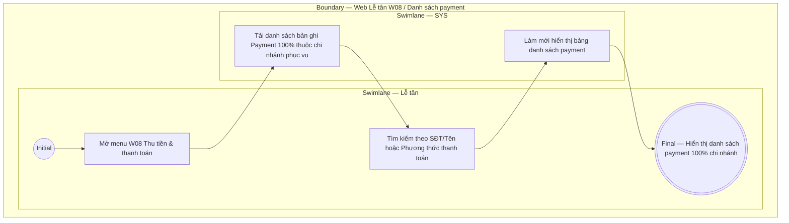

# LT-W08-US01 - Xem danh sách payment

## Preconditions
- Lễ tân đã đăng nhập vào Web Lễ tân, có quyền thu tiền và truy cập menu W08 Thu tiền & thanh toán.
- Hệ thống đã có các bản ghi Payment (giao dịch thu tiền thành công 100%) trong chi nhánh phục vụ.

## Trigger
- Lễ tân chọn menu **W08 · Thu tiền & thanh toán** trên thanh điều hướng chính.
- Màn hình liên quan: Web Lễ tân — W08 Thu tiền & thanh toán, tab Danh sách payment.

## Main Flow

1. Lễ tân truy cập menu W08.
2. SYS nạp và hiển thị **Danh sách payment** thuộc chi nhánh phục vụ dưới dạng bảng bao gồm các thông tin giao dịch thu tiền thành công 100%:
   - **Mã Payment**: Mã phiếu thu / giao dịch duy nhất (ví dụ: `PAY-001`).
   - **Hội viên**: Tên và số điện thoại hội viên thực hiện thanh toán.
   - **Mã Đăng ký (Registration)**: Mã đăng ký gói liên kết (ví dụ: `DK001`).
   - **Gói tập**: Tên gói tập đăng ký tương ứng.
   - **Số tiền thanh toán**: Số tiền 100% thực thu.
   - **Phương thức thanh toán**: Nhãn hình thức (`Tiền mặt` hoặc `Chuyển khoản`).
   - **Ngày / Giờ thanh toán**: Thời điểm ghi nhận giao dịch thành công.
   - **Người ghi nhận**: Tài khoản thực hiện tạo payment.
   - **Thao tác**: Nút **Xem / In phiếu thu** cho hội viên.
3. Lễ tân có thể tìm kiếm theo Mã Payment, Mã Registration, Tên hội viên hoặc SĐT và lọc theo Phương thức thanh toán.

- **Business rules / logic:**
  - **Quy tắc về trạng thái Payment**: Payment chỉ được lưu vết khi đã thu tiền thành công 100%. **Hệ thống tuyệt đối không tồn tại Payment ở trạng thái Pending (chờ thanh toán)**. Trạng thái Pending chỉ dành cho bản ghi Đăng ký (Registration).
  - Lễ tân chỉ xem danh sách payment thuộc phạm vi chi nhánh làm việc.

## Exception Flows
- Không tìm thấy giao dịch thỏa mãn điều kiện tìm kiếm: SYS hiển thị thông báo danh sách trống.

## Activity Diagram — Swimlane
**Trigger:** Lễ tân mở tab Danh sách payment tại menu W08.

