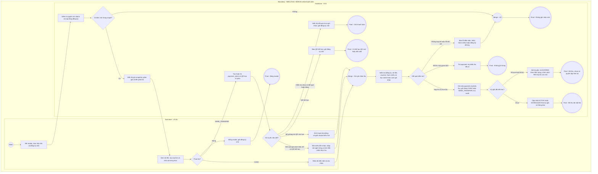

# LT-W08-US02 - Tạo payment

## Preconditions
- Lễ tân đăng nhập, có quyền thu tiền trong chi nhánh phục vụ của Lễ tân.
- Đăng ký còn chờ thanh toán (PENDING_PAYMENT); chưa có payment thành công.

## Trigger
- Bấm Ghi nhận thanh toán ở W08, Thu tiền ở W04 hoặc chuyển tiếp sau lưu đăng ký/gia hạn.

## Main Flow
1. SYS mở modal Ghi nhận thanh toán; Lễ tân tìm Hội viên bằng tên, mã hoặc SĐT.
2. SYS nạp các đăng ký chờ của đúng hội viên trong scope. Lễ tân chọn đăng ký; nếu mở từ W04 thì prefill đúng đăng ký đó.
3. SYS hiển thị giá snapshot, voucher và số tiền phải trả 100% sau giảm giá; không cho nhập khoản thu thiếu.
4. Lễ tân chọn CASH hoặc BANK_TRANSFER và nhập ghi chú tùy chọn. Với CASH, nhận đủ tiền thực tế rồi bấm xác nhận.
5. SYS kiểm tra lại quyền, đăng ký còn chờ, số tiền/voucher và chưa thu; ghi đúng một payment thành công không có status, đúng một phiếu thu, audit và thông báo.
6. Với kỳ gốc chưa kết thúc, đăng ký chuyển ACTIVE khi đã đến ngày bắt đầu hoặc SCHEDULED nếu ngày bắt đầu ở tương lai. Kỳ gốc đã kết thúc: giữ EXPIRED theo hiện trạng và PAY-OQ-01 còn mở, không tự dời ngày. Làm mới W04, W08 và gói/lịch sử thanh toán của đúng hội viên.

### Field-level specification — Modal Ghi nhận thanh toán
| Field / control | Loại UI Control | State | Required | Conditional / dynamic | Source / validation |
| --- | --- | --- | --- | --- | --- |
| Hội viên cần thanh toán | Search Combobox | USER-INPUT / PREFILL | required | TRIGGER | Tên/mã/SĐT từ hồ sơ trong scope có đăng ký chờ; chọn mới xóa lựa chọn đăng ký cũ. |
| Gói tập đăng ký chờ thanh toán | Select Box | USER-INPUT / PREFILL | required | DYNAMIC: luôn hiện, danh sách đổi theo Hội viên | Mã ĐK, tên gói, kỳ hiệu lực và giá từ đăng ký chờ; prefill khi mở từ W04; không có đơn thì báo rỗng. |
| Số tiền thanh toán 100% | Currency | READONLY | required | Không | Snapshot đăng ký và giảm giá hợp lệ; phải thu đủ 100% một lần. |
| Mã giảm giá / Voucher (nếu có) | Searchable Select Box | USER-INPUT / PREFILL | optional | TRIGGER | Voucher hợp lệ theo chi nhánh/đăng ký; kiểm tra trước tạo yêu cầu, đổi mã phải cập nhật yêu cầu QR và số tiền. |
| Số tiền giảm | Currency | READONLY / AUTO-FILL | required | Không | Kết quả xác thực voucher, mặc định 0. |
| Phương thức thanh toán | Radio Group | USER-INPUT / PREFILL | required | TRIGGER | CASH hoặc BANK_TRANSFER; mặc định CASH cho thu tiền mặt mới. Khi đối soát yêu cầu chuyển khoản giữ BANK_TRANSFER, không đổi sang CASH. |
| Mã QR VietQR | QR Image | READONLY | conditional | CONDITIONAL: hiện khi BANK_TRANSFER có yêu cầu còn hạn; ẩn khi CASH hoặc QR hết hạn | Nguồn payment_intents; chính xác tài khoản, số tiền và nội dung chuyển khoản; chưa tạo payment. |
| Ngân hàng / Số tài khoản / Chủ tài khoản | Readonly Text | READONLY | conditional | CONDITIONAL: hiện khi BANK_TRANSFER; ẩn khi CASH | Thông tin thụ hưởng từ cấu hình chi nhánh do SYS cung cấp. |
| Nội dung chuyển khoản | Readonly Text | READONLY | conditional | CONDITIONAL: hiện khi BANK_TRANSFER; ẩn khi CASH | Nội dung liên kết đúng yêu cầu QR và đăng ký do SYS sinh. |
| Hạn QR / thời gian còn lại | Countdown / Text | READONLY | conditional | CONDITIONAL: hiện khi có yêu cầu BANK_TRANSFER; ẩn khi CASH hoặc chưa có yêu cầu | Hết hạn sau 15 phút từ lúc tạo yêu cầu; hết hạn QR không hủy đăng ký. |
| Ghi chú giao dịch | Text Area | USER-INPUT | optional | Không | Nhân viên nhập tối đa 255 ký tự; không thay thế mã giao dịch đối soát. |

Thao tác modal: Áp dụng/Bỏ voucher, xác nhận CASH, tạo/làm mới QR, kiểm tra kết quả đã ghi nhận, đối soát thủ công, mô phỏng chuyển khoản trong kiểm thử, Đóng. Các nút submit/cancel không nằm trong bảng field của form.

### Field-level specification — Modal Xác nhận đối chiếu thanh toán
Modal chỉ mở khi đối chiếu thủ công yêu cầu BANK_TRANSFER; không mở cho CASH. Các field bên dưới luôn hiển thị trong modal này.

| Field / control | Loại UI Control | State | Required | Conditional / dynamic | Source / validation |
| --- | --- | --- | --- | --- | --- |
| Giao dịch | Readonly Text | READONLY | required | Không | payment_code hoặc ID của yêu cầu được chọn. |
| Số tiền | Currency | READONLY | required | Không | amount của yêu cầu; phải kiểm chứng đã nhận đủ. |
| Phương thức | Readonly Text | READONLY | required | Không | BANK_TRANSFER của yêu cầu được chọn. |
| Mã giao dịch trên chứng từ ngân hàng | Textbox | USER-INPUT | required | Không | transaction_ref; tối đa 100 ký tự, bỏ khoảng trắng đầu/cuối; không rỗng hoặc trùng giao dịch khác. |
| Ghi chú đối soát | Textarea | PREFILL | optional | Không | Ghi chú ban đầu được truyền từ yêu cầu; cho sửa, tối đa 255 ký tự. |
| Đối chiếu thực thu | Checkbox | USER-INPUT | required | Không | Ban đầu chưa tích; phải tích xác nhận đã đối chiếu và nhận đủ số tiền trước khi submit. |

Thao tác: Xác nhận đã nhận đủ tiền hoặc Đóng. Không đưa các nút form vào bảng field.

## Alternate Flows
### AF-01 - Chuyển khoản qua QR
1. Chọn BANK_TRANSFER: SYS tạo hoặc trả yêu cầu QR còn hiệu lực trong payment_intents. Chưa tạo payments/phiếu thu.
2. Hội viên quét QR chuyển khoản đủ số tiền. Nhân viên kiểm tra kết quả đã ghi nhận trong hệ thống; giai đoạn này không yêu cầu IPN/webhook hay API truy vấn ngân hàng tự động.
3. Nếu chưa có kết quả, giữ đăng ký chờ và dùng AF-02 để đối soát. Luồng kiểm thử chủ động dùng AF-03.
### AF-02 - Đối soát chuyển khoản thủ công
1. Nhân viên chọn đối soát đúng đăng ký/yêu cầu. SYS mở modal Xác nhận đối chiếu thanh toán; nhân viên kiểm chứng giao dịch thực nhận, nhập Mã giao dịch trên chứng từ ngân hàng và tích Đối chiếu thực thu sau khi đã nhận đủ tiền.
2. Xác nhận; SYS kiểm tra quyền, số tiền, mã tham chiếu không trùng và đăng ký còn chờ. Ghi payment BANK_TRANSFER, phiếu thu và kích hoạt đúng một lần như bước 5-6. Không ghi CASH thay cho chuyển khoản.
3. QR đã hết hạn nhưng tiền đã tới: vẫn đối soát theo tham chiếu thực tế nếu đăng ký còn chờ; không dùng QR hết hạn để mô phỏng chuyển khoản.
### AF-03 - Mô phỏng chuyển khoản có chủ đích để kiểm thử
1. Với yêu cầu QR còn hạn và đăng ký còn chờ, kích hoạt mô phỏng chuyển khoản.
2. SYS đi qua cùng kiểm tra và ghi nhận BANK_TRANSFER thành công đúng một lần. Đây là luồng kiểm thử được duyệt, không phải bằng chứng tiền thật hoặc IPN.
### AF-04 - QR hết hạn, đổi voucher hoặc đóng modal
1. Hết 15 phút, yêu cầu QR hết hiệu lực; đổi voucher tạo/cập nhật yêu cầu với số tiền mới và vô hiệu yêu cầu cũ. Không đổi đăng ký thành đã hủy.
2. Người dùng có thể tạo QR mới cho cùng đăng ký hoặc đóng modal. Đăng ký còn chờ tới khi thanh toán hoặc được hủy chủ động tại W04/HV03, kể cả sau 3 ngày.

## Exception Flows
- Trường hợp thanh toán khi toàn bộ kỳ gốc đã qua: PAY-OQ-01 còn mở; hiện giữ ngày gốc và trả EXPIRED, không tự dời ngày và không cam kết quyền tập ACTIVE/SCHEDULED.

- Chưa tích Đối chiếu thực thu: báo Cần xác nhận đã đối chiếu và nhận đủ số tiền, không gửi ghi nhận thanh toán.
- Không tìm thấy đơn, sai scope/quyền, thiếu mã giao dịch, số tiền không đủ hoặc voucher không hợp lệ: báo lỗi, không tạo payment/phiếu thu và không kích hoạt.
- Yêu cầu QR hết hạn/đã thay thế: từ chối mô phỏng/xác nhận tự động; tạo QR mới hoặc đối soát giao dịch thật.
- Đăng ký đã hủy: không cho thanh toán qua yêu cầu cũ. Thanh toán và hủy cùng lúc: kiểm tra lại trạng thái, chỉ một kết quả có hiệu lực.
- Gửi lại yêu cầu đã thu: trả kết quả đã ghi nhận; không thêm payment, phiếu thu hoặc doanh thu lần hai. Mã ngân hàng đã dùng cho đơn khác bị từ chối.
- Lỗi kết nối: báo chưa xác định kết quả, tải lại đúng đăng ký trước khi thử tiếp; không mặc định thành công.

## Activity Diagram — Swimlane

