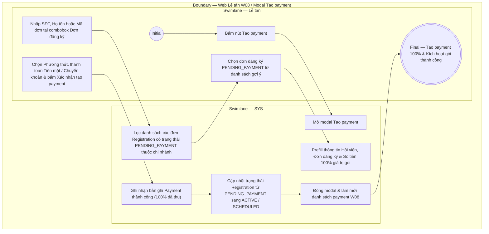

# LT-W08-US02 - Tạo payment

## Preconditions
- Lễ tân đã đăng nhập vào Web Lễ tân, có quyền thu tiền tại quầy.
- Đã tồn tại bản ghi Đăng ký gói tập (`Registration`) ở trạng thái **`PENDING_PAYMENT` (Chờ thanh toán)** trong chi nhánh.

## Trigger
- Lễ tân bấm nút **Tạo payment** trên màn hình W08 (hoặc được hệ thống tự động chuyển tiếp sau khi tạo đăng ký mới tại W04).
- Màn hình liên quan: Web Lễ tân — W08 Thu tiền & thanh toán, modal **Tạo payment** (`payment-form`).

## Main Flow

1. Lễ tân bấm nút **Tạo payment**.
2. SYS mở modal **Tạo payment**.
3. Tại ô nhập liệu/combobox **Đơn đăng ký**, Lễ tân nhập SĐT người dùng, Họ tên người dùng hoặc Mã đơn đăng ký.
4. SYS tự động lọc và hiển thị danh sách các Đơn đăng ký (`Registration`) thỏa mãn điều kiện tìm kiếm và đang ở trạng thái **`PENDING_PAYMENT` (Chờ thanh toán)** thuộc chi nhánh.
5. Lễ tân chọn Đơn đăng ký cần thu tiền từ danh sách gợi ý.
6. SYS tự động nạp và prefill toàn bộ thông tin đơn đăng ký lên form:
   - Thông tin hội viên (Họ tên, SĐT).
   - Mã đăng ký và Tên gói tập tương ứng.
   - Số tiền thanh toán 100% (Giá niêm yết của gói đăng ký, thanh toán 1 lần duy nhất).
7. Lễ tân chọn **Phương thức thanh toán**: `Tiền mặt` (`CASH`) hoặc `Chuyển khoản` (`BANK_TRANSFER`).
8. Lễ tân bấm nút **Xác nhận tạo payment**.
9. SYS kiểm tra tính hợp lệ và ghi nhận giao dịch Payment thành công (100% số tiền đã thu, tuyệt đối không có trạng thái Pending cho bản ghi Payment).
10. SYS tự động chuyển trạng thái Đơn đăng ký (`Registration`) từ `PENDING_PAYMENT` sang **`ACTIVE`** (hoặc **`SCHEDULED`** nếu ngày bắt đầu gói ở tương lai).
11. SYS đóng modal, làm mới danh sách payment W08 và cho phép Lễ tân xem/in phiếu thu cho hội viên tại quầy.

### Field-level specification — Modal Tạo payment

| Field / control | State | Required | Conditional / dynamic | Source / validation |
|---|---|---|---|---|
| Ô tìm kiếm Đơn đăng ký | `USER-INPUT` | required | `DYNAMIC`: Hỗ trợ gõ SĐT, Họ tên người dùng hoặc Mã đơn đăng ký để lọc danh sách các đơn đang ở trạng thái `PENDING_PAYMENT` | Tra cứu từ danh sách Registration chi nhánh |
| Đơn đăng ký chọn | `USER-INPUT` | required | `DYNAMIC`: Lễ tân chọn 1 đơn đăng ký `PENDING_PAYMENT` từ dropdown danh sách gợi ý | Combobox đơn đăng ký |
| Thông tin Hội viên & Gói tập | `READONLY` | required | `DYNAMIC`: Prefill Họ tên, SĐT hội viên, Mã đăng ký và Tên gói tập từ đơn được chọn | Registration được chọn |
| Số tiền thanh toán | `READONLY (PREFILL)` | required | `DYNAMIC`: Prefill 100% giá trị gói đăng ký; thanh toán 1 lần duy nhất | Bảng giá gói đăng ký |
| Phương thức thanh toán | `USER-INPUT` | required | `DYNAMIC`: Chọn `Tiền mặt` (`CASH`) hoặc `Chuyển khoản` (`BANK_TRANSFER`) | Select dropdown hình thức |
| Ghi chú thanh toán | `USER-INPUT` | optional | `DYNAMIC`: Lễ tân nhập ghi chú cho giao dịch nếu có | Lễ tân nhập |

- **Business rules / logic:**
  - **Quy trình kích hoạt gói**: `Registration (PENDING_PAYMENT)` ➔ **Tạo Payment (100% thành công)** ➔ `Registration (ACTIVE / SCHEDULED)`.
  - Payment được tạo ra luôn ở trạng thái đã hoàn tất (100% đã thu tiền). Tuyệt đối không tồn tại trạng thái Pending đối với bản ghi Payment.
  - Hệ thống hoàn toàn không có module giảm giá hay tính toán trừ giảm giá.

## Exception Flows
- Không tìm thấy đơn đăng ký nào ở trạng thái `PENDING_PAYMENT` theo thông tin nhập: SYS hiển thị thông báo "Không tìm thấy đơn đăng ký chờ thanh toán phù hợp".

## Activity Diagram — Swimlane
**Trigger:** Lễ tân bấm nút Tạo payment tại menu W08.

