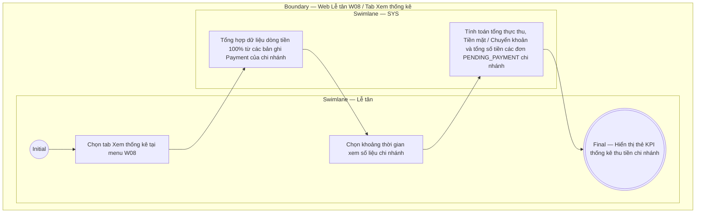

# LT-W08-US03 - Xem thống kê

## Preconditions
- Lễ tân đã đăng nhập vào Web Lễ tân, có quyền thu tiền và đang ở menu W08 Thu tiền & thanh toán trong chi nhánh phục vụ.

## Trigger
- Lễ tân chọn tab **Xem thống kê** tại menu W08.
- Màn hình liên quan: Web Lễ tân — W08 Thu tiền & thanh toán, tab Thống kê thanh toán.

## Main Flow

1. Lễ tân chuyển sang tab **Xem thống kê** trên màn hình W08.
2. SYS nạp và hiển thị các thẻ KPI thống kê thu tiền thuộc chi nhánh phục vụ:
   - **Tổng doanh thu thực thu 100% trong ngày/kỳ**: Tổng số tiền đã thu từ các bản ghi Payment thành công tại quầy chi nhánh.
   - **Thống kê theo Tiền mặt**: Số tiền thực thu bằng hình thức tiền mặt tại chi nhánh.
   - **Thống kê theo Chuyển khoản**: Số tiền thực thu qua QR / Chuyển khoản ngân hàng tại chi nhánh.
   - **Số lượt Payment đã hoàn tất**: Tổng số bản ghi Payment Lễ tân đã khởi tạo thành công.
   - **Tổng số tiền chờ thanh toán**: Tổng số tiền ở các đơn đăng ký (`Registration`) có trạng thái `PENDING_PAYMENT` (Chờ thanh toán) chưa được tạo payment tại chi nhánh.
3. Lễ tân chọn khoảng thời gian (Hôm nay, Tuần này, Tháng này) để xem thống kê.
4. SYS cập nhật số liệu thống kê thu tiền chi nhánh theo điều kiện chọn.

- **Business rules / logic:**
  - Thống kê thu tiền phản ánh chính xác dòng tiền thực thu 100% tại quầy từ các bản ghi Payment thành công của chi nhánh.
  - Phân định rõ ràng số tiền thực thu đã hoàn tất giao dịch và tổng số tiền ở các đơn đăng ký đang chờ thanh toán (`PENDING_PAYMENT`).

## Activity Diagram — Swimlane
**Trigger:** Lễ tân mở tab Xem thống kê tại menu W08.

