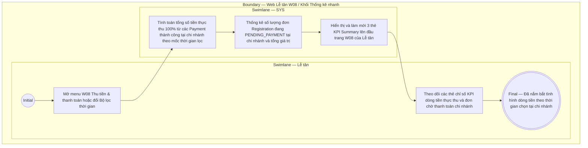

# LT-W08-US03 - Xem thống kê

## Preconditions
- Lễ tân đã đăng nhập vào Web Lễ tân, có quyền thu tiền và đang ở menu W08 Thu tiền & thanh toán trong chi nhánh phục vụ.

## Trigger
- Lễ tân truy cập menu **W08 · Thu tiền & thanh toán** trên thanh điều hướng chính hoặc thay đổi giá trị tại **Bộ lọc thời gian thanh toán**.
- Màn hình liên quan: Web Lễ tân — W08 Thu tiền & thanh toán, Khối Thống kê nhanh (KPI Summary Cards).

## Main Flow

1. Lễ tân truy cập menu W08 Thu tiền & thanh toán (hoặc điều chỉnh giá trị tại Bộ lọc thời gian thanh toán).
2. SYS tự động tổng hợp và hiển thị **Khối Thống kê nhanh (KPI Summary Cards)** thuộc chi nhánh phục vụ ở phần trên cùng của màn hình theo mốc thời gian đã chọn (mặc định là Hôm nay `TODAY`):
   - **Thẻ Tổng thực thu**: Tổng số tiền thực thu 100% từ các giao dịch thanh toán thành công trong mốc thời gian lọc tại chi nhánh (ví dụ: `5.650.000 đ`). Có nút badge `[Lọc]` / `[✓ Đang lọc]`.
   - **Thẻ Lượt thanh toán thành công**: Tổng số lượt giao dịch payment đã thu tiền thành công 100% trong mốc thời gian lọc tại chi nhánh (ví dụ: `12 lượt`). Có nút badge `[Lọc]` / `[✓ Đang lọc]`.
   - **Thẻ Đơn chờ thanh toán**: Tổng số lượng đơn đăng ký (`Registration`) đang ở trạng thái `PENDING_PAYMENT` và tổng giá trị các đơn này tại chi nhánh đang chờ khách đóng tiền để kích hoạt gói (ví dụ: `3 đơn · 4.500.000 đ`). Có nút badge `[↗ Xem đơn]`.
3. Lễ tân theo dõi các chỉ số tài chính dòng tiền thực thu và tình hình các đơn chờ thanh toán tại chi nhánh theo thời gian thực.
4. Khi Lễ tân chọn ngày khác hoặc khoảng ngày tại **Bộ lọc thời gian thanh toán**, SYS lập tức tính toán và làm mới số liệu của cả 3 thẻ KPI đồng bộ với bảng danh sách payment chi nhánh bên dưới.

## Alternate Flows
- **AF-01 — Bấm thẻ KPI Tổng thực thu / Lượt thanh toán thành công để lọc nhanh giao dịch thành công tại chi nhánh:**
  1. Lễ tân bấm vào thẻ **Tổng thực thu** hoặc thẻ **Lượt thanh toán thành công**.
  2. SYS đồng bộ giá trị dropdown `Trạng thái = COMPLETED (Thành công)`, làm mới DataGrid bên dưới hiển thị danh sách các giao dịch thành công tại chi nhánh và gắn nhãn visual `[✓ Đang lọc]` kèm highlight viền/nền xanh cho 2 thẻ KPI.
  3. Khi Lễ tân bấm lại lần nữa vào thẻ đang kích hoạt, SYS tự động chuyển trạng thái về `Tất cả` (`''`) và hoàn nguyên visual về mặc định.
- **AF-02 — Bấm thẻ KPI Đơn chờ thanh toán để xem chi tiết đơn đăng ký chi nhánh:**
  1. Lễ tân bấm vào thẻ **Đơn chờ thanh toán**.
  2. SYS điều hướng sang màn hình **W04 · Đăng ký & gia hạn** kèm tham số bộ lọc `status = PENDING_PAYMENT` để xem và xử lý các đơn chờ đóng tiền tại chi nhánh.

### Field-level specification — Khối Thống kê nhanh (KPI Summary Cards)
| Field / control | Loại UI Control | State | Required | Conditional / dynamic | Source / validation |
| :--- | :--- | :--- | :--- | :--- | :--- |
| Thẻ Tổng thực thu | `Interactive Stat Card (Currency)` | `READONLY` (Clickable) | required | `DYNAMIC` | Tổng số tiền đã thu thành công 100% theo ngày/khoảng ngày được chọn tại Bộ lọc thời gian thanh toán (mặc định hôm nay `TODAY`, ví dụ: `5.650.000 đ`). Bấm để kích hoạt lọc DataGrid theo `Trạng thái = COMPLETED`; bấm lại để hoàn nguyên `Tất cả`. Nguồn từ các bản ghi Payment `CONFIRMED` thuộc branch scope |
| Thẻ Lượt thanh toán thành công | `Interactive Stat Card (Count)` | `READONLY` (Clickable) | required | `DYNAMIC` | Tổng số lượt giao dịch thanh toán thành công 100% theo ngày/khoảng ngày được chọn tại Bộ lọc thời gian thanh toán (mặc định hôm nay `TODAY`, ví dụ: `12 lượt`) tại chi nhánh. Bấm để kích hoạt lọc DataGrid theo `Trạng thái = COMPLETED`; bấm lại để hoàn nguyên `Tất cả` |
| Thẻ Đơn chờ thanh toán | `Interactive Stat Card (Count & Currency)` | `READONLY` (Clickable) | required | `DYNAMIC` | Số lượng đơn và tổng giá trị các gói đang ở trạng thái `PENDING_PAYMENT` tại chi nhánh chờ hội viên đóng tiền để kích hoạt gói tính đến hiện tại hoặc theo thời gian lọc (ví dụ: `3 đơn · 4.500.000 đ`). Bấm để điều hướng sang màn hình W04 Đăng ký & gia hạn với bộ lọc `status = PENDING_PAYMENT` |

- **Business rules / logic:**
  - Các chỉ số KPI phản ánh trung thực và tức thời dòng tiền thực thu 100% từ các giao dịch thành công tại chi nhánh của Lễ tân.
  - Tuyệt đối không có chỉ số công nợ hay nợ đọng; phân định rõ số tiền đã thu vào quỹ và số tiền của các đơn đăng ký đang chờ đóng tiền (`PENDING_PAYMENT`).
  - Số liệu tự động cập nhật ngay khi:
    1. Thay đổi ngày/khoảng ngày tại Bộ lọc thời gian thanh toán.
    2. Có giao dịch thanh toán mới thành công tại chi nhánh.
    3. Có đơn đăng ký mới được tạo ở trạng thái `PENDING_PAYMENT` từ menu W04 tại chi nhánh.

## Activity Diagram — Swimlane
**Trigger:** Lễ tân mở menu W08 hoặc đổi bộ lọc thời gian để theo dõi thống kê dòng tiền chi nhánh.

