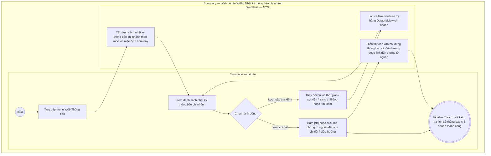

# LT-W09-US01 - Tra cứu lịch sử gửi thông báo chi nhánh

## Preconditions
- Lễ tân đã đăng nhập Web Lễ tân và được cấp quyền xem lịch sử thông báo trong phạm vi chi nhánh (`branch scope`).
- Hệ thống đã tự động ghi nhận nhật ký lịch sử các thông báo in-app do SYS phát sinh tới Hội viên / PT trong chi nhánh.

## Trigger
- Lễ tân chọn menu **W09 · Thông báo** trên thanh điều hướng chính.
- Màn hình liên quan: Web Lễ tân — W09 Thông báo chi nhánh.

## Main Flow

1. Khi các sự kiện nghiệp vụ xảy ra (Thanh toán thành công, Đặt lịch PT, Hủy lịch, Phân công PT...), Hệ thống (SYS) tự động gửi in-app notification và lưu bản ghi nhật ký thông báo (`notification_log`).
2. Lễ tân truy cập menu **W09 · Thông báo**.
3. SYS tải và hiển thị **Bảng Nhật ký Lịch sử gửi thông báo chi nhánh (Datagridview 6 cột)**:
   - **Thời gian**: Ngày và giờ phát thông báo (`DD/MM/YYYY HH:mm`).
   - **Sự kiện**: Mã sự kiện phát sinh (ví dụ: `PAYMENT_CONFIRMED`, `BOOKING_CREATED`).
   - **Người nhận**: Ô 2 dòng: Dòng trên là Họ tên (`Nguyễn Văn A`), dòng dưới là `Mã định danh · SĐT` (`HV00123 · 0901 234 567`) thuộc phạm vi chi nhánh.
   - **Tiêu đề thông báo**: Tiêu đề thông báo thực tế người nhận đã xem (sau khi SYS đã render thay thế các biến động thành dữ liệu thực tế).
   - **Mã tham chiếu**: Mã chứng từ hoặc hồ sơ nguồn dạng link (ví dụ: `PT00123`, `BK00456`), bấm vào để mở xem chi tiết giao dịch hoặc lịch tập tương ứng.
   - **Trạng thái đọc**: Badge `Đã đọc` (màu xanh) hoặc `Chưa đọc` (màu xám).
   - **Thao tác**: Nút **`[ 👁 ]`** để mở xem toàn văn nội dung chi tiết thông báo đã gửi.
4. Lễ tân sử dụng thanh công cụ lọc và tìm kiếm:
   - **Bộ lọc thời gian**: `Date / Date Range Picker` (Mặc định hôm nay `TODAY`, chọn 1 ngày hoặc khoảng ngày).
   - **Bộ lọc Sự kiện**: Dropdown chọn sự kiện phát sinh (`Tất cả`, `Thanh toán`, `Đặt lịch`, `Gói sắp hết hạn`...).
   - **Bộ lọc Trạng thái đọc**: Dropdown chọn `Tất cả`, `Đã đọc`, `Chưa đọc`.
   - **Ô tìm kiếm**: Tìm theo Họ tên, SĐT người nhận hoặc Mã tham chiếu thuộc chi nhánh.
5. Khi Lễ tân thay đổi bộ lọc hoặc nhập từ khóa tìm kiếm, SYS lọc và làm mới danh sách nhật ký tương ứng theo branch scope.
6. Khi Lễ tân bấm vào mã tham chiếu hoặc nút **`[ 👁 ]`**, SYS hiển thị chi tiết nội dung đầy đủ đã phát và điều hướng deep-link đến giao dịch/lịch tập gốc nếu cần.

### Field-level specification — Bảng Nhật ký Lịch sử thông báo chi nhánh
| Field / control | Loại UI Control | State | Required | Conditional / dynamic | Source / validation |
| :--- | :--- | :--- | :--- | :--- | :--- |
| Bộ lọc thời gian gửi | `Date / Date Range Picker` | `USER-INPUT (PREFILL)` | required | `TRIGGER` | Mặc định điền sẵn **Hôm nay (`TODAY`)**; hỗ trợ chọn 1 ngày hoặc khoảng ngày (*Từ ngày — Đến ngày*). Khi thay đổi, hệ thống tự động lọc lại nhật ký thông báo chi nhánh |
| Bộ lọc Sự kiện | `Select Dropdown` | `USER-INPUT` | optional | Không | Mặc định `Tất cả`; tùy chọn: `PAYMENT_CONFIRMED`, `BOOKING_CREATED`, `PACKAGE_EXPIRING`... |
| Bộ lọc Trạng thái đọc | `Select Dropdown` | `USER-INPUT` | optional | Không | Mặc định `Tất cả`; tùy chọn: `Đã đọc`, `Chưa đọc` |
| Ô tìm kiếm nhật ký | `Text Input (Search)` | `USER-INPUT` | optional | Không | Tìm kiếm theo Họ tên, SĐT người nhận hoặc Mã tham chiếu thuộc chi nhánh |
| Cột Thời gian | `Readonly Text` | `READONLY` | required | Không | Thời điểm phát sinh thông báo (`DD/MM/YYYY HH:mm`) |
| Cột Sự kiện | `Status Badge` | `READONLY` | required | `DYNAMIC` | Tên mã sự kiện phát sinh thông báo (ví dụ: `PAYMENT_CONFIRMED`) |
| Cột Người nhận | `Readonly Text (Two-line Cell)` | `READONLY` | required | Không | Hiển thị 2 dòng: Dòng 1 Họ tên người nhận (chữ đậm), Dòng 2 `Mã định danh · SĐT` (chữ xám nhỏ) thuộc chi nhánh |
| Cột Tiêu đề thông báo | `Readonly Text` | `READONLY` | required | `DYNAMIC` | Tiêu đề thông báo thực tế đã gửi (sau khi nạp biến động thành dữ liệu thật, ví dụ: *"Thanh toán thành công gói Gym 1 Tháng"*). Giúp bảng gọn gàng, không bị tràn dòng; xem toàn văn nội dung tại nút `[ 👁 ]` |
| Cột Mã tham chiếu | `Link Text` | `READONLY` | optional | `DYNAMIC` | Mã chứng từ hoặc hồ sơ nguồn dạng link (ví dụ: `PT00123`, `BK00456`); click điều hướng đến màn hình chi tiết tương ứng (hiển thị `-` nếu là thông báo chung) |
| Cột Trạng thái đọc | `Status Badge` | `READONLY` | required | `DYNAMIC` | Trạng thái đọc thông báo trên app: `Đã đọc` (badge xanh lá) hoặc `Chưa đọc` (badge xám) |
| Nút Xem chi tiết `[ 👁 ]` | `Icon Button` | `USER-INPUT` | optional | Không | Nút icon con mắt trên từng dòng; click mở popup/drawer xem toàn văn nội dung thông báo |

- **Business rules / logic:**
  - Lễ tân chỉ xem danh sách nhật ký thông báo được gửi cho hội viên/PT trong phạm vi chi nhánh phục vụ (`branch scope`).
  - Màn hình lịch sử phục vụ mục đích **Tra cứu và Kiểm tra nhật ký kiểm toán (Read-only)**. Lễ tân tuyệt đối không có quyền chỉnh sửa, thu hồi hay xóa log thông báo đã phát.
  - Trạng thái `Đã đọc` được cập nhật tự động khi người dùng mở xem thông báo trên Mobile App.

## Exception Flows
- Không tìm thấy nhật ký thỏa mãn điều kiện lọc: SYS hiển thị thông báo danh sách trống.

## Activity Diagram — Swimlane
**Trigger:** Lễ tân truy cập menu W09 Thông báo chi nhánh.

