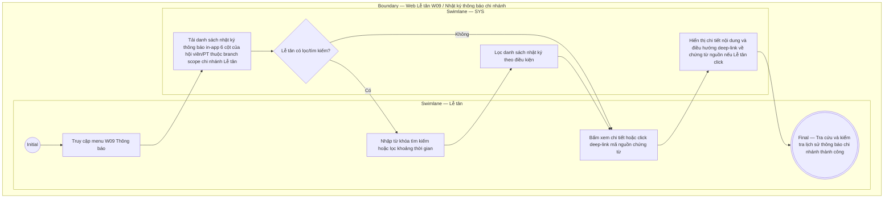

# LT-W09-US01 - Tra cứu lịch sử gửi thông báo chi nhánh

## Preconditions
- Lễ tân đã đăng nhập Web Lễ tân và được cấp quyền xem lịch sử thông báo trong phạm vi chi nhánh (branch scope).
- Hệ thống đã tự động ghi nhận nhật ký lịch sử các thông báo in-app do SYS phát sinh tới Hội viên / PT trong chi nhánh.

## Trigger
- Lễ tân chọn menu **W09 · Thông báo** trên thanh điều hướng chính.
- Màn hình liên quan: Web Lễ tân — W09 Thông báo chi nhánh.

## Main Flow

1. Lễ tân truy cập menu **W09 · Thông báo**.
2. Hệ thống tải và hiển thị bảng danh sách nhật ký lịch sử thông báo in-app đã gửi cho Hội viên/PT thuộc chi nhánh hiện tại của Lễ tân:
   - **Thời gian:** Ngày và giờ phát thông báo (ví dụ: `13/09 10:30`).
   - **Event:** Mã sự kiện phát sinh (`PAYMENT_CONFIRMED`, `BOOKING_CREATED`, `PT_ASSIGNED`, ...).
   - **Người nhận:** Mã & Họ tên Hội viên / PT trong chi nhánh (ví dụ: `HV001 - Nguyễn Văn A`).
   - **Nội dung:** Tiêu đề & Nội dung thực tế người nhận đã nhận được.
   - **Nguồn:** Mã chứng từ / Event nguồn tham chiếu (`PAY001`, `BK001`), hỗ trợ bấm deep-link đến giao dịch/booking tương ứng.
   - **Đọc:** Trạng thái đọc (`Chưa đọc` / `Đã đọc`).
3. Lễ tân nhập tên/SĐT hội viên hoặc chọn khoảng thời gian để tìm kiếm nhật ký thông báo.
4. Hệ thống hiển thị kết quả tìm kiếm thỏa mãn điều kiện.
5. **Quy tắc nghiệp vụ:**
   - Thông báo được Hệ thống (SYS) tự động phát sinh khi các sự kiện nghiệp vụ xảy ra (Thanh toán, Đặt lịch PT, Phân công PT...). Lễ tân không soạn hay gửi thông báo thủ công.
   - Màn hình dùng để **tra cứu và kiểm tra lịch sử thông báo** chi nhánh. Lễ tân chỉ xem được dữ liệu hội viên/PT thuộc chi nhánh phục vụ của mình.

## Alternate Flows

### AF-01 — Không có nhật ký trong phạm vi
1. Không có thông báo nào thỏa mãn bộ lọc.
2. SYS hiển thị trạng thái bảng rỗng.

## Exception Flows

- Lỗi kết nối mạng: SYS hiển thị thông báo lỗi tra cứu.

## Activity Diagram — Swimlane
**Trigger:** Lễ tân truy cập menu W09 Thông báo trên Web Lễ tân.

