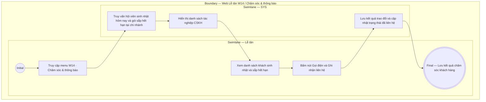

# LT-W14-US01 - Tác nghiệp Chăm sóc khách hàng tại quầy

## Preconditions
- Lễ tân đã đăng nhập vào Web Portal, làm việc tại chi nhánh quầy tiếp đón.
- Hệ thống có danh sách hội viên sinh nhật trong ngày và gói sắp hết hạn tại chi nhánh.

## Trigger
- Lễ tân chọn menu **W14 · Chăm sóc & thông báo** hoặc bấm khối CSKH tại Dashboard W01.
- Màn hình liên quan: Web Lễ tân — Màn hình `W14 · Chăm sóc & thông báo`.

## Quy tắc sắp hết hạn
- Gói đã thanh toán, đang có hiệu lực và chưa hết hạn: theo thời gian còn <= 4 ngày, theo buổi còn <= 3 buổi; Combo dùng OR giữa các quyền lợi áp dụng. Nguồn hiển thị là is_expiring và display_status do SYS/API tính; status nội bộ ACTIVE vẫn dùng cho kiểm tra quyền tập. Không tạo enum/field DB mới và không tự tính ngưỡng riêng trên UI.

## Main Flow

1. Lễ tân truy cập màn hình **Chăm sóc & thông báo**.
2. SYS hiển thị danh sách tác nghiệp tại chi nhánh qua Hàng 4 Thẻ KPI và 4 Tab tương ứng 1-1:
    - **Sinh nhật hôm nay:** Các hội viên có sinh nhật hôm nay để lễ tân chuẩn bị quà/lời chúc khi khách đến check-in hoặc gọi điện chúc mừng.
    - **Sắp hết hạn (<= 4 ngày hoặc <= 3 buổi):** Danh sách khách hàng cận hạn kèm số tiền dự thu gia hạn toàn bộ các gói đó (`Dự thu: [Tiền] ₫`) để lễ tân gọi điện tư vấn gia hạn thu tiền.
    - **Chờ nhắc gia hạn (14 ngày qua):** Danh sách khách hàng vừa hết hạn chưa mua tiếp kèm số tiền dự thu tái ký (`Dự thu: [Tiền] ₫`) để lễ tân liên hệ giữ chân / tái ký gói.
    - **Đăng ký mới hôm nay:** Danh sách hợp đồng tạo mới trong ngày tại chi nhánh kèm tổng giá trị các hợp đồng ký mới (`Tổng tiền: [Tiền] ₫`).
3. Lễ tân bấm vào Thẻ KPI bất kỳ để chuyển nhanh đến Tab tác nghiệp tương ứng.
4. Lễ tân bấm nút **`Gọi`** để mở modal ghi nhận kết quả tư vấn và cập nhật trạng thái đã liên hệ.

### Field-level specification — Màn hình Chăm sóc & thông báo Lễ tân (W14)
| Field / control | Loại UI Control | State | Required | Conditional / dynamic | Source / validation |
| :--- | :--- | :--- | :--- | :--- | :--- |
| Thẻ KPI Sinh nhật hôm nay | `Metric Card` | `READONLY` | required | `DYNAMIC` | Số lượng hội viên sinh nhật trong ngày; click chuyển sang Tab Sinh nhật |
| Thẻ KPI Sắp hết hạn (<= 4 ngày hoặc <= 3 buổi) | `Metric Card` | `READONLY` | required | `DYNAMIC` | Số gói cận hạn kèm số tiền dự thu gia hạn toàn bộ các gói; click chuyển sang Tab Sắp hết hạn |
| Thẻ KPI Chờ nhắc gia hạn (14 ngày qua) | `Metric Card` | `READONLY` | required | `DYNAMIC` | Số gói hết hạn 1-14 ngày chưa mua tiếp kèm số tiền dự thu tái ký; click chuyển sang Tab Chờ nhắc gia hạn |
| Thẻ KPI Đăng ký mới hôm nay | `Metric Card` | `READONLY` | required | `DYNAMIC` | Số hợp đồng đăng ký mới trong ngày kèm tổng giá trị các hợp đồng; click chuyển sang Tab Đăng ký mới |
| Thanh điều hướng Tab | `Tab Bar (dxTabs)` | `USER-INPUT` | required | `TRIGGER` | 4 tab tác nghiệp: Sinh nhật, Sắp hết hạn, Chờ nhắc gia hạn, Đăng ký mới |
| Cột Dự thu gia hạn (Tab Sắp hết hạn) | `DataGrid Column` | `READONLY` | required | `DYNAMIC` | Hiển thị giá trị gói dự tính thu về khi gia hạn (`price_snapshot`) |
| Cột Dự thu tái ký (Tab Chờ nhắc gia hạn) | `DataGrid Column` | `READONLY` | required | `DYNAMIC` | Hiển thị giá trị gói dự tính thu về khi tái ký hợp đồng (`price_snapshot`) |
| Cột Giá trị gói (Tab Đăng ký mới) | `DataGrid Column` | `READONLY` | required | `DYNAMIC` | Hiển thị tổng giá trị của hợp đồng đăng ký mới (`price_snapshot`) |
| Nút Chúc mừng / Nhắc hạn | `Action Button` | `USER-INPUT` | optional | `Không` | Bấm gửi thông báo in-app tự động cho hội viên |
| Nút Gọi / Ghi nhận CSKH | `Action Button` | `USER-INPUT` | optional | `Không` | Mở modal nhập kết quả gọi điện và lưu ghi chú CSKH |
| Nút Gia hạn / Tái ký gói | `Action Button` | `USER-INPUT` | optional | `Không` | Mở điều hướng tạo đơn gia hạn hoặc đăng ký gói mới |

| Ngày hết hạn / số ngày còn lại | Text | READONLY | conditional | CONDITIONAL: hiện khi quyền lợi có hạn theo ngày; ẩn khi gói chỉ giới hạn số buổi | end_date/days_left API; không đặt ngày giả cho gói vô thời hạn. |
| Số buổi Gym / PT còn lại | Text | READONLY | conditional | CONDITIONAL: hiện khi gói có quyền lợi theo buổi tương ứng; ẩn khi không có quyền lợi đó | remaining_gym_sessions / remaining_pt_sessions API; Combo xét OR, không trừ booked lần nữa. |
| Nhãn sắp hết hạn | Badge | READONLY | required | Không | is_expiring/display_status từ cùng nguồn customerCare với KPI; status nội bộ ACTIVE giữ nguyên. |

- KPI cận hạn và danh sách lấy cùng tập đăng ký theo scope. Nhóm Chờ nhắc gia hạn là gói đã hết hạn trong 14 ngày qua, giữ nguyên tiêu chí riêng.

## Alternate Flows
- Hội viên đồng ý gia hạn: Lễ tân bấm `Tạo gia hạn` để lập tức mở modal tạo đơn gia hạn và thu tiền 100% tại quầy.

## Exception Flows
- Không liên lạc được với khách: Lễ tân chọn trạng thái `Không nghe máy` để hệ thống xếp lịch nhắc gọi lại sau.

## Activity Diagram — Swimlane
**Trigger:** Lễ tân mở menu W14 · Chăm sóc & thông báo.

