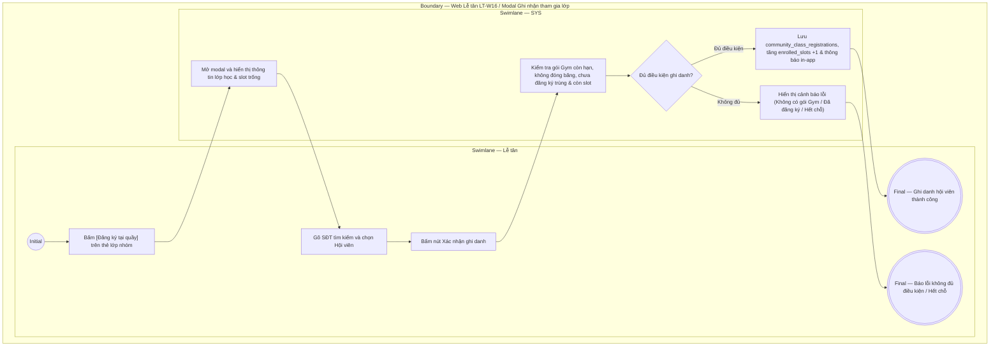

# LT-W16-US01 - Đăng ký lớp tập cộng đồng tại quầy

## Preconditions
- Người dùng đăng nhập tài khoản Lễ tân.
- Chi nhánh có lớp tập cộng đồng đang mở đăng ký (`status = 'OPEN'`) và còn chỗ trống (`enrolled_slots < max_slots`).
- Hội viên có gói Gym còn hiệu lực sử dụng và không bị đóng băng.

## Trigger
- Hội viên tới quầy Lễ tân yêu cầu đăng ký tham gia một lớp tập cộng đồng. Lễ tân truy cập menu **LT-W16 Lớp tập cộng đồng** và bấm nút **[Đăng ký tại quầy]** trên thẻ lớp học.
- Màn hình liên quan: Web Lễ tân — LT-W16 Lớp tập cộng đồng, modal **Ghi nhận học viên tham gia lớp**.

## Main Flow

1. Lễ tân truy cập menu LT-W16, xem danh sách các lớp tập nhóm theo ngày.
2. Lễ tân kiểm tra lớp học hội viên muốn tham gia (ví dụ: `Yoga Hatha Buổi Sáng - 18/09/2026 - Còn 5/40 chỗ`).
3. Lễ tân bấm nút **[Đăng ký tại quầy]** trên thẻ lớp tương ứng.
4. SYS mở modal **Ghi nhận học viên tham gia lớp** và tự động hiển thị thông tin lớp: Tên lớp, Giáo viên, Ngày giờ, Số chỗ trống hiện tại (`READONLY`).
5. Lễ tân gõ SĐT hoặc Họ tên để tra cứu và chọn **Hội viên**.
6. SYS tự động kiểm tra điều kiện hội viên:
   - Có gói Gym còn hạn không?
   - Gói Gym có bị đóng băng không?
   - Hội viên đã đăng ký lớp này trước đó chưa?
7. Nếu thỏa mãn, SYS hiển thị thông tin gói Gym hợp lệ và trạng thái sẵn sàng.
8. Lễ tân bấm **Xác nhận ghi danh**.
9. SYS lưu bản ghi vào `community_class_registrations`, tăng số lượng `enrolled_slots` lên 1, gửi thông báo xác nhận và lịch tập vào app Mobile Hội viên.

### Field-level specification — modal Ghi nhận học viên tham gia lớp
| Field / control | Loại UI Control | State | Required | Conditional / dynamic | Source / validation |
| :--- | :--- | :--- | :--- | :--- | :--- |
| Tên lớp tập | `Readonly Text` | `READONLY (PREFILL)` | required | `Không` | Tên lớp được chọn từ thẻ ban đầu |
| Ngày giờ diễn ra | `Readonly Text` | `READONLY (PREFILL)` | required | `Không` | Ngày và khung giờ của buổi tập |
| Số chỗ trống còn lại | `Readonly Text / Badge` | `READONLY (PREFILL)` | required | `Không` | Hiển thị dạng `Còn X chỗ trống` (`max_slots - enrolled_slots`) |
| Hội viên | `Select Dropdown (Searchable)` | `USER-INPUT` | required | `TRIGGER` | Lễ tân tìm hội viên theo SĐT hoặc Họ tên |
| Gói Gym đối soát [AUTO] | `Readonly Text` | `READONLY (AUTO-FILL)` | required | `DYNAMIC` | SYS tự động kiểm tra và hiển thị tên gói Gym còn hạn của HV |
| Ghi chú | `Textarea` | `USER-INPUT` | optional | `Không` | Ghi chú thêm nếu hội viên có yêu cầu đặc biệt |

- **Business rules / logic:**
  - Hội viên chỉ được đăng ký nếu có gói Gym còn hiệu lực sử dụng.
  - Không cho phép 1 hội viên đăng ký trùng lặp 2 lần vào cùng một buổi lớp tập cộng đồng.
  - Nếu số chỗ đã đầy (`enrolled_slots = max_slots`), hệ thống khóa nút đăng ký.

## Alternate Flows

### AF-01 - Hủy Thao Tác
1. Lễ tân chọn **Hủy** hoặc nút **X**.
2. SYS đóng modal và giữ nguyên thông tin lớp tập.

## Exception Flows
- **Hội viên chưa có gói Gym / Gói hết hạn:** SYS hiển thị cảnh báo: *"Hội viên chưa có gói Gym còn hiệu lực. Vui lòng đăng ký/gia hạn gói Gym trước khi tham gia lớp cộng đồng"*.
- **Đã đăng ký trước đó:** Hội viên đã có tên trong danh sách lớp. SYS báo: *"Hội viên này đã đăng ký tham gia lớp học trước đó"*.
- **Lớp đã hết chỗ:** Số slot trống = 0. SYS báo: *"Lớp học đã đủ số lượng học viên tối đa"*.

## Activity Diagram — Swimlane
**Trigger:** Lễ tân bấm [Đăng ký tại quầy] trên thẻ lớp trong menu LT-W16.

