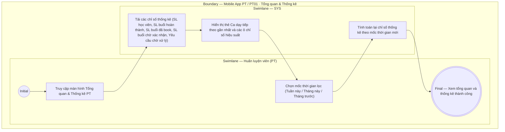

# PT01-US00 - Xem tổng quan và thống kê hiệu suất PT

## Preconditions
- Huấn luyện viên (PT) đã đăng nhập ứng dụng Mobile bằng tài khoản PT hợp lệ.
- PT có dữ liệu lịch dạy và danh sách học viên được phân công.

## Trigger
- PT mở ứng dụng Mobile PT hoặc bấm chọn tab `PT01 · Lịch`.
- Màn hình liên quan: Mobile App PT — Màn hình `Tổng quan & Thống kê PT`.

## Main Flow

1. PT mở ứng dụng Mobile PT hoặc chọn màn hình tổng quan.
2. Hệ thống nạp và hiển thị màn hình **Tổng quan & Thống kê hiệu suất PT**.
3. Bảng chỉ số thống kê hiệu suất (thời gian lọc mặc định: Tháng hiện tại) bao gồm:
   - **Số lượng học viên phụ trách:** Tổng số học viên đang được phân công cho PT (`ACTIVE`).
   - **Số buổi đã dạy hoàn thành:** Tổng số buổi tập đã đủ xác nhận 2 chiều và chuyển trạng thái `DONE` trong tháng.
   - **Số buổi đã được book (sắp dạy):** Tổng số ca tập ở trạng thái `Đã đặt` (`UPCOMING`) trong tương lai.
   - **Số buổi đang chờ xác nhận:** Tổng số ca tập ở trạng thái `Chờ xác nhận hoàn thành` (`AWAITING_CONFIRMATION`).
   - **Số yêu cầu phân công chờ xử lý:** Tổng số yêu cầu chọn PT từ học viên đang ở trạng thái `PENDING`.
4. Khung **Ca dạy tiếp theo gần nhất:** Hiển thị thời gian (ví dụ: `09:00 - 11:00 Today`), Họ tên Học viên, Gói tập và nút thao tác nhanh `[ Xác nhận hoàn thành ]`.
5. PT có thể thay đổi mốc thời gian xem thống kê (Tuần này / Tháng này / Tháng trước).
6. Hệ thống tự động nạp lại các con số thống kê theo mốc thời gian được chọn.

- **Business rules / logic:**
  - Màn hình tổng quan cung cấp bức tranh toàn cảnh về khối lượng công việc và hiệu suất huấn luyện của PT trong kỳ.
  - Các con số thống kê tự động cập nhật ngay khi có buổi tập hoàn thành hoặc có lịch đặt mới.

## Alternate Flows

### AF-01 — Đổi mốc thời gian thống kê
1. PT chọn lọc theo "Tuần này" hoặc "Tháng trước".
2. SYS tính toán và cập nhật lại toàn bộ các chỉ số thống kê tương ứng với khoảng thời gian đã chọn.

## Exception Flows

- Lỗi kết nối mạng: SYS hiển thị thông báo "Không thể nạp dữ liệu thống kê, vui lòng kiểm tra kết nối mạng".

## Activity Diagram — Swimlane
**Trigger:** PT mở ứng dụng Mobile PT hoặc truy cập màn hình Tổng quan.

