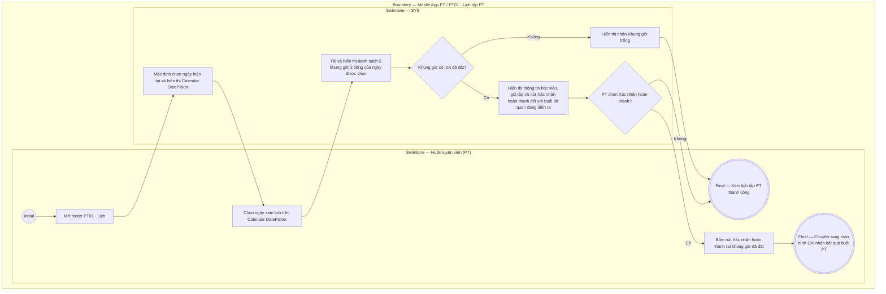

# PT01-US01 - Xem lịch PT theo ngày

## Preconditions
- Huấn luyện viên (PT) đã đăng nhập ứng dụng Mobile bằng tài khoản PT hợp lệ.
- PT được phân công giảng dạy cho ít nhất một Hội viên có gói tập PT còn hiệu lực.

## Trigger
- PT chọn menu footer `PT01 · Lịch` trên ứng dụng Mobile PT.
- Màn hình liên quan: Mobile App PT — Tab `PT01 · Lịch`.

## Main Flow

1. PT mở tab **PT01 · Lịch** trên footer navigation.
2. Hệ thống nạp bộ chọn ngày Calendar / DatePicker (dạng lịch tháng, ví dụ `< Tháng 9 Năm 2026 >`), mặc định chọn ngày hiện tại.
3. Hệ thống hiển thị tiêu đề ngày được chọn (ví dụ: `07/09/2026 - Khung làm việc cố định: 08:00 - 18:00`) cùng **Lưới 5 khung giờ làm việc cố định** (Slots 2 tiếng: `08:00-10:00`, `10:00-12:00`, `12:00-14:00`, `14:00-16:00`, `16:00-18:00`).
4. Tại từng khung giờ trong ngày:
   - **Khung giờ trống:** Hiển thị thẻ `Khung giờ trống` viền nét đứt màu xám nhạt (chỉ đọc, tuyệt đối không có nút đặt lịch hay icon `[ + ]` vì PT không tự đặt lịch).
   - **Khung giờ có lịch đặt — Trạng thái `Đã đặt` (`UPCOMING`):** Thẻ viền xanh dương, hiển thị Họ tên học viên, Gói tập, Chi nhánh, Badge `Đã đặt`. Đến giờ hoặc qua giờ tập, hiển thị nút màu xanh `[ Xác nhận hoàn thành ]`.
   - **Khung giờ có lịch đặt — Trạng thái `Chờ xác nhận hoàn thành` (`AWAITING_CONFIRMATION`):** Thẻ viền vàng cam, Badge `Chờ xác nhận`. Hiển thị nút màu xanh `[ Xác nhận hoàn thành ]` nếu PT chưa ghi nhận kết quả (hoặc nhãn `Chờ Hội viên xác nhận` nếu PT đã ghi nhận).
   - **Khung giờ có lịch đặt — Trạng thái `Hoàn thành` (`DONE` / Đã ghi nhận):** Thẻ viền xanh lá, Badge `Đã ghi nhận` (đã đủ xác nhận 2 chiều và trừ 1 buổi; không có nút thao tác).
   - **Khung giờ có lịch đặt — Trạng thái `Đã hủy` (`CANCELLED`):** Thẻ làm mờ màu xám, Badge `Đã hủy` (không có nút thao tác).
5. PT có thể chọn bất kỳ ngày nào khác trên Calendar / DatePicker để chuyển sang xem lịch tập của ngày đó.
6. **Quy tắc nghiệp vụ:**
   - PT chỉ xem được các buổi tập nằm trong phạm vi phân công (assignment scope) của chính mình.
   - PT **không có quyền hủy lịch tập** (nút/thao tác Hủy lịch không xuất hiện đối với vai trò PT; chỉ có Hội viên hoặc Lễ tân/QTV thực hiện hủy lịch).
   - Khi PT bấm `[ Xác nhận hoàn thành ]` tại ca tập `Đã đặt` (đến giờ) hoặc `Chờ xác nhận hoàn thành`, hệ thống chuyển sang modal ghi nhận kết quả buổi học (`PT01-US02`).

### Field-level specification — Màn hình Lịch PT theo ngày
| Field / control | Loại UI Control | State | Required | Conditional / dynamic | Source / validation |
| :--- | :--- | :--- | :--- | :--- | :--- |
| **Bộ chọn ngày linh hoạt 2 chế độ (Expandable / Collapsible Calendar)** | `DatePicker / Horizontal Calendar Strip` | `USER-INPUT (PREFILL)` | required | `TRIGGER`: Chạm chọn ngày trên dải cuộn ngang (Thu gọn) hoặc trên lưới cả tháng (Mở rộng) để nạp lại danh sách 5 ca tập của ngày tương ứng; hỗ trợ chạm nút/tiêu đề tháng để chuyển đổi qua lại giữa 2 chế độ | Bộ chọn ngày thông minh 2 chế độ: Chế độ Thu gọn (Dải ngày cuộn ngang bo góc, ngày chọn nền xanh ngọc) và Chế độ Mở rộng (Lưới cả tháng 7 cột T2-CN giúp chạm chọn tức thì bất kỳ ngày nào trong tháng mà không cần vuốt ngang). Mặc định chọn ngày hiện tại (`DD/MM/YYYY`) |
| **Tiêu đề ngày & Khung giờ cố định** | `Text Label` | `READONLY` | required | `DYNAMIC`: Cập nhật ngày theo giá trị chọn ở TRIGGER | Hiển thị: `DD/MM/YYYY - Khung làm việc cố định: 08:00 - 18:00` |
| **Lưới 5 khung giờ làm việc** | `Grid Container` | `READONLY` | required | Không | Khung bố cục lưới (Grid Container) gồm 5 khung giờ 2 tiếng cố định: `08:00-10:00`, `10:00-12:00`, `12:00-14:00`, `14:00-16:00`, `16:00-18:00` |
| **Thẻ khung giờ trống** | `Slot Card (Empty)` | `READONLY` | conditional | `CONDITIONAL`: **Hiện khi** trong ngày có khung giờ chưa có học viên đặt lịch; **Ẩn khi** tất cả các khung giờ trong ngày đều đã có lịch đặt | Thẻ card viền nét đứt màu xám nhạt, hiển thị Khung giờ và nhãn `Khung giờ trống` (**chỉ đọc, tuyệt đối không có nút đặt lịch hay nút icon `[ + ]`** vì PT không tự đặt lịch) |
| **Thẻ ca tập — Trạng thái `Đã đặt` (`UPCOMING`)** | `Booking Card (Actionable)` | `USER-INPUT / READONLY` | conditional | `CONDITIONAL`: **Hiện khi** trong ngày có ca tập ở trạng thái `Đã đặt` (`UPCOMING`); **Ẩn khi** trong ngày không có ca tập nào ở trạng thái này | Thẻ card viền bo bên trái màu xanh dương; hiển thị Khung giờ, Họ tên học viên, Tên gói PT, Chi nhánh, Badge trạng thái `Đã đặt` (xanh dương). Đến giờ hoặc qua giờ tập, hiển thị nút màu xanh `[ Xác nhận hoàn thành ]` (mở Bottom Sheet `PT01-US02`) |
| **Thẻ ca tập — Trạng thái `Chờ xác nhận hoàn thành` (`AWAITING_CONFIRMATION`)** | `Booking Card (Actionable)` | `USER-INPUT / READONLY` | conditional | `CONDITIONAL`: **Hiện khi** trong ngày có ca tập đang ở trạng thái `Chờ xác nhận hoàn thành` (`AWAITING_CONFIRMATION`); **Ẩn khi** không có ca tập nào ở trạng thái này | Thẻ card viền bo bên trái màu vàng cam; hiển thị Khung giờ, Họ tên học viên, Tên gói PT, Chi nhánh, Badge trạng thái `Chờ xác nhận` (vàng cam) kèm nút bấm màu xanh `[ Xác nhận hoàn thành ]` nếu PT chưa ghi nhận kết quả vế của mình (hoặc hiển thị nhãn `Chờ Hội viên xác nhận`) |
| **Thẻ ca tập — Trạng thái `Hoàn thành` (`DONE`)** | `Booking Card (Readonly)` | `READONLY` | conditional | `CONDITIONAL`: **Hiện khi** trong ngày có ca tập đã hoàn tất xác nhận 2 chiều và chuyển sang trạng thái `DONE` (`Đã ghi nhận`); **Ẩn khi** không có ca tập nào ở trạng thái này | Thẻ card viền bo bên trái màu xanh lá; hiển thị Khung giờ, Họ tên học viên, Tên gói PT, Chi nhánh, Badge trạng thái `Đã ghi nhận` (xanh lá); hiển thị thông tin đã trừ 1 buổi; không có nút thao tác |
| **Thẻ ca tập — Trạng thái `Đã hủy` (`CANCELLED`)** | `Booking Card (Disabled)` | `READONLY` | conditional | `CONDITIONAL`: **Hiện khi** trong ngày có ca tập đã bị Hội viên hoặc Quản trị viên/Lễ tân hủy (`CANCELLED`); **Ẩn khi** không có ca tập nào bị hủy | Thẻ card làm mờ (opacity thấp), gạch ngang khung giờ hoặc hiển thị màu xám; hiển thị Họ tên học viên, Tên gói PT, Badge trạng thái `Đã hủy` (xám); khóa hoàn toàn tương tác, không có nút xác nhận |

## Alternate Flows

### AF-01 — PT xem lịch dạy của ngày khác trên Calendar
1. PT chọn ngày khác trên lưới lịch tháng (DatePicker).
2. SYS nạp danh sách 5 khung giờ của ngày được chọn và hiển thị trạng thái các buổi tập tương ứng.

### AF-02 — Ngày không có lịch đặt nào
1. PT chọn ngày mà tất cả 5 khung giờ đều chưa có người đặt.
2. SYS hiển thị nhãn `Khung giờ trống` cho toàn bộ 5 slot trong ngày.

## Exception Flows

- Lỗi kết nối mạng: SYS hiển thị thông báo "Không thể nạp dữ liệu lịch tập, vui lòng kiểm tra kết nối mạng và thử lại".
- PT chưa được phân công học viên nào: SYS hiển thị thông báo "Bạn chưa có buổi tập nào được phân công".

## Activity Diagram — Swimlane
**Trigger:** PT chọn menu footer PT01 · Lịch trên ứng dụng Mobile.

