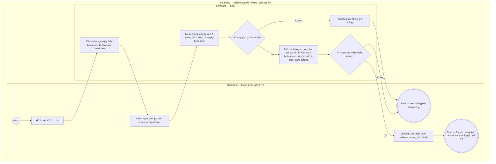

# PT01-US01 - Xem lịch PT theo ngày

## Preconditions
- Huấn luyện viên (PT) đã đăng nhập ứng dụng Mobile bằng tài khoản PT hợp lệ.
- PT được phân công giảng dạy cho ít nhất một Hội viên có gói tập PT còn hiệu lực.

## Trigger
- PT chọn menu footer `PT01 · Lịch` trên ứng dụng Mobile PT.
- Màn hình liên quan: Mobile App PT — Tab `PT01 · Lịch`.

## Main Flow

1. PT mở tab **PT01 · Lịch**.
2. Hệ thống nạp bộ chọn ngày Calendar / DatePicker (dạng lịch tháng, ví dụ `< Tháng 9 Năm 2026 >`), mặc định chọn ngày hiện tại.
3. Hệ thống hiển thị tiêu đề ngày được chọn (ví dụ: `07/09/2026 - Khung làm việc cố định: 08:00 - 18:00`) cùng danh sách 5 khung giờ 2 tiếng cố định trong ngày (`08:00-10:00`, `10:00-12:00`, `12:00-14:00`, `14:00-16:00`, `16:00-18:00`).
4. Tại từng khung giờ trong ngày:
   - **Khung giờ đã có lịch đặt:** Hiển thị Họ tên Học viên (ví dụ: `Bùi Thị Hoa`), Tên gói PT (`PT 10 buổi`), Trạng thái buổi tập (`Đã đặt`, `Chờ xác nhận`, `Đã ghi nhận`, `Đã hủy`). Đối với các khung giờ đã qua hoặc đang diễn ra, hiển thị nút màu xanh `[ Xác nhận hoàn thành ]`.
   - **Khung giờ chưa có lịch:** Hiển thị nhãn `Khung giờ trống`.
5. PT có thể chọn bất kỳ ngày nào khác trên Calendar / DatePicker để chuyển sang xem lịch tập của ngày đó.
6. **Quy tắc nghiệp vụ:**
   - PT chỉ xem được các buổi tập nằm trong phạm vi phân công (assignment scope) của chính mình.
   - PT **không có quyền hủy lịch tập** (nút/thao tác Hủy lịch không xuất hiện đối với vai trò PT; chỉ có Hội viên hoặc Lễ tân/QTV thực hiện hủy lịch).
   - Khi PT bấm `[ Xác nhận hoàn thành ]` tại khung giờ đã đặt, hệ thống chuyển sang modal ghi nhận kết quả buổi học (`PT01-US02`).

### Field-level specification — Màn hình PT01 · Lịch tập PT
| Field / control | State | Required | Conditional / dynamic | Source / validation |
|---|---|---|---|---|
| Calendar / DatePicker chọn ngày | `USER-INPUT` + `PREFILL` | required | `DYNAMIC`: Lưới lịch tháng (ví dụ `< Tháng 9 Năm 2026 >`), mặc định chọn ngày hiện tại | Chọn ngày/tháng/năm |
| Tiêu đề ngày & Khung làm việc | `READONLY` | optional | `DYNAMIC`: hiển thị ngày được chọn và khung giờ làm việc cố định (`08:00 - 18:00`) | Cấu hình ca làm việc PT |
| Danh sách 5 khung giờ cố định | `READONLY` | required | `DYNAMIC`: 5 slot cố định (`08:00-10:00`, `10:00-12:00`, `12:00-14:00`, `14:00-16:00`, `16:00-18:00`) | Database session PT |
| Thẻ thông tin buổi tập đã đặt | `READONLY` | optional | `DYNAMIC`: hiển thị Họ tên Học viên, Tên gói PT, Badge trạng thái (`Đã đặt`, `Đang diễn ra`, `Đã ghi nhận`, `Đã hủy`) | Data booking PT-Member |
| Nhãn Khung giờ trống | `READONLY` | optional | `DYNAMIC`: hiển thị nhãn "Khung giờ trống" tại slot chưa có người đặt | Slot trống |
| Nút `[ Xác nhận hoàn thành ]` | `USER-INPUT` | optional | `CONDITIONAL`: chỉ hiển thị đối với khung giờ đã đặt và đã qua/đang diễn ra khung giờ tập | Thao tác mở modal ghi nhận kết quả |

## Alternate Flows

### AF-01 — PT xem lịch dạy của ngày khác trên Calendar
1. PT chọn ngày khác trên lưới lịch tháng (DatePicker).
2. SYS nạp danh sách 5 khung giờ của ngày được chọn và hiển thị trạng thái các buổi tập tương ứng.

### AF-02 — Ngày không có lịch đặt nào
1. PT chọn ngày mà tất cả 5 khung giờ đều chưa có người đặt.
2. SYS hiển thị nhãn `Khung giờ trống` cho toàn bộ 5 slot trong ngày.

## Exception Flows

- Lỗi kết nối mạng: SYS hiển thị thông báo "Không thể nạp dữ liệu lịch tập, vui lòng kiểm tra kết nối mạng và thử lại".
- PT chưa được phân công học viên nào: SYS hiển thị thông báo "Bạn chưa có buổi tập nào được phân công".

## Activity Diagram — Swimlane
**Trigger:** PT chọn menu footer PT01 · Lịch trên ứng dụng Mobile.

