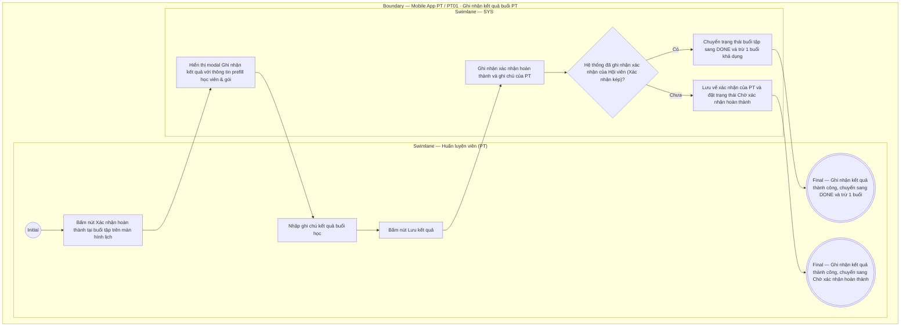

# PT01-US02 - Xác nhận hoàn thành và ghi kết quả buổi học

## Preconditions
- PT đang đăng nhập ứng dụng Mobile PT và xem danh sách lịch tập tại `PT01 · Lịch`.
- Buổi tập được chọn thuộc phạm vi phân công của PT hiện hành, có trạng thái `Đang diễn ra`, `Chờ xác nhận` hoặc đã qua khung giờ tập.

## Trigger
- PT bấm nút `[ Xác nhận hoàn thành ]` tại một buổi tập trên màn hình `PT01 · Lịch`.
- Màn hình liên quan: Mobile App PT — Modal / Form `Ghi nhận kết quả buổi PT`.

## Main Flow

1. PT bấm nút `[ Xác nhận hoàn thành ]` tại buổi tập đã qua khung giờ hoặc đang đến giờ tập.
2. Hệ thống hiển thị modal `Ghi nhận kết quả buổi PT` với thông tin prefill của buổi tập (Mã buổi, Khung giờ, Tên học viên, Tên gói tập).
3. PT chọn kết quả buổi tập (mặc định: `Hoàn thành`).
4. PT nhập ghi chú buổi tập (đánh giá thể trạng, nội dung bài tập, lưu ý cho học viên).
5. PT bấm `[ Lưu kết quả ]`.
6. Hệ thống ghi nhận kết quả xác nhận của PT.
7. Hệ thống kiểm tra vế xác nhận của Hội viên (xác nhận 2 chiều):
   - Nếu đủ xác nhận 2 chiều: Chuyển trạng thái buổi tập sang `DONE` (`Đã ghi nhận`) và trừ 1 buổi khả dụng trong gói tập của Hội viên.
   - Nếu chưa đủ xác nhận 2 chiều: Đặt trạng thái buổi tập thành `Chờ xác nhận hoàn thành` (`AWAITING_CONFIRMATION`).
8. Hệ thống thông báo thành công và cập nhật lại trạng thái buổi tập trên màn hình lịch.

### Field-level specification — Modal Ghi nhận kết quả buổi PT
| Field / control | State | Required | Conditional / dynamic | Source / validation |
| :--- | :--- | :--- | :--- | :--- |
| **Thông tin ca tập (Mã buổi & Khung giờ)** | `READONLY (PREFILL)` | required | Không | Tự động prefill từ ca tập được chọn (ví dụ: `SES00452 · 08:00 - 10:00, 15/09/2026`) |
| **Học viên & Gói tập** | `READONLY (PREFILL)` | required | Không | Tự động prefill từ ca tập được chọn (ví dụ: `Trần Thị Bình · Gói PT 20 buổi`) |
| **Kết quả buổi tập** | `USER-INPUT` + `PREFILL` | required | Không | Mặc định prefill `Hoàn thành` (Radio / Select cố định: `Hoàn thành`) |
| **Ghi chú buổi tập** | `USER-INPUT` | optional | Không | PT nhập nội dung bài tập, đánh giá thể trạng hoặc dặn dò học viên (hỗ trợ tiếng Việt) |

- **Business rules / logic:**
  - PT **không có quyền hủy lịch tập**. Nút `[ Xác nhận hoàn thành ]` là nút thao tác duy nhất của PT để ghi nhận kết quả và hoàn tất vế xác nhận của mình.
  - PT chỉ thực hiện ghi nhận kết quả 1 lần duy nhất cho mỗi buổi tập; sau khi buổi học hoàn tất (`DONE`), thẻ ca tập chuyển sang trạng thái chỉ đọc và khóa thao tác. Mọi điều chỉnh sau khi hoàn tất thuộc thẩm quyền của QTV/Lễ tân trên Web (`W06`).
  - Các buổi tập có trạng thái `Đã hủy` sẽ không hiển thị nút `[ Xác nhận hoàn thành ]` trên giao diện.
  - Việc trừ 1 buổi tập chỉ xảy ra khi buổi học đủ xác nhận 2 chiều và chưa từng trừ buổi trước đó.

## Alternate Flows

Không có luồng rẽ nhánh trong modal.

## Exception Flows

- Lỗi kết nối khi lưu: SYS thông báo lỗi và giữ nguyên dữ liệu trong modal để PT thử lại.

## Activity Diagram — Swimlane
**Trigger:** PT bấm nút Xác nhận hoàn thành tại buổi tập trên màn hình lịch PT01.

