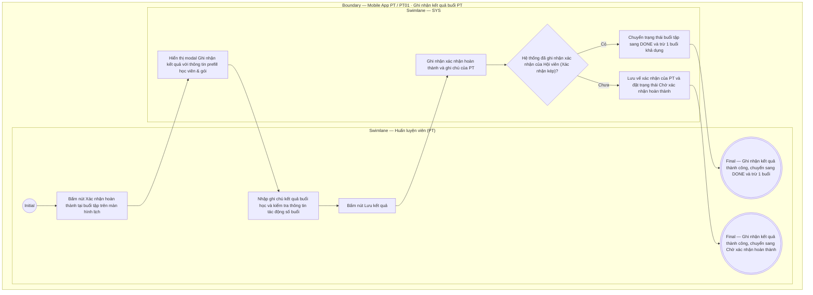

# PT01-US02 - Xác nhận hoàn thành và ghi kết quả buổi học

## Preconditions
- PT đang đăng nhập ứng dụng Mobile PT và xem danh sách lịch tập tại `PT01 · Lịch`.
- Buổi tập được chọn thuộc phạm vi phân công của PT hiện hành, có trạng thái `Đang diễn ra`, `Chờ xác nhận` hoặc đã qua khung giờ tập.

## Trigger
- PT bấm nút `[ Xác nhận hoàn thành ]` tại một buổi tập trên màn hình `PT01 · Lịch`.
- Màn hình liên quan: Mobile App PT — Modal / Form `Ghi nhận kết quả buổi PT`.

## Main Flow

1. PT bấm nút `[ Xác nhận hoàn thành ]` tại buổi tập đã qua khung giờ hoặc đang diễn ra.
2. Hệ thống hiển thị modal `Ghi nhận kết quả buổi PT` với thông tin prefill của buổi tập (Mã buổi, Khung giờ, Tên học viên, Tên gói tập).
3. PT chọn kết quả buổi tập (mặc định: `Hoàn thành`).
4. PT nhập ghi chú buổi tập (đánh giá thể trạng, nội dung bài tập, lưu ý cho học viên).
5. Hệ thống hiển thị thông tin tác động số buổi: `Hoàn thành: trừ 1 buổi sau khi lưu thành công`.
6. PT bấm `[ Lưu kết quả ]`.
7. Hệ thống ghi nhận kết quả xác nhận của PT.
8. Hệ thống kiểm tra vế xác nhận của Hội viên (xác nhận 2 chiều):
   - Nếu đủ xác nhận 2 chiều: Chuyển trạng thái buổi tập sang `DONE` (`Đã ghi nhận`) và trừ 1 buổi khả dụng trong gói tập của Hội viên.
   - Nếu chưa đủ xác nhận 2 chiều: Đặt trạng thái buổi tập thành `Chờ xác nhận hoàn thành` (`AWAITING_CONFIRMATION`).
9. Hệ thống thông báo thành công và cập nhật lại trạng thái buổi tập trên màn hình lịch.

### Field-level specification — Modal Ghi nhận kết quả buổi PT
| Field / control | State | Required | Conditional / dynamic | Source / validation |
| :--- | :--- | :--- | :--- | :--- |
| **Thông tin ca tập (Mã buổi & Khung giờ)** | `READONLY (PREFILL)` | required | Không | Tự động prefill từ ca tập được chọn (ví dụ: `SES00452 · 08:00 - 10:00, 15/09/2026`) |
| **Học viên & Gói tập** | `READONLY (PREFILL)` | required | Không | Tự động prefill từ ca tập được chọn (ví dụ: `Bùi Thị Hoa · PT 10 buổi`) |
| **Kết quả buổi tập** | `USER-INPUT` + `PREFILL` | required | Không | Mặc định prefill `Hoàn thành` (Radio / Select cố định: `Hoàn thành`) |
| **Ghi chú buổi tập** | `USER-INPUT` | optional | Không | PT nhập nội dung bài tập, đánh giá thể trạng hoặc dặn dò học viên (hỗ trợ tiếng Việt) |
| **Thông báo tác động số buổi** | `READONLY` | required | Không | Hiển thị thông báo giải thích: *"Hoàn thành: trừ 1 buổi khả dụng sau khi đủ xác nhận 2 chiều"* |
| **Lý do sửa kết quả** | `USER-INPUT` | conditional | `CONDITIONAL`: **Hiện và bắt buộc khi** PT mở lại modal để chỉnh sửa kết quả/ghi chú của ca tập đã lưu trước đó; **Ẩn khi** PT thực hiện ghi nhận kết quả lần đầu | Textarea nhập lý do điều chỉnh để ghi audit log; tối thiểu 10 ký tự nếu hiển thị |

- **Business rules / logic:**
  - PT **không có quyền hủy lịch tập**. Nút `[ Xác nhận hoàn thành ]` là nút thao tác duy nhất của PT để ghi nhận kết quả và xác nhận hoàn thành buổi học.
  - Các buổi tập có trạng thái `Đã hủy` sẽ không hiển thị nút `[ Xác nhận hoàn thành ]` trên giao diện.
  - Việc trừ 1 buổi tập chỉ xảy ra khi buổi học đủ xác nhận 2 chiều và chưa từng trừ buổi trước đó.
  - Sau khi lưu, PT chỉ có thể chỉnh sửa ghi chú nếu cung cấp lý do sửa kết quả hợp lệ.

## Alternate Flows

### AF-01 — Bổ sung hoặc chỉnh sửa ghi chú kết quả đã lưu
1. PT chọn buổi tập đã ghi nhận để xem hoặc chỉnh sửa ghi chú.
2. SYS hiển thị thông tin đã lưu, yêu cầu PT nhập "Lý do sửa kết quả".
3. PT nhập lý do sửa và cập nhật lại ghi chú.
4. SYS ghi nhận phiên bản ghi chú mới mà không trừ thêm buổi tập.

## Exception Flows

- Lỗi kết nối khi lưu: SYS thông báo lỗi và giữ nguyên dữ liệu trong modal để PT thử lại.

## Activity Diagram — Swimlane
**Trigger:** PT bấm nút Xác nhận hoàn thành tại buổi tập trên màn hình lịch PT01.

