# PT01-US03 - Đặt lịch hộ hội viên được phân công

## Preconditions
- PT đăng nhập bằng tài khoản PT hoạt động, có hồ sơ và chi nhánh làm việc hợp lệ.
- Hội viên/hợp đồng được chọn phải thuộc phân công chính thức của chính PT. Form có thể mở khi chưa có lựa chọn; không được lưu nếu không có hợp đồng đủ điều kiện.

## Trigger
- PT bấm Đặt lịch tại PT01 hoặc Đặt lịch nhanh tại PT06.

## Main Flow
1. SYS tải hồ sơ PT và chi nhánh từ API theo phiên hiện hành; hiển thị hai trường chỉ đọc.
2. SYS tải các hội viên được phân công; PT chọn hội viên bằng searchable combobox.
3. SYS xóa lựa chọn hợp đồng cũ và tải hợp đồng PT/Combo phù hợp của hội viên đó; PT chọn hợp đồng. SYS nạp thời lượng, quyền lợi, thời hạn và số buổi khả dụng. Với hợp đồng nhóm, SYS nạp toàn bộ thành viên ACCEPTED và trưởng nhóm, hiển thị người tham gia chỉ đọc; không chọn/bỏ từng người.
4. PT chọn ngày bằng Date picker và nhập/chọn giờ bắt đầu bằng Time picker. Thời lượng lấy từ hợp đồng, nếu không có thì cấu hình gói do API xác định; giờ kết thúc = giờ bắt đầu + thời lượng. PT không sửa thời lượng/giờ kết thúc.
5. PT nhập ghi chú tùy chọn, xem lại toàn bộ thông tin rồi bấm Đặt lịch.
6. Server xác định PT từ phiên, kiểm tra phân công/hợp đồng/hội viên và chi nhánh, thanh toán đủ 100% theo giá phải trả sau giảm giá hợp lệ, số buổi khả dụng, ngày hiệu lực và khoảng đóng băng.
7. Server kiểm tra ngày làm việc của PT, giờ hoạt động chi nhánh, ngày nghỉ lễ toàn chuỗi/chi nhánh; cả khoảng bắt đầu–kết thúc phải hợp lệ và trong tương lai. Kiểm tra giao nhau với lịch PT và hội viên, không chỉ trùng giờ bắt đầu.
8. Server kiểm tra lại trong thao tác ghi nguyên tử để chống hai yêu cầu tranh buổi/giờ; tạo booking kèm snapshot người tham gia bất biến và giữ đúng một buổi của hợp đồng nhóm (remaining giảm 1, booked tăng 1, không nhân theo số người). Không ghi nhận đã tập, không tự xác nhận thay hội viên.
9. SYS thông báo thành công sau phản hồi API, đóng form và tải lại lịch đúng ngày, danh sách học viên và bốn KPI. Cùng booking được nhìn thấy ở Hội viên và Web trong phạm vi quyền; thông báo theo cấu hình backend.

### Field-level specification — Form Đặt lịch hộ
| Field | UI | State | Required | Conditional / dynamic | Source / validation |
| --- | --- | --- | --- | --- | --- |
| Họ tên PT | Text | READONLY | required | Không | Hồ sơ API của phiên PT; không chọn PT khác, server bỏ qua/từ chối PT giả mạo |
| Chi nhánh | Text | READONLY | required | Không | Chi nhánh làm việc API của chính PT; phải hoạt động và nằm trong quyền sử dụng hợp đồng |
| Hội viên | Searchable combobox | USER-INPUT | required | TRIGGER: điều khiển danh sách hợp đồng | API chỉ trả hội viên được gán chính PT; tìm theo tên/mã/SĐT, chọn ID thực |
| Hợp đồng / gói PT | Searchable combobox | USER-INPUT | required | DYNAMIC: luôn hiện, options theo hội viên; lựa chọn đồng thời kích hoạt nạp thời lượng/quyền lợi | API hợp đồng cùng hội viên và assigned PT; chưa chọn hội viên thì rỗng/disabled; đổi hội viên xóa hợp đồng cũ |
| Người tham gia nhóm | Readonly list | READONLY | conditional | CONDITIONAL: hiện khi hợp đồng PT nhóm; ẩn khi PT cá nhân | API toàn bộ ACCEPTED gồm trưởng nhóm; tên/mã và vai trò trưởng nhóm, không chọn/bỏ người; nguồn snapshot booking sau khi lưu |
| Thời hạn và số buổi khả dụng | Text | READONLY | required | Không | API hợp đồng đã chọn; chưa chọn hiển thị chưa chọn; end_date null hiển thị Không giới hạn, không tự đặt ngày hết hạn |
| Ngày tập | Date picker | PREFILL, USER-INPUT | required | TRIGGER: nạp ràng buộc theo ngày | Ngày đang xem ở PT01 hoặc hôm nay từ PT06; chặn ngày quá khứ, ngoài hiệu lực, đóng băng, nghỉ/lễ theo API |
| Giờ bắt đầu | Time picker | USER-INPUT | required | TRIGGER: tính lại giờ kết thúc | HH:mm hợp lệ, phút 00–59; thời gian thực trong giờ hoạt động, không giới hạn 5 ca |
| Thời lượng (phút) | Text | READONLY | required | Không | API hợp đồng/gói; số dương; thiếu dữ liệu chặn lưu, không mặc định 60/120 phút |
| Giờ kết thúc | Text | READONLY | required | Không | Tính từ giờ bắt đầu + thời lượng; server tính/kiểm tra lại; thiếu đầu vào hiển thị chưa xác định |
| Ghi chú | Textarea | USER-INPUT | optional | Không | PT nhập; giới hạn 2.000 ký tự theo booking API hiện có |

Các trường luôn hiển thị trừ danh sách người tham gia chỉ áp dụng hợp đồng nhóm. Thay hợp đồng/ngày/giờ phải bỏ kết quả khả dụng cũ và tính lại. Đặt lịch disabled khi đang tải/gửi hoặc thiếu dữ liệu; Đóng form chỉ bỏ bản nháp, không phải Hủy booking. Không thêm trường DB, endpoint hay quyền hủy PT trong US này.

### Business Rules
- Own scope do server áp dụng: PT phiên = PT phụ trách hợp đồng = PT booking; member thuộc hợp đồng. Không tin ID gửi từ UI.
- Hợp đồng PT/Combo đã thanh toán đủ, hội viên/PT/chi nhánh hoạt động; ngày tập nằm trong hiệu lực. Gói không thời hạn vẫn phải đủ các điều kiện còn lại.
- Khoảng đóng băng ACTIVE chặn ngày giao nhau; gói đang đóng băng không thể đặt lịch.
- Quyết định nhóm đã chốt PT-OQ-03: đặt toàn bộ ACCEPTED gồm trưởng nhóm, không cho chọn người tham gia. Server kiểm tra từng người hoạt động, Gym hợp lệ tại ngày tập, không đóng băng, đúng quyền chi nhánh và không xung đột lịch. Bất kỳ người nào không đạt → từ chối toàn bộ, không loại người lỗi để đặt phần còn lại.
- Một hợp đồng nhóm chỉ giữ một buổi/booking. Danh sách người tham gia được chốt nguyên tử cùng booking và bất biến; thành viên được thêm/chấp nhận sau đó không tự xuất hiện trong lịch đã đặt.
- Trưởng nhóm tiếp tục là đại diện member xác nhận/hủy theo quyền Hội viên hiện hành; thành viên khác chỉ xem lịch thuộc snapshot. PT chỉ xác nhận vế PT, không được hủy hoặc chọn lại người tham gia.
- Schema snapshot người tham gia do backend owner/ERD quản lý; US này chỉ quy định dữ liệu UI và nghiệp vụ đã duyệt.
- Một buổi được giữ khi đặt; khi xác nhận kép chỉ chuyển booked sang used một lần, không trừ remaining lần thứ hai.
- Trùng lịch kiểm tra cả khoảng thời gian với PT và học viên; hai buổi liền kề được phép nếu không giao nhau và các ràng buộc khác hợp lệ.
- Lưu lỗi hoặc thiếu nguồn API không tạo lịch/số buổi/nhân sự mẫu. Đây là yêu cầu nghiệp vụ mới, không phải tuyên bố backend đã cấp quyền PT tạo lịch.

## Alternate Flows
- AF-01: Đổi hội viên → xóa hợp đồng/thời lượng/giờ kết thúc cũ → tải hợp đồng mới. Đổi hợp đồng/ngày/giờ → tính lại điều kiện và giờ kết thúc.
- AF-02: Không có hội viên/hợp đồng phù hợp: hiển thị rỗng có lý do, khóa Đặt lịch; PT có thể chọn lại hoặc đóng.
- AF-03: PT đóng form trước khi gửi: bỏ bản nháp, không thay đổi lịch hay số buổi.
- AF-04: Thành công từ PT06: chuyển Lịch sang đúng ngày vừa đặt; từ PT01 giữ ngày đã đặt.

## Exception Flows
- EF-01: Phiên hết hạn, PT/member/registration ngoài scope hoặc phân công thay đổi: từ chối trên server, không ghi booking; yêu cầu tải lại/đăng nhập.
- EF-02: Chưa trả đủ, hết buổi, ngoài hiệu lực, đóng băng, chi nhánh không thuộc quyền lợi, bất kỳ người tham gia nhóm inactive/không có Gym hợp lệ ngày tập/đóng băng/sai chi nhánh/trùng lịch: chặn toàn bộ, nêu lý do và giữ đầu vào để chỉnh.
- EF-03: Sai ngày/giờ, ngày nghỉ, ngày lễ, vượt giờ hoạt động hoặc trùng lịch PT/hội viên: chặn tại trường liên quan, tải lại tính khả dụng.
- EF-04: Thiếu thời lượng/cấu hình hoặc tải API lỗi: chặn lưu; không suy đoán dữ liệu.
- EF-05: Hai lần lưu đồng thời hoặc timeout sau gửi: đối chiếu lịch từ server trước khi thử lại, không tự ghi thành công hoặc tạo booking lặp. Hết buổi/xung đột mới phải bị từ chối nguyên tử.

## Activity Diagram — Swimlane

```mermaid
flowchart TB
  subgraph B["Boundary - Mobile PT / PT01-US03 - Đặt lịch hộ"]
    subgraph L0["Swimlane - PT"]
      I(("Initial"))
      A["Mở form từ PT01 hoặc PT06"]
      C["Chọn hội viên"]
      CR["Chọn hợp đồng từ danh sách API"]
      T["Chọn ngày, giờ bắt đầu; nhập ghi chú"]
      U{"Thao tác form?"}
      X["Đóng bản nháp"]
      SAVE["Bấm Đặt lịch"]
    end
    subgraph L1["Swimlane - SYS"]
      LOAD["Nạp PT, chi nhánh và hội viên own scope"]
      DL{"Nguồn dữ liệu sẵn sàng?"}
      EL["Báo lỗi tải hoặc thiếu cấu hình"]
      FL((("Final - Chưa thể đặt")))
      U2{"Chọn lại hay đóng?"}
      F2((("Final - Đóng form chưa lưu")))
      M(("Merge - Chọn lại"))
      REG["Nạp options hợp đồng theo hội viên"]
      DUR["Nạp thời lượng và quyền lợi hợp đồng được chọn"]
      GROUP{"Hợp đồng nhóm?"}
      GP["Nạp toàn bộ ACCEPTED gồm trưởng nhóm, hiển thị readonly"]
      SINGLE["Hiển thị hội viên cá nhân"]
      MG(("Merge - Người tham gia"))
      DR{"Có hợp đồng đủ dữ liệu?"}
      ER["Hiển thị rỗng và khóa lưu"]
      MR(("Merge - Chỉnh lựa chọn"))
      END["Tính giờ kết thúc và ràng buộc theo ngày"]
      FC((("Final - Bỏ bản nháp")))
      V["Server kiểm tra own scope, paid, period, workdays, holiday, remaining và từng người: active, Gym, freeze, branch, conflict"]
      DV{"Đủ mọi điều kiện?"}
      EV["Báo lý do và giữ đầu vào"]
      WRITE["Ghi nguyên tử booking và snapshot người tham gia; giữ một buổi hợp đồng và audit"]
      DW{"Kết quả ghi?"}
      EW["Tải lại lịch để đối chiếu xung đột hoặc timeout"]
      FW((("Final - Chưa xác nhận thành công")))
      SYNC["Tải lịch đúng ngày và KPI; phát sự kiện theo cấu hình"]
      FS((("Final - Đặt lịch thành công")))
    end
    I --> A
    A --> LOAD
    LOAD --> DL
    DL -->|Lỗi hoặc thiếu cấu hình| EL
    EL --> FL
    DL -->|Sẵn sàng| M
    M --> C
    C --> REG
    REG --> DR
    DR -->|Không| ER
    ER --> MR
    DR -->|Có| CR
    CR --> DUR
    DUR --> GROUP
    GROUP -->|Có| GP
    GROUP -->|Không| SINGLE
    GP --> MG
    SINGLE --> MG
    MG --> T
    T --> END
    END --> U
    U -->|Đổi lựa chọn| MR
    U -->|Đóng| X
    X --> FC
    MR --> U2
    U2 -->|Chọn lại| M
    U2 -->|Đóng| F2
    U -->|Gửi| SAVE
    SAVE --> V
    V --> DV
    DV -->|Không| EV
    EV --> MR
    DV -->|Có| WRITE
    WRITE --> DW
    DW -->|Xung đột hoặc chưa rõ| EW
    EW --> FW
    DW -->|Thành công| SYNC
    SYNC --> FS
  end
```

