# PT02-US01 - Xem danh sách học viên và gói phụ trách

## Preconditions
- Huấn luyện viên (PT) đã đăng nhập ứng dụng Mobile PT bằng tài khoản hợp lệ.
- Danh sách phân công có thể rỗng hoặc có nhiều học viên/hợp đồng gói tập được QTV/Lễ tân phân công.

## Trigger
- PT bấm chọn menu footer `PT02 · Gói phụ trách` trên ứng dụng Mobile PT.
- Màn hình liên quan: Mobile App PT — Màn hình `PT02 · Gói phụ trách`.

## Phạm vi dữ liệu
- API own registrations gồm ACTIVE, SCHEDULED, FROZEN, EXPIRED để xem lịch sử; có mặt trong danh sách không đồng nghĩa đủ điều kiện đặt lịch.
- Gán PT do Lễ tân / QTV phân công trực tiếp tại quầy; PT được gán là chính thức phụ trách học viên/gói tập ngay mà không cần qua bước phê duyệt yêu cầu.
- Dữ liệu hiển thị được phân loại theo 2 góc nhìn (2 tab):
  1. **Tab 1: Học viên phụ trách**: Gom nhóm theo từng học viên duy nhất (`member_id`), mỗi học viên chỉ xuất hiện 1 thẻ duy nhất dù đăng ký nhiều gói mà PT phụ trách. Chạm vào học viên sẽ mở màn hình phụ danh sách các gói của học viên đó do chính PT phụ trách. Chạm tiếp vào từng gói sẽ mở màn hình chi tiết lộ trình tập luyện `PT02-US02`.
  2. **Tab 2: Gói đang phụ trách**: Danh sách phẳng từng gói tập cụ thể mà PT đang phụ trách. Chạm vào gói tập sẽ mở trực tiếp màn hình chi tiết lộ trình tập luyện `PT02-US02`.

## Quy tắc sắp hết hạn
- Gói đã thanh toán, đang có hiệu lực và chưa hết hạn: theo thời gian còn <= 4 ngày, theo buổi còn <= 3 buổi; Combo dùng OR giữa các quyền lợi áp dụng. Nguồn hiển thị là is_expiring và display_status do SYS/API tính; status nội bộ ACTIVE vẫn dùng cho kiểm tra quyền tập. Không tạo enum/field DB mới và không tự tính ngưỡng riêng trên UI.

## Main Flow

1. PT mở menu footer **PT02 · Gói phụ trách**.
2. Hệ thống nạp danh sách các hợp đồng gói PT thuộc phạm vi phân công (`trainerId = currentPtId`).
3. Hệ thống hiển thị thanh chuyển đổi giữa 2 tab:
   - **Tab 1: Học viên phụ trách** (mặc định mở):
     - Hiển thị danh sách các học viên duy nhất được phân công cho PT. Mỗi học viên chỉ xuất hiện đúng 1 thẻ (card) tóm tắt:
       * Avatar chữ cái viết tắt họ tên.
       * Họ và tên Học viên, Mã học viên, Số điện thoại.
       * Pill badge số lượng gói PT đang phụ trách (ví dụ: `2 gói PT đang phụ trách`).
       * Tổng số buổi PT còn lại cộng dồn của tất cả các gói do PT này phụ trách.
     - Khi PT bấm chọn 1 thẻ học viên: Hệ thống mở **Màn hình phụ Danh sách gói của học viên** (`#memberPackagesSubscreen`), lọc và hiển thị danh sách tất cả các gói tập thuộc về học viên đó mà chính PT này đang phụ trách.
     - Khi PT bấm chọn 1 gói trong màn hình phụ: Hệ thống mở màn hình chi tiết lộ trình tập luyện `PT02-US02`. Nút quay lại `[←]` sẽ đưa PT về màn hình phụ danh sách gói của học viên đó. Nút quay lại `[←]` trên màn hình phụ sẽ đưa PT về Tab 1.
   - **Tab 2: Gói đang phụ trách**:
     - Hiển thị danh sách tất cả các gói tập cá nhân mà PT đang phụ trách. Mỗi thẻ thể hiện 1 hợp đồng gói cụ thể:
       * Avatar chữ cái viết tắt họ tên, Họ tên học viên, Mã học viên, Số điện thoại.
       * Tên gói tập PT và Ngày hết hạn gói.
       * Badge trạng thái (`Đang hoạt động`, `Sắp hết hạn`).
       * Cụm 2 chỉ số theo dõi: Buổi PT còn lại và Thời gian tập lần cuối.
       * Thanh tiến độ buổi tập đồ họa (`Đã tập X / Y buổi` kèm tỷ lệ phần trăm %).
     - Khi PT bấm chọn 1 thẻ gói tập: Hệ thống mở trực tiếp màn hình chi tiết lộ trình tập luyện `PT02-US02`. Nút quay lại `[←]` trên màn hình chi tiết sẽ đưa PT về trực tiếp Tab 2.
4. PT có thể nhập từ khóa vào ô tìm kiếm để lọc học viên theo tên hoặc số điện thoại theo thời gian thực (áp dụng cho tab đang hoạt động).
5. **Quy tắc nghiệp vụ:**
   - PT chỉ xem được học viên và gói tập thuộc phạm vi phân công của chính mình (`assigned_pt_id = currentPtId`).
   - Tuyệt đối không hiển thị thông tin tài chính, thanh toán hay công nợ của học viên trên các màn hình danh sách.
   - Thẻ hiển thị badge `Sắp hết hạn` khi reg.is_expiring = true do API trả.

### Field-level specification — Màn hình Danh sách gói phụ trách của PT
| Field / control | Loại UI Control | State | Required | Conditional / dynamic | Source / validation |
| :--- | :--- | :--- | :--- | :--- | :--- |
| **Thanh tìm kiếm học viên / gói (Search Bar)** | `Searchbox (Input Text)` | `USER-INPUT` | optional | `TRIGGER`: Nhập từ khóa (tên hoặc SĐT) để lọc danh sách theo thời gian thực | Ô input tìm kiếm, placeholder: `Tìm học viên được phân công...` / `Tìm gói tập, học viên phụ trách...`, icon kính lúp và nút xóa nhanh `[×]` |
| **Bộ chuyển Tab chính (Segmented Tabs)** | `Tab Segmented Control` | `USER-INPUT (PREFILL)` | required | `TRIGGER`: Chuyển đổi giữa `Học viên phụ trách` (Tab 1) và `Gói đang phụ trách` (Tab 2) | 2 nút tab lựa chọn: `Học viên phụ trách (N)` (mặc định chọn) và `Gói đang phụ trách (M)` |
| **Thẻ học viên tóm tắt (Tab 1 - Unique Member Card)** | `Member Summary Card (Actionable)` | `USER-INPUT / READONLY` | conditional | `CONDITIONAL`: **Hiện khi** PT đang ở Tab 1 và có ít nhất 1 học viên thỏa mãn điều kiện lọc; **Ẩn khi** ở Tab 2 hoặc không có học viên | Thẻ card hiển thị Avatar chữ viết tắt, Họ và tên (in đậm), Mã HV, SĐT, Pill badge số gói (`X gói PT đang phụ trách`), tổng số buổi PT còn lại. Chạm vào thẻ để mở màn hình phụ `#memberPackagesSubscreen` |
| **Pill badge số gói phụ trách (trên thẻ học viên Tab 1)** | `Pill Badge` | `READONLY` | required | `Không` | Badge bo góc màu xanh lá nhạt (`--primary-light`) hiển thị số lượng gói mà PT đang phụ trách của học viên đó (ví dụ: `1 gói PT đang phụ trách` hoặc `2 gói PT đang phụ trách`) |
| **Tổng số buổi PT còn lại (trên thẻ học viên Tab 1)** | `Metric Box` | `READONLY` | required | `Không` | Hiển thị tổng số buổi PT còn lại cộng dồn từ các gói mà PT phụ trách của học viên đó (ví dụ: `Còn lại 5 buổi`) |
| **Màn hình phụ Danh sách gói của học viên (`#memberPackagesSubscreen`)** | `Subscreen Overlay / View` | `USER-INPUT / READONLY` | conditional | `CONDITIONAL`: **Hiện khi** PT bấm chọn 1 thẻ học viên ở Tab 1; **Ẩn khi** PT bấm nút quay lại `[←]` trên màn hình phụ | Toàn màn hình phụ hiển thị danh sách các gói tập của riêng học viên được chọn mà PT đang phụ trách |
| **Nút quay lại trên Màn hình phụ (`[←]`)** | `Action Button (Back Icon)` | `USER-INPUT` | conditional | `CONDITIONAL`: **Hiện khi** Màn hình phụ `#memberPackagesSubscreen` đang mở; **Ẩn khi** ở màn hình chính | Nút bấm icon mũi tên quay lại trên header màn hình phụ; chạm để đóng màn hình phụ và quay về Tab 1 |
| **Banner thông tin học viên (trên Màn hình phụ)** | `Profile Info Banner` | `READONLY` | conditional | `CONDITIONAL`: **Hiện khi** Màn hình phụ `#memberPackagesSubscreen` đang mở; **Ẩn khi** ở màn hình chính | Khối thông tin định danh học viên: Avatar chữ cái đầu, Họ và tên (in đậm), Mã học viên, Số điện thoại và tổng số gói PT phụ trách |
| **Thẻ gói tập phụ trách (Dùng chung cho Tab 2 và Màn hình phụ)** | `Package Card (Actionable)` | `USER-INPUT / READONLY` | conditional | `CONDITIONAL`: **Hiện khi** xem ở Tab 2 hoặc xem trong Màn hình phụ của học viên; **Ẩn khi** ở Tab 1 | Thẻ card hiển thị Avatar, Họ tên, Mã HV, SĐT, Tên gói PT, Ngày hết hạn, Badge trạng thái (`Đang hoạt động` hoặc `Sắp hết hạn`), ô `Buổi PT còn lại`, ô `Lần cuối` và `Thanh tiến độ buổi tập`. Chạm vào thẻ để mở `PT02-US02` |
| **Badge trạng thái gói (trên thẻ gói tập)** | `Status Badge` | `READONLY` | required | `DYNAMIC`: Nhãn và màu sắc thay đổi theo trạng thái gói (`Đang hoạt động` xanh lá, `Sắp hết hạn` vàng cam) | reg.display_status từ API (hiển thị `Sắp hết hạn` khi reg.is_expiring = true) |
| **Chỉ số Buổi PT còn lại (trên thẻ gói tập)** | `Metric Box` | `READONLY` | required | `Không` | Hiển thị số lượng buổi tập PT còn lại của gói (ví dụ: `3 Buổi PT`) |
| **Chỉ số Lần cuối (trên thẻ gói tập)** | `Text Metric Box` | `READONLY` | required | `Không` | Hiển thị ngày hoàn thành buổi tập gần nhất (`DD/MM/YYYY`) hoặc `-` nếu chưa tập |
| **Thanh tiến độ buổi tập (trên thẻ gói tập)** | `Progress Bar (Graphic)` | `READONLY` | required | `Không` | Dải thanh tiến trình trực quan hiển thị `Đã tập X / Y buổi` kèm tỷ lệ % hoàn thành gói |
| **Thông báo danh sách rỗng (Empty State)** | `Empty State Box` | `READONLY` | conditional | `CONDITIONAL`: **Hiện khi** PT chưa có dữ liệu ở tab hiện hành hoặc không tìm thấy kết quả khớp từ khóa; **Ẩn khi** có ít nhất 1 kết quả | Khối thông báo rỗng kèm icon minh họa và nhãn: `Chưa có học viên nào được phân công` hoặc `Không tìm thấy gói phù hợp` |

## Alternate Flows

### AF-01 — PT chưa có học viên nào được phân công
1. PT chưa được phân công học viên hoặc không có học viên thỏa mãn từ khóa tìm kiếm.
2. SYS hiển thị thông báo "Chưa có học viên nào được phân công" (hoặc "Không tìm thấy học viên hoặc gói phụ trách phù hợp").

## Exception Flows

- Lỗi kết nối mạng: SYS hiển thị thông báo lỗi và giữ nguyên trạng thái cũ.

## Activity Diagram — Swimlane
**Trigger:** PT chọn menu footer PT02 · Gói phụ trách trên ứng dụng Mobile PT.

```mermaid
flowchart TB
  subgraph B["Boundary - Mobile PT / PT02-US01"]
    subgraph L0["Swimlane - PT"]
      I(("Initial"))
      A["Chọn menu Gói phụ trách"]
      DTab{"PT chọn tab nào?"}
      T1["Xem danh sách học viên phụ trách"]
      T2["Xem danh sách gói đang phụ trách"]
      DAct1{"Thao tác ở Tab 1?"}
      SM["Bấm vào thẻ học viên"]
      VSub["Xem danh sách gói của học viên trong màn hình phụ"]
      DSub{"Thao tác ở màn hình phụ?"}
      BSub["Bấm nút [←] trên màn hình phụ"]
      SP1["Bấm vào gói tập cần xem"]
      DAct2{"Thao tác ở Tab 2?"}
      SP2["Bấm vào thẻ gói tập cần xem"]
      SR1["Nhập từ khóa tìm kiếm học viên"]
      SR2["Nhập từ khóa tìm kiếm gói tập"]
      N2["Mở màn hình chi tiết lộ trình tập luyện PT02-US02"]
    end

    subgraph L1["Swimlane - SYS"]
      M0(("Merge - Tải dữ liệu"))
      S["Tải danh sách gói được phân công của PT từ API"]
      D{"Kết quả nạp?"}
      E["Báo lỗi nạp dữ liệu"]
      FE((("Final - Lỗi mạng")))
      EMP["Hiển thị thông báo chưa có học viên nào"]
      F0((("Final - Chưa có học viên")))
      MTab(("Merge - Phân luồng Tab"))
      R1["Gom nhóm học viên duy nhất và hiển thị thẻ kèm pill badge"]
      R2["Hiển thị danh sách phẳng thẻ gói tập kèm tiến độ"]
      MTab1(("Merge - Vào Tab 1"))
      RSub["Mở màn hình phụ hiển thị các gói của học viên đó"]
      MNav(("Merge - Điều hướng lộ trình"))
      FN((("Final - Chuyển sang PT02-US02")))
      F1((("Final - Hoàn tất xem Tab 1")))
      F2((("Final - Hoàn tất xem Tab 2")))

      I --> A --> M0
      SR1 --> M0
      SR2 --> M0
      M0 --> S --> D
      D -->|Lỗi API| E --> FE
      D -->|Danh sách rỗng| EMP --> F0
      D -->|Có dữ liệu| MTab
      MTab --> DTab
      DTab -->|Tab 1: Học viên phụ trách| R1 --> MTab1
      DTab -->|Tab 2: Gói đang phụ trách| R2 --> T2
      MTab1 --> T1 --> DAct1
      DAct1 -->|Tìm kiếm hoặc làm mới| SR1
      DAct1 -->|Chọn một học viên| SM --> RSub --> VSub --> DSub
      DAct1 -->|Đổi sang Tab 2| MTab
      DAct1 -->|Dừng xem| F1
      DSub -->|Bấm nút quay lại| BSub --> MTab1
      DSub -->|Chọn một gói tập| SP1 --> MNav
      T2 --> DAct2
      DAct2 -->|Tìm kiếm hoặc làm mới| SR2
      DAct2 -->|Chọn một gói tập| SP2 --> MNav
      DAct2 -->|Đổi sang Tab 1| MTab
      DAct2 -->|Dừng xem| F2
      MNav --> N2 --> FN
    end
  end
```

