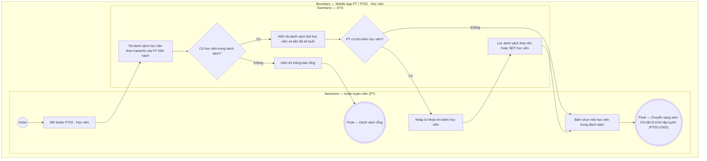

# PT02-US01 - Xem danh sách học viên được phân công

## Preconditions
- Huấn luyện viên (PT) đã đăng nhập ứng dụng Mobile PT bằng tài khoản hợp lệ.
- PT được phân công hướng dẫn luyện tập cho ít nhất một Hội viên có gói PT còn hiệu lực.

## Trigger
- PT bấm chọn menu footer `PT02 · Học viên` trên ứng dụng Mobile PT.
- Màn hình liên quan: Mobile App PT — Tab `PT02 · Học viên`.

## Main Flow

1. PT mở menu footer **PT02 · Học viên**.
2. Hệ thống nạp danh sách các học viên thuộc phạm vi phân công (assignment scope) của PT hiện hành (`trainerId`).
3. Danh sách hiển thị thông tin tổng quan của từng học viên:
   - Ảnh đại diện / Avatar chữ cái viết tắt (ví dụ: `TB`, `VP`).
   - Họ và tên Học viên, Số điện thoại, Mã học viên (ví dụ: `Trần Thị Bình`, `HV002 · 0902 345 678`).
   - Tên gói PT đang sử dụng và Hạn sử dụng (ví dụ: `Gói PT 20 buổi · 20/09/2026`).
   - Badge trạng thái gói tập: `Đang hoạt động` hoặc `Sắp hết hạn`.
   - Cụm 2 chỉ số theo dõi:
     - Số buổi PT còn lại (ví dụ: `3 Buổi PT`).
     - Thời gian tập lần cuối (ví dụ: `04/09/2026` hoặc `-` nếu chưa tập lần nào).
   - Thanh tiến độ buổi tập (Progress Bar): Dải thanh tiến trình đồ họa trực quan hiển thị tiến độ hoàn thành gói dạng `Đã tập X / Y buổi` kèm tỷ lệ phần trăm (%).
4. PT có thể nhập từ khóa để tìm kiếm học viên theo tên hoặc số điện thoại.
5. PT bấm chọn một thẻ học viên trong danh sách để mở màn hình xem chi tiết lộ trình tập luyện (`PT02-US02`).
6. **Quy tắc nghiệp vụ:**
   - PT chỉ xem được danh sách học viên được phân công cho chính mình.
   - Tuyệt đối không hiển thị thông tin tài chính, thanh toán hay công nợ của học viên trên màn hình danh sách.
   - Thẻ học viên hiển thị badge `Sắp hết hạn` khi thời hạn gói còn dưới 7 ngày hoặc số buổi còn lại $\le 3$.

### Field-level specification — Màn hình Danh sách học viên PT
| Field / control | State | Required | Conditional / dynamic | Source / validation |
| :--- | :--- | :--- | :--- | :--- |
| **Thanh tìm kiếm học viên (Search Bar)** | `USER-INPUT` | optional | `TRIGGER`: Nhập từ khóa (tên hoặc SĐT) để lọc danh sách thẻ học viên theo thời gian thực | Ô input tìm kiếm, placeholder: `Tìm học viên được phân công...`, icon kính lúp và nút xóa nhanh `[×]` |
| **Bộ chuyển phân loại tab (Tabs)** | `USER-INPUT` + `PREFILL` | required | `TRIGGER`: Chuyển giữa tab `Đang phụ trách` (`PT02-US01`) và tab `Yêu cầu phân công` (`PT02-US03`) | 2 tab lựa chọn: `Đang phụ trách (N)` (mặc định chọn) và `Yêu cầu phân công (M)` (kèm badge đỏ đếm số lượng nếu có yêu cầu mới) |
| **Thẻ học viên — Trạng thái `Đang hoạt động`** | `USER-INPUT / READONLY` | conditional | `CONDITIONAL`: **Hiện khi** học viên có gói PT còn hiệu lực (`ACTIVE`) và chưa cận ngày hết hạn (hạn còn trên 7 ngày và số buổi còn lại > 3); **Ẩn khi** không có học viên nào ở trạng thái này | Thẻ card hiển thị Avatar chữ viết tắt, Họ và tên (in đậm), Mã HV, SĐT, Tên gói PT, Hạn sử dụng gói, Badge `Đang hoạt động` (xanh lá), ô `Buổi PT còn lại`, ô `Lần cuối` và `Thanh tiến độ buổi tập`. Chạm vào thẻ để mở màn hình chi tiết lộ trình `PT02-US02` |
| **Thẻ học viên — Trạng thái `Sắp hết hạn`** | `USER-INPUT / READONLY` | conditional | `CONDITIONAL`: **Hiện khi** học viên có gói PT còn hiệu lực nhưng thời hạn còn dưới 7 ngày hoặc số buổi còn lại $\le 3$; **Ẩn khi** không có học viên nào ở tình trạng này | Thẻ card tương tự thẻ hoạt động nhưng hiển thị Badge cảnh báo `Sắp hết hạn` (màu vàng cam) kèm `Thanh tiến độ buổi tập`, giúp PT chủ động nhắc nhở học viên gia hạn gói. Chạm vào thẻ để mở màn hình chi tiết lộ trình `PT02-US02` |
| **Chỉ số Buổi PT còn lại (trên thẻ học viên)** | `READONLY` | required | `DYNAMIC`: Cập nhật theo số buổi thực tế còn lại của gói PT được gán cho học viên tương ứng | Hiển thị số lượng buổi tập PT còn lại (ví dụ: `3 Buổi PT`). Dữ liệu từ gói tập của học viên |
| **Chỉ số Lần cuối (trên thẻ học viên)** | `READONLY` | required | `DYNAMIC`: Cập nhật theo ngày hoàn thành buổi tập gần nhất của học viên | Hiển thị ngày tập hoàn thành gần nhất (`DD/MM/YYYY`) hoặc ký tự `-` nếu học viên mới chưa tập buổi nào |
| **Thanh tiến độ buổi tập (trên thẻ học viên)** | `READONLY` | required | `DYNAMIC`: Cập nhật tỷ lệ % thanh tiến trình và thông số buổi theo số buổi đã tập trên tổng số buổi của gói (`Đã tập X / Y buổi`) | Dải thanh tiến trình (progress bar) đồ họa hiển thị trực quan tỷ lệ buổi tập đã hoàn thành của gói PT (ví dụ: `Đã tập 17 / 20 buổi` kèm tỷ lệ 85%), giúp PT nắm bắt ngay tiến độ lộ trình mà không cần mở chi tiết |
| **Thông báo danh sách rỗng (Empty State)** | `READONLY` | conditional | `CONDITIONAL`: **Hiện khi** PT chưa có học viên nào được phân công hoặc không tìm thấy học viên nào khớp với từ khóa tìm kiếm; **Ẩn khi** có ít nhất 1 học viên trong danh sách kết quả | Khối thông báo rỗng kèm icon minh họa và nhãn `Chưa có học viên nào được phân công` (hoặc `Không tìm thấy học viên phù hợp`) |

## Alternate Flows

### AF-01 — PT chưa có học viên nào được phân công
1. PT chưa được phân công học viên hoặc không có học viên thỏa mãn từ khóa tìm kiếm.
2. SYS hiển thị thông báo "Chưa có học viên nào được phân công".

## Exception Flows

- Lỗi kết nối mạng: SYS hiển thị thông báo lỗi và giữ nguyên trạng thái cũ.

## Activity Diagram — Swimlane
**Trigger:** PT chọn menu footer PT02 · Học viên trên ứng dụng Mobile.

