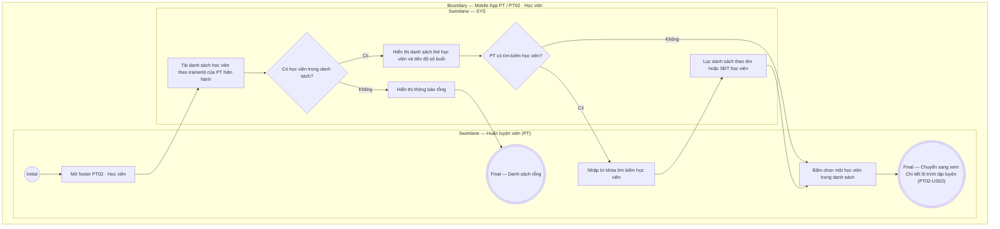

# PT02-US01 - Xem danh sách học viên được phân công

## Preconditions
- Huấn luyện viên (PT) đã đăng nhập ứng dụng Mobile PT bằng tài khoản hợp lệ.
- PT được phân công hướng dẫn luyện tập cho ít nhất một Hội viên có gói PT còn hiệu lực.

## Trigger
- PT bấm chọn menu footer `PT02 · Học viên` trên ứng dụng Mobile PT.
- Màn hình liên quan: Mobile App PT — Tab `PT02 · Học viên`.

## Main Flow

1. PT mở menu footer **PT02 · Học viên**.
2. Hệ thống nạp danh sách các học viên thuộc phạm vi phân công (assignment scope) của PT hiện hành (`trainerId`).
3. Danh sách hiển thị thông tin tổng quan của từng học viên:
   - Họ và tên Học viên, SĐT, Mã HV.
   - Tên gói PT đang sử dụng (ví dụ: `Gói PT 20 buổi`, `Gói PT 10 buổi`).
   - Số buổi PT còn lại, thời gian tập lần cuối và trạng thái gói (`Đang hoạt động`, `Sắp hết hạn`).
4. PT có thể nhập từ khóa để tìm kiếm học viên theo tên hoặc số điện thoại.
5. PT bấm chọn một học viên trong danh sách để mở màn hình xem chi tiết lộ trình tập luyện (`PT02-US02`).
6. **Quy tắc nghiệp vụ:**
   - PT chỉ xem được danh sách học viên được phân công cho chính mình.
   - Không hiển thị thông tin tài chính, thanh toán hay công nợ của học viên trên màn hình danh sách.

## Alternate Flows

### AF-01 — PT chưa có học viên nào được phân công
1. PT chưa được phân công học viên hoặc không có học viên thỏa mãn từ khóa tìm kiếm.
2. SYS hiển thị thông báo "Chưa có học viên nào được phân công".

## Exception Flows

- Lỗi kết nối mạng: SYS hiển thị thông báo lỗi và giữ nguyên trạng thái cũ.

## Activity Diagram — Swimlane
**Trigger:** PT chọn menu footer PT02 · Học viên trên ứng dụng Mobile.

