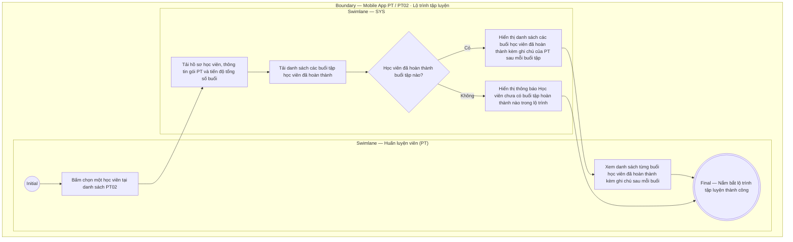

# PT02-US02 - Xem lộ trình và lịch sử tập luyện của học viên

## Preconditions
- PT đang đăng nhập ứng dụng Mobile PT và xem danh sách học viên tại `PT02 · Học viên`.
- Học viên được chọn thuộc phạm vi phân công của PT hiện hành.

## Trigger
- PT bấm chọn một học viên trong danh sách `PT02 · Học viên`.
- Màn hình liên quan: Mobile App PT — Màn hình `Chi tiết lộ trình tập luyện của học viên`.

## Main Flow

1. PT bấm chọn một học viên trong danh sách phân công.
2. Hệ thống nạp và hiển thị thông tin tổng quan lộ trình tập luyện của học viên:
   - Hồ sơ học viên (Họ và tên, SĐT, Chi nhánh tập luyện).
   - Thông tin gói PT đang sử dụng (Tên gói, Tổng số buổi, Số buổi đã tập, Số buổi còn lại, Hạn sử dụng gói).
   - Thanh tiến độ lộ trình tập luyện (ví dụ: `Đã tập 17 / 20 buổi - Còn lại 3 buổi`).
3. Hệ thống hiển thị danh sách từng buổi tập mà học viên đã hoàn thành (`Buổi 1`, `Buổi 2`, `Buổi 3`, ...) kèm theo nội dung ghi chú bài tập & đánh giá kết quả của PT ghi nhận sau mỗi buổi tập đó.
4. PT xem chi tiết danh sách từng buổi tập đã hoàn thành cùng các ghi chú để nắm bắt chính xác lộ trình tập luyện và tiến độ thể lực của học viên, từ đó chủ động cân chỉnh giáo án/bài tập cho các buổi tiếp theo.

### Field-level specification — Màn hình Chi tiết lộ trình tập luyện
| Field / control | State | Required | Conditional / dynamic | Source / validation |
|---|---|---|---|---|
| Thẻ hồ sơ học viên | `READONLY` | required | `DYNAMIC`: nạp Họ tên, SĐT, Chi nhánh học viên | Profile học viên |
| Thẻ thông tin gói PT | `READONLY` | required | `DYNAMIC`: nạp Tên gói, Tổng số buổi, Số buổi đã tập, Số buổi còn lại | Data gói PT học viên |
| Thanh tiến độ hoàn thành | `READONLY` | required | `DYNAMIC`: hiển thị phần trăm / số buổi đã hoàn thành trên tổng số buổi gói | Tiến độ sử dụng gói |
| Danh sách các buổi đã hoàn thành | `READONLY` | required | `DYNAMIC`: nạp danh sách từng buổi học viên đã hoàn thành theo thứ tự thời gian | Database session history |
| Ghi chú của PT sau mỗi buổi | `READONLY` | optional | `DYNAMIC`: hiển thị ghi chú kết quả bài tập, mức tạ, đánh giá thể trạng do PT ghi lại sau mỗi buổi tập | History session note |
| Badge trạng thái buổi tập | `READONLY` | required | `DYNAMIC`: `Đã ghi nhận` (`DONE`) | Trạng thái session |

- **Business rules / logic:**
  - Lộ trình tập luyện hiển thị danh sách từng buổi đã hoàn thành kèm ghi chú chi tiết sau mỗi buổi để PT nắm bắt lộ trình và liên tục điều chỉnh giáo án phù hợp với thể trạng của học viên.
  - PT chỉ xem được lộ trình tập luyện của các học viên do chính mình phụ trách.

## Alternate Flows

### AF-01 — Học viên mới chưa có buổi tập nào hoàn thành
1. Học viên mới đăng ký gói và chưa hoàn thành buổi tập nào.
2. SYS hiển thị thông báo "Học viên chưa có buổi tập hoàn thành nào trong lộ trình" và hiển thị số buổi còn nguyên (ví dụ: `0 / 20 buổi`).

## Exception Flows

- Lỗi kết nối mạng: SYS hiển thị thông báo lỗi và cho phép PT thử lại.

## Activity Diagram — Swimlane
**Trigger:** PT chọn một học viên trong danh sách PT02 trên ứng dụng Mobile.

