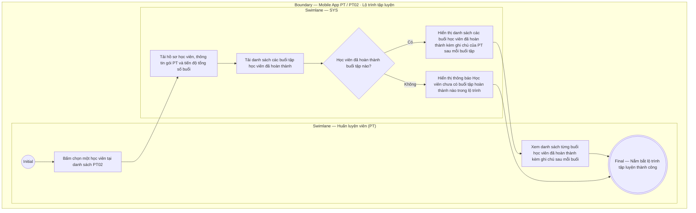

# PT02-US02 - Xem lộ trình và lịch sử tập luyện của học viên

## Preconditions
- PT đang đăng nhập ứng dụng Mobile PT và xem danh sách học viên tại `PT02 · Học viên`.
- Học viên được chọn thuộc phạm vi phân công của PT hiện hành.

## Trigger
- PT bấm chọn một học viên trong danh sách `PT02 · Học viên`.
- Màn hình liên quan: Mobile App PT — Màn hình `Chi tiết lộ trình tập luyện của học viên`.

## Main Flow

1. PT bấm chọn một học viên trong danh sách phân công.
2. Hệ thống nạp và hiển thị thông tin tổng quan lộ trình tập luyện của học viên:
   - Hồ sơ học viên (Họ và tên, SĐT, Mã HV, Chi nhánh tập luyện).
   - Thông tin gói PT đang sử dụng (Tên gói, Tổng số buổi, Số buổi đã tập, Số buổi còn lại, Hạn sử dụng gói).
   - Thanh tiến độ lộ trình tập luyện trực quan (ví dụ: `Đã tập 17 / 20 buổi - Còn lại 3 buổi`).
3. Hệ thống hiển thị danh sách từng buổi tập mà học viên đã hoàn thành (`Buổi 1`, `Buổi 2`, `Buổi 3`, ...) kèm theo nội dung ghi chú bài tập & đánh giá kết quả của PT ghi nhận sau mỗi buổi tập đó.
4. PT xem chi tiết danh sách từng buổi tập đã hoàn thành cùng các ghi chú để nắm bắt chính xác lộ trình tập luyện và tiến độ thể lực của học viên, từ đó chủ động cân chỉnh giáo án/bài tập cho các buổi tiếp theo.
5. **Quy tắc nghiệp vụ:**
   - Lộ trình tập luyện hiển thị danh sách từng buổi đã hoàn thành kèm ghi chú chi tiết sau mỗi buổi để PT nắm bắt lộ trình và liên tục điều chỉnh giáo án phù hợp với thể trạng của học viên.
   - PT chỉ xem được lộ trình tập luyện của các học viên do chính mình phụ trách.

### Field-level specification — Màn hình Chi tiết lộ trình & Lịch sử tập luyện của học viên
| Field / control | Loại UI Control | State | Required | Conditional / dynamic | Source / validation |
| :--- | :--- | :--- | :--- | :--- | :--- |
| **Nút quay lại (Back Button `[←]`)** | `Action Button (Back Icon)` | `USER-INPUT` | required | Không | Icon mũi tên quay lại góc trên bên trái màn hình; chạm để đóng màn hình chi tiết và quay về danh sách học viên `PT02-US01` |
| **Khối thông tin hồ sơ học viên** | `Profile Info Card` | `READONLY` | required | Không | Hiển thị thông tin định danh: Avatar chữ cái đầu họ tên, Họ và tên học viên (in đậm), Mã học viên, Số điện thoại và Chi nhánh đăng ký sinh hoạt |
| **Khối thông tin gói PT & Thời hạn** | `Package Info Card` | `READONLY` | required | Không | Hiển thị: Tên gói PT (ví dụ: `Gói PT 20 buổi`), Tổng số buổi theo hợp đồng và Ngày hết hạn gói (`DD/MM/YYYY`) |
| **Thanh tiến độ lộ trình tập luyện (Progress Bar)** | `Progress Bar (Graphic)` | `READONLY` | required | Không | Thanh tiến trình trực quan thể hiện tiến độ hoàn thành gói dạng `Đã tập X / Y buổi` kèm tỷ lệ phần trăm (`%`) và nhãn số buổi còn lại `Còn lại Z buổi` |
| **Thẻ lịch sử buổi tập đã hoàn thành (Session History Item)** | `Timeline Session Card` | `READONLY` | conditional | `CONDITIONAL`: **Hiện khi** học viên đã có ít nhất 1 buổi tập đạt xác nhận hoàn thành (`DONE`); **Ẩn khi** học viên là người mới chưa có buổi tập nào hoàn thành | Thẻ lịch sử theo dòng thời gian (timeline), hiển thị: Thứ tự buổi tập (`Buổi 1`, `Buổi 2`...), Ngày tập (`DD/MM/YYYY`), Khung giờ (`HH:mm - HH:mm`), Badge trạng thái `Hoàn thành` (xanh lá), và Khối nội dung ghi chú kết quả/đánh giá thể lực do PT đã ghi nhận sau buổi |
| **Thông báo chưa có buổi tập nào (Empty State)** | `Empty State Box` | `READONLY` | conditional | `CONDITIONAL`: **Hiện khi** học viên mới đăng ký gói và chưa hoàn thành buổi tập nào (`0 / Y buổi`); **Ẩn khi** học viên đã hoàn thành ít nhất 1 buổi tập | Khối thông báo rỗng kèm icon minh họa và nhãn: `Học viên chưa có buổi tập hoàn thành nào trong lộ trình` |

## Alternate Flows

### AF-01 — Học viên mới chưa có buổi tập nào hoàn thành
1. Học viên mới đăng ký gói và chưa hoàn thành buổi tập nào.
2. SYS hiển thị thông báo "Học viên chưa có buổi tập hoàn thành nào trong lộ trình" và hiển thị số buổi còn nguyên (ví dụ: `0 / 20 buổi`).

## Exception Flows

- Lỗi kết nối mạng: SYS hiển thị thông báo lỗi và cho phép PT thử lại.

## Activity Diagram — Swimlane
**Trigger:** PT chọn một học viên trong danh sách PT02 trên ứng dụng Mobile.

