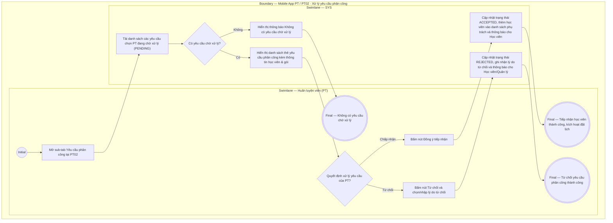

# PT02-US03 - Tiếp nhận và xử lý yêu cầu phân công PT

## Preconditions
- PT đang đăng nhập ứng dụng Mobile PT bằng tài khoản hợp lệ.
- PT có yêu cầu chọn/phân công PT mới từ Học viên ở trạng thái `Chờ tiếp nhận` (`PENDING`).

## Trigger
- PT chọn sub-tab `Yêu cầu phân công` tại menu `PT02 · Học viên` hoặc bấm vào thông báo Yêu cầu phân công mới từ `PT03`.
- Màn hình liên quan: Mobile App PT — Sub-tab `Yêu cầu phân công PT` / Modal `Chi tiết yêu cầu phân công`.

## Main Flow

1. PT mở sub-tab **Yêu cầu phân công** tại `PT02 · Học viên`.
2. Hệ thống hiển thị danh sách các yêu cầu chọn PT từ Học viên đang ở trạng thái `Chờ tiếp nhận` (`PENDING`).
3. Mỗi yêu cầu hiển thị chi tiết: Họ tên Học viên, Tên gói PT đăng ký (ví dụ: `Gói PT 20 buổi`), Chi nhánh tập luyện, Ngày gửi yêu cầu và Ghi chú/mong muốn của học viên (nếu có).
4. PT bấm xem chi tiết yêu cầu và đưa ra quyết định:
   - **Đồng ý tiếp nhận:** PT bấm nút `[ Đồng ý tiếp nhận ]`. Hệ thống cập nhật trạng thái phân công thành `Đã tiếp nhận` (`ACCEPTED`), đưa học viên vào danh sách phụ trách chính thức của PT và kích hoạt gói tập/cho phép đặt lịch.
   - **Từ chối tiếp nhận:** PT bấm nút `[ Từ chối ]`, chọn/nhập lý do từ chối (ví dụ: *Trùng ca làm việc, Đã kín ca phụ trách*). Hệ thống cập nhật trạng thái yêu cầu thành `Đã từ chối` (`REJECTED`) và thông báo cho Học viên / Quản lý để điều phối PT khác.
5. Hệ thống gửi thông báo kết quả xử lý cho Học viên và làm mới danh sách yêu cầu.

### Field-level specification — Màn hình Tiếp nhận yêu cầu phân công PT
| Field / control | State | Required | Conditional / dynamic | Source / validation |
|---|---|---|---|---|
| Danh sách yêu cầu chờ xử lý | `READONLY` | required | `DYNAMIC`: nạp danh sách các yêu cầu phân công đang ở trạng thái `PENDING` của PT | Database assignment request |
| Thẻ thông tin học viên & gói | `READONLY` | required | `DYNAMIC`: nạp Họ tên, SĐT, Tên gói PT, Chi nhánh và Ghi chú mong muốn của HV | Data request |
| Nút `[ Đồng ý tiếp nhận ]` | `USER-INPUT` | required | `DYNAMIC`: bấm để chấp nhận phân công | Thao tác chấp nhận |
| Nút `[ Từ chối ]` | `USER-INPUT` | required | `DYNAMIC`: bấm để từ chối phân công | Thao tác từ chối |
| Lý do từ chối | `USER-INPUT` | optional | `CONDITIONAL`: bắt buộc nhập/chọn khi PT bấm Từ chối | Danh sách lý do / Văn bản tự do |

- **Business rules / logic:**
  - PT có quyền chủ động chấp nhận hoặc từ chối yêu cầu phân công tùy theo ca làm việc và tải công việc hiện tại.
  - Khi PT chấp nhận, học viên lập tức xuất hiện trong danh sách `PT02-US01` và cho phép tiến hành đặt lịch tập `PT01-US01`.
  - Khi PT từ chối, gói tập của học viên trở về trạng thái chưa phân công PT để QTV/Lễ tân hoặc Học viên chọn PT khác.

## Alternate Flows

### AF-01 — Không có yêu cầu chờ xử lý
1. PT không có yêu cầu phân công mới nào đang chờ.
2. SYS hiển thị thông báo "Không có yêu cầu phân công nào đang chờ xử lý".

## Exception Flows

- Lỗi kết nối mạng: SYS thông báo không thể cập nhật trạng thái yêu cầu và giữ nguyên dữ liệu để PT thử lại.

## Activity Diagram — Swimlane
**Trigger:** PT mở sub-tab Yêu cầu phân công trong PT02 hoặc bấm thông báo phân công mới.

