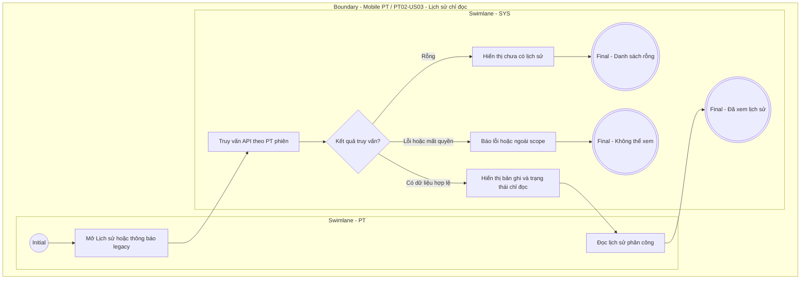

# PT02-US03 - Lịch sử phân công PT (chỉ đọc)

> Retired: luồng Tiếp nhận và xử lý yêu cầu phân công do hội viên chọn đã ngừng theo quyết định staff-only ngày 20/09/2026. Giữ nguyên ID và đường dẫn để bảo toàn tham chiếu/audit. US này chỉ mô tả tra cứu lịch sử legacy, không duy trì quyền chấp nhận/từ chối.

## Preconditions
- PT đăng nhập hợp lệ; bản ghi lịch sử truy cập phải thuộc chính PT.
- Dữ liệu legacy có thể rỗng; không cần có yêu cầu chờ xử lý.

## Trigger
- PT chọn tab Lịch sử phân công ở PT02 hoặc mở thông báo phân công legacy.

## Main Flow
1. SYS xác định PT từ phiên, truy vấn lịch sử được phép xem từ API hiện có.
2. SYS hiển thị dữ liệu lịch sử cùng trạng thái đã lưu, kể cả PENDING chưa xử lý.
3. PT đọc học viên, hợp đồng, chi nhánh, thời điểm yêu cầu/phản hồi và ghi chú/lý do nếu API có trả.
4. Không có Đồng ý, Từ chối, modal từ chối hay thao tác sửa/xóa/phân công. PENDING legacy là lịch sử chưa xử lý, không phải việc cần PT duyệt.
5. Phân công hiện hành do Lễ tân/QTV quyết định; lịch sử không tự kích hoạt quyền đặt lịch. Muốn đặt hộ phải có phân công chính thức theo PT01-US03.

### Field-level specification — Lịch sử phân công
| Field / control | UI | State | Required | Conditional / dynamic | Source / validation |
| --- | --- | --- | --- | --- | --- |
| Tab Lịch sử phân công | Tabs | USER-INPUT | required | TRIGGER | Chuyển từ Đang phụ trách sang dữ liệu lịch sử own scope |
| Họ tên, mã học viên | Text | READONLY | required | Không | API bản ghi lịch sử; không suy ra hồ sơ ngoài quyền |
| Hợp đồng / gói | Text | READONLY | required | Không | Tham chiếu đã lưu qua API |
| Chi nhánh | Text | READONLY | required | Không | API bản ghi |
| Trạng thái lịch sử | Badge | READONLY | required | Không | PENDING: Chưa xử lý (lịch sử); ACCEPTED: Đã tiếp nhận; REJECTED: Đã từ chối; giữ trạng thái nguồn |
| Ngày yêu cầu | Timestamp | READONLY | required | Không | Thời điểm gốc API |
| Ngày phản hồi | Timestamp | READONLY | optional | Không | API; chưa có thì hiển thị chưa có phản hồi |
| Ghi chú / lý do đã lưu | Text | READONLY | optional | Không | API; rỗng ghi chưa có, không cho nhập mới |
| Rỗng / lỗi | Status | READONLY | conditional | CONDITIONAL: hiện khi không có bản ghi hoặc tải lỗi; ẩn khi tải thành công có bản ghi | Không tạo lịch sử giả |
| Thử lại | Button | USER-INPUT | conditional | CONDITIONAL: hiện khi lỗi; ẩn khi thành công/đang tải | Tải lại lịch sử |

## Alternate Flows
- AF-01: Không có bản ghi → hiển thị Chưa có lịch sử phân công.
- AF-02: Link/thông báo cũ → mở lịch sử chỉ đọc nếu còn được phép xem; không mở form duyệt.
- AF-03: Quay lại Đang phụ trách → PT02-US01, dựa trên phân công hiện hành.

## Exception Flows
- EF-01: API lỗi → báo lỗi và cho tải lại; không thay lịch sử bằng danh sách phân công hiện tại.
- EF-02: Bản ghi ngoài own scope hoặc đã không còn được phép truy cập → báo không thể xem; không lộ dữ liệu.
- EF-03: Yêu cầu gọi lại accept/reject từ client cũ không được cấp quyền theo đặc tả mới; việc vô hiệu hóa backend thuộc Main, không suy ra đã triển khai từ tài liệu.

## Activity Diagram — Swimlane

