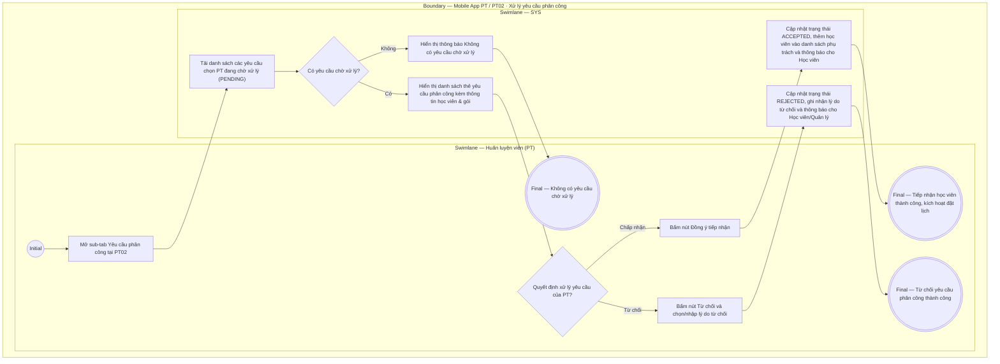

# PT02-US03 - Tiếp nhận và xử lý yêu cầu phân công PT

## Preconditions
- Huấn luyện viên (PT) đang đăng nhập ứng dụng Mobile PT bằng tài khoản hợp lệ.
- PT có yêu cầu chọn/phân công PT mới từ Hội viên ở trạng thái `Chờ tiếp nhận` (`PENDING`).

## Trigger
- PT chọn sub-tab `Yêu cầu phân công` tại menu `PT02 · Học viên` hoặc bấm vào thông báo Yêu cầu phân công mới từ chuông thông báo `PT03`.
- Màn hình liên quan: Mobile App PT — Sub-tab `Yêu cầu phân công` / Bottom Sheet `Xác nhận từ chối yêu cầu phân công`.

## Main Flow

1. PT mở sub-tab **Yêu cầu phân công** tại `PT02 · Học viên`.
2. Hệ thống hiển thị danh sách các yêu cầu chọn PT từ Hội viên đang ở trạng thái `Chờ tiếp nhận` (`PENDING`).
3. Mỗi yêu cầu hiển thị chi tiết: Họ tên Học viên, Mã HV, Số điện thoại, Tên gói PT đăng ký (ví dụ: `Gói PT 20 buổi`), Chi nhánh tập luyện, Thời gian gửi yêu cầu và Ghi chú/mong muốn của học viên (nếu có).
4. PT xem chi tiết yêu cầu và đưa ra quyết định:
   - **Đồng ý tiếp nhận:** PT bấm nút `[ Đồng ý tiếp nhận ]`. Hệ thống cập nhật trạng thái phân công thành `Đã tiếp nhận` (`ACCEPTED`), đưa học viên vào danh sách phụ trách chính thức của PT (`PT02-US01`) và kích hoạt quyền đặt lịch tập cho hai bên.
   - **Từ chối tiếp nhận:** PT bấm nút `[ Từ chối ]`. Hệ thống hiển thị Bottom Sheet `Xác nhận từ chối yêu cầu phân công`. PT chọn lý do từ chối định sẵn (và nhập diễn giải chi tiết nếu chọn `Khác`), sau đó bấm xác nhận. Hệ thống cập nhật trạng thái yêu cầu thành `Đã từ chối` (`REJECTED`) và thông báo cho Hội viên / Quản lý để điều phối PT khác.
5. Hệ thống gửi thông báo kết quả xử lý cho Hội viên và làm mới danh sách yêu cầu.
6. **Quy tắc nghiệp vụ:**
   - PT có quyền chủ động chấp nhận hoặc từ chối yêu cầu phân công tùy theo ca làm việc và tải công việc thực tế.
   - Khi PT chấp nhận, học viên lập tức xuất hiện trong danh sách `PT02-US01` và cho phép tiến hành đặt lịch tập `PT01-US01`.
   - Khi PT từ chối, gói tập của học viên trở về trạng thái chưa phân công PT để QTV/Lễ tân hoặc Học viên chọn PT khác.

### Field-level specification — Danh sách Thẻ yêu cầu phân công (Sub-tab Yêu cầu phân công)
| Field / control | Loại UI Control | State | Required | Conditional / dynamic | Source / validation |
| :--- | :--- | :--- | :--- | :--- | :--- |
| **Thẻ yêu cầu phân công PT** | `Request Card` | `USER-INPUT / READONLY` | conditional | `CONDITIONAL`: **Hiện khi** có yêu cầu phân công PT đang ở trạng thái `Chờ tiếp nhận` (`PENDING`); **Ẩn khi** không có yêu cầu nào chờ xử lý | Thẻ card hiển thị: Avatar chữ cái viết tắt, Họ và tên học viên, Mã HV, Số điện thoại, Chi nhánh đăng ký, Tên gói PT yêu cầu, Thời gian gửi yêu cầu (`DD/MM/YYYY HH:mm`) và Ghi chú mong muốn của học viên (nếu có) |
| **Nút Đồng ý tiếp nhận** | `Action Button (Success)` | `USER-INPUT` | conditional | `CONDITIONAL`: **Hiện khi** thẻ yêu cầu ở trạng thái `PENDING`; **Ẩn khi** yêu cầu đã được chấp nhận hoặc từ chối | Nút Primary màu xanh lá trên thẻ yêu cầu; chạm để chấp nhận tiếp nhận học viên vào danh sách phụ trách chính thức |
| **Nút Từ chối** | `Action Button (Danger Outline)` | `USER-INPUT` | conditional | `CONDITIONAL`: **Hiện khi** thẻ yêu cầu ở trạng thái `PENDING`; **Ẩn khi** yêu cầu đã được xử lý | Nút Secondary màu viền xám/đỏ nhạt trên thẻ yêu cầu; chạm để mở Bottom Sheet `Xác nhận từ chối yêu cầu phân công` |
| **Thông báo không có yêu cầu chờ xử lý (Empty State)** | `Empty State Box` | `READONLY` | conditional | `CONDITIONAL`: **Hiện khi** không có yêu cầu phân công nào đang chờ xử lý; **Ẩn khi** có ít nhất 1 yêu cầu ở trạng thái `PENDING` | Khối thông báo rỗng kèm icon minh họa và nhãn: `Không có yêu cầu phân công nào đang chờ xử lý` |

### Field-level specification — Modal / Bottom Sheet Xác nhận từ chối yêu cầu phân công
| Field / control | Loại UI Control | State | Required | Conditional / dynamic | Source / validation |
| :--- | :--- | :--- | :--- | :--- | :--- |
| **Thông tin yêu cầu tóm tắt** | `Readonly Summary Box` | `READONLY` | required | Không | Hiển thị tóm tắt Họ và tên học viên cùng Tên gói PT bị từ chối tiếp nhận |
| **Lý do từ chối** | `Select Dropdown / Radio Group` | `USER-INPUT` | required | `TRIGGER`: Chọn lý do để điều khiển hiển thị trường nhập chi tiết bổ sung | Dropdown / Radio selection chọn lý do định sẵn: `Trùng ca làm việc`, `Đã kín ca phụ trách`, `Không phù hợp mục tiêu tập luyện`, `Khác` |
| **Chi tiết lý do khác** | `Textarea` | `USER-INPUT` | conditional | `CONDITIONAL`: **Hiện khi** trường `Lý do từ chối` nhận giá trị `Khác`; **Ẩn khi** trường `Lý do từ chối` nhận bất kỳ giá trị định sẵn nào khác | Ô nhập văn bản nhiều dòng (textarea), tối đa 255 ký tự; giải thích cụ thể lý do từ chối để chuyển tiếp cho ban quản trị / học viên |

## Alternate Flows

### AF-01 — Không có yêu cầu chờ xử lý
1. PT không có yêu cầu phân công mới nào đang chờ.
2. SYS hiển thị thông báo "Không có yêu cầu phân công nào đang chờ xử lý".

## Exception Flows

- Lỗi kết nối mạng: SYS thông báo không thể cập nhật trạng thái yêu cầu và giữ nguyên dữ liệu để PT thử lại.

## Activity Diagram — Swimlane
**Trigger:** PT mở sub-tab Yêu cầu phân công trong PT02 hoặc bấm thông báo phân công mới.

