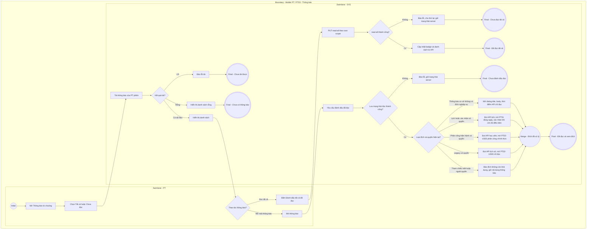

# PT03-US01 - Xem và xử lý thông báo PT

## Preconditions
- PT đã đăng nhập ứng dụng Mobile PT bằng tài khoản hợp lệ.
- Danh sách thông báo có thể rỗng.

## Trigger
- PT bấm chọn chuông thông báo mở `PT03 · Thông báo` trên ứng dụng Mobile PT.
- Màn hình liên quan: Mobile App PT — Tab `PT03 · Thông báo`.

## Main Flow

1. PT mở màn hình **PT03 · Thông báo** từ chuông.
2. Hệ thống nạp danh sách các thông báo dành riêng cho PT hiện hành, từ các sự kiện backend được cấu hình:
   - **Thông báo phân công chính thức:** phát khi Lễ tân/QTV gán hoặc chuyển giao PT; không phát yêu cầu hội viên chọn PT theo luồng đã retired. Thông báo legacy vẫn là lịch sử chỉ đọc.
   - **Thông báo Đặt lịch PT mới:** Phát khi Hội viên/Lễ tân/QTV hoặc PT được phép đặt lịch hộ (`PT01-US03`). Nội dung: *"Lịch dạy mới: Học viên [Tên HV] đã đặt lịch tập vào [Khung giờ] ngày [DD/MM/YYYY]"*.
   - **Thông báo Hủy lịch buổi PT:** Phát khi Học viên/Lễ tân hủy lịch buổi PT (`HV02-US03`). Nội dung: *"Lịch dạy bị hủy: Buổi tập với Học viên [Tên HV] lúc [Khung giờ] ngày [DD/MM/YYYY] đã bị hủy"*.
   - **Thông báo Xác nhận hoàn thành từ Học viên:** Phát khi Học viên xác nhận buổi học (`HV02-US04`). Nội dung: *"Học viên [Tên HV] đã bấm xác nhận hoàn thành buổi tập [Khung giờ] ngày [DD/MM/YYYY]. Vui lòng xác nhận kết quả"*.
   - **Thông báo Nhắc lịch dạy sắp tới:** Chỉ hiển thị sự kiện do backend phát theo cấu hình nhắc lịch; không hứa lịch gửi 15–30 phút khi scheduler/provider chưa được xác nhận. Nội dung: *"Nhắc lịch dạy: Bạn có buổi tập với Học viên [Tên HV] vào lúc [Khung giờ] hôm nay"*.
3. PT có thể lọc danh sách thông báo theo trạng thái (`Tất cả` / `Chưa đọc`).
4. PT bấm chọn một thông báo cụ thể trong danh sách.
5. Hệ thống đánh dấu thông báo thành "Đã đọc" và tự động điều hướng PT đến màn hình xử lý tương ứng:
   - Thông báo phân công chính thức → Chi tiết học viên (`PT02-US02`) nếu còn scope; thông báo yêu cầu cũ → Lịch sử phân công chỉ đọc (`PT02-US03`).
   - Thông báo Đặt lịch / Hủy lịch / Nhắc lịch $\rightarrow$ Điều hướng đến Lịch tập PT theo ngày (`PT01-US01`).
   - Thông báo Xác nhận hoàn thành $\rightarrow$ Điều hướng mở modal Ghi nhận kết quả buổi PT (`PT01-US02`).

- **Business rules / logic:**
  - Hệ thống chỉ hiển thị thông báo của chính PT đó, tuyệt đối không gửi nhầm thông báo của PT khác.
  - Thao tác xem thông báo chỉ cập nhật trạng thái "Đã đọc", không tự động thay đổi kết quả buổi học hay trạng thái phân công.

### Field-level specification — Màn hình Thông báo PT
| Field / control | Loại UI Control | State | Required | Conditional / dynamic | Source / validation |
| :--- | :--- | :--- | :--- | :--- | :--- |
| **Bộ lọc Tất cả / Chưa đọc** | `Tab Segmented Control` | `USER-INPUT` | required | `TRIGGER`: Điều khiển tập thông báo hiển thị | Lọc `notifications.is_read` từ API `GET /notifications`, chỉ thuộc tài khoản PT hiện hành |
| **Tiêu đề thông báo** | `Text Label (Bold)` | `READONLY` | required | Không | `notifications.title` qua API; không sinh thông báo tại frontend từ danh sách lịch hoặc yêu cầu phân công |
| **Nội dung thông báo** | `Text Paragraph` | `READONLY` | required | Không | `notifications.body` qua API; hiển thị nguyên nội dung đã lưu, không chèn tên/gói/khung giờ mẫu |
| **Thời điểm gửi** | `Timestamp Text` | `READONLY` | required | Không | `notifications.created_at` qua API, định dạng ngày/giờ địa phương |
| **Trạng thái đã đọc** | `Status Dot / Badge` | `READONLY` | required | Không | `notifications.is_read` và `read_at`; đồng bộ sau khi API xác nhận, không chỉ lưu localStorage |
| **Thao tác mở thông báo** | `Notification Item Row` | `USER-INPUT` | required | Không | Gọi `PUT /notifications/:id/read`, dùng `event_type`, `reference_type`, `reference_id` thật để mở màn hình PT01/PT02 theo Main Flow. API đích vẫn kiểm tra quyền; tham chiếu không còn hợp lệ thì báo lỗi, không tự tạo kết quả buổi học/phân công |
| **Trạng thái trống / lỗi tải** | `Empty State Box / Error State Box` | `READONLY` | conditional | `CONDITIONAL`: Hiện khi danh sách lọc rỗng hoặc API tải lỗi; ẩn khi có dữ liệu hợp lệ | Phân biệt chưa có thông báo và lỗi kết nối; không thay bằng lịch nhắc giả |
| **Nút thử lại** | `Action Button` | `USER-INPUT` | conditional | `CONDITIONAL`: Hiện khi API tải lỗi; ẩn khi đang tải hoặc đã tải thành công | Gọi lại API danh sách |

### Field-level specification — Đọc tất cả và điều hướng
| Field / control | UI | State | Required | Conditional / dynamic | Source / validation |
| --- | --- | --- | --- | --- | --- |
| Đánh dấu tất cả đã đọc | Icon + text button | USER-INPUT | required | Không | PUT read-all notifications hiện có; disabled khi đang gửi/không còn chưa đọc; thành công mới cập nhật UI |
| Quay lại | Icon button | USER-INPUT | required | Không | Trở về màn hình trước |

Không tổng hợp thông báo tại frontend; không lưu trạng thái đọc vào localStorage. GET notifications là nguồn danh sách; PUT read/read-all phải thành công trước khi đổi UI. Deep link đợi dữ liệu đích tải xong và kiểm tra scope trước khi mở.

### Field-level specification — Dialog nội dung thông báo cơ sở
| Field | UI | State | Required | Conditional / dynamic | Source / validation |
| --- | --- | --- | --- | --- | --- |
| Tiêu đề | Text | READONLY | required | Không | title của thông báo API đã chọn |
| Nội dung | Text | READONLY | required | Không | body từ API, không tạo booking/reference giả |
| Thời điểm gửi | Timestamp | READONLY | required | Không | created_at từ API |

Phân loại bằng event_type/reference của API. Thông báo cơ sở hoặc sự kiện không liên quan booking/phân công mở dialog nội dung chỉ đọc; không ép điều hướng Calendar với ID giả. Đóng dialog quay về danh sách.

## Alternate Flows

### AF-01 — Lọc xem thông báo chưa đọc
1. PT chọn tab `Chưa đọc`.
2. SYS hiển thị danh sách các thông báo chưa được PT mở xem.

- AF-02: Không có thông báo sau lọc → trạng thái rỗng, không tự dựng nhắc lịch.
- AF-03: Thông báo lịch sử hoặc không có đích còn hiệu lực → đọc nội dung, không mở thao tác đã retired.

- AF-04: Đọc tất cả → PUT read-all → thành công mới cập nhật badge/list, không mở lần lượt các đích.

- AF-05: Thông báo cơ sở/không có đích nghiệp vụ → đọc thành công rồi mở dialog title/body/time chỉ đọc.

## Exception Flows

- Lỗi kết nối mạng: SYS hiển thị thông báo "Không thể nạp danh sách thông báo, vui lòng kiểm tra kết nối mạng".

- Đánh dấu đọc thất bại: giữ trạng thái máy chủ và báo lỗi; không báo đã đọc chỉ từ localStorage.
- Đích đã hủy/hoàn thành/ngoài scope: tải lại, hiển thị chỉ đọc hoặc báo không còn quyền; không tự mở modal xác nhận.
- Push/SMS ngoài ứng dụng phụ thuộc provider; in-app từ API không chứng minh đã giao SMS/push (PT-OQ-01).

## Activity Diagram — Swimlane

