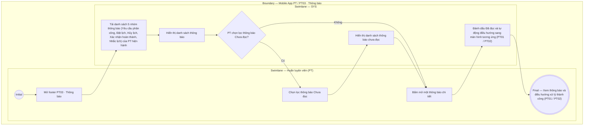

# PT03-US01 - Xem và xử lý thông báo PT

## Preconditions
- PT đã đăng nhập ứng dụng Mobile PT bằng tài khoản hợp lệ.
- PT có các thông báo in-app được phát từ các sự kiện vận hành lịch tập và phân công học viên.

## Trigger
- PT bấm chọn menu footer `PT03 · Thông báo` trên ứng dụng Mobile PT.
- Màn hình liên quan: Mobile App PT — Tab `PT03 · Thông báo`.

## Main Flow

1. PT mở menu footer **PT03 · Thông báo**.
2. Hệ thống nạp danh sách các thông báo dành riêng cho PT hiện hành, bao gồm 5 nhóm thông báo chính:
   - **Thông báo Yêu cầu phân công PT mới:** Phát khi Hội viên chọn PT phụ trách gói tập (`HV03-US04`). Nội dung: *"Bạn có yêu cầu phân công PT mới từ Học viên [Tên HV] - Gói [Tên gói]"*.
   - **Thông báo Đặt lịch PT mới:** Phát khi Học viên/Lễ tân đặt lịch dạy (`HV02-US02`). Nội dung: *"Lịch dạy mới: Học viên [Tên HV] đã đặt lịch tập vào [Khung giờ] ngày [DD/MM/YYYY]"*.
   - **Thông báo Hủy lịch buổi PT:** Phát khi Học viên/Lễ tân hủy lịch buổi PT (`HV02-US03`). Nội dung: *"Lịch dạy bị hủy: Buổi tập với Học viên [Tên HV] lúc [Khung giờ] ngày [DD/MM/YYYY] đã bị hủy"*.
   - **Thông báo Xác nhận hoàn thành từ Học viên:** Phát khi Học viên xác nhận buổi học (`HV02-US04`). Nội dung: *"Học viên [Tên HV] đã bấm xác nhận hoàn thành buổi tập [Khung giờ] ngày [DD/MM/YYYY]. Vui lòng xác nhận kết quả"*.
   - **Thông báo Nhắc lịch dạy sắp tới:** Phát tự động trước ca dạy 15–30 phút. Nội dung: *"Nhắc lịch dạy: Bạn có buổi tập với Học viên [Tên HV] vào lúc [Khung giờ] hôm nay"*.
3. PT có thể lọc danh sách thông báo theo trạng thái (`Tất cả` / `Chưa đọc`).
4. PT bấm chọn một thông báo cụ thể trong danh sách.
5. Hệ thống đánh dấu thông báo thành "Đã đọc" và tự động điều hướng PT đến màn hình xử lý tương ứng:
   - Thông báo Yêu cầu phân công $\rightarrow$ Điều hướng đến Chi tiết học viên & Lộ trình (`PT02-US02`).
   - Thông báo Đặt lịch / Hủy lịch / Nhắc lịch $\rightarrow$ Điều hướng đến Lịch tập PT theo ngày (`PT01-US01`).
   - Thông báo Xác nhận hoàn thành $\rightarrow$ Điều hướng mở modal Ghi nhận kết quả buổi PT (`PT01-US02`).

- **Business rules / logic:**
  - Hệ thống chỉ hiển thị thông báo của chính PT đó, tuyệt đối không gửi nhầm thông báo của PT khác.
  - Thao tác xem thông báo chỉ cập nhật trạng thái "Đã đọc", không tự động thay đổi kết quả buổi học hay trạng thái phân công.

### Field-level specification — Màn hình Thông báo PT
| Field / control | Loại UI Control | State | Required | Conditional / dynamic | Source / validation |
| :--- | :--- | :--- | :--- | :--- | :--- |
| **Bộ lọc Tất cả / Chưa đọc** | `Tab Segmented Control` | `USER-INPUT` | required | `TRIGGER`: Điều khiển tập thông báo hiển thị | Lọc `notifications.is_read` từ API `GET /notifications`, chỉ thuộc tài khoản PT hiện hành |
| **Tiêu đề thông báo** | `Text Label (Bold)` | `READONLY` | required | Không | `notifications.title` qua API; không sinh thông báo tại frontend từ danh sách lịch hoặc yêu cầu phân công |
| **Nội dung thông báo** | `Text Paragraph` | `READONLY` | required | Không | `notifications.body` qua API; hiển thị nguyên nội dung đã lưu, không chèn tên/gói/khung giờ mẫu |
| **Thời điểm gửi** | `Timestamp Text` | `READONLY` | required | Không | `notifications.created_at` qua API, định dạng ngày/giờ địa phương |
| **Trạng thái đã đọc** | `Status Dot / Badge` | `READONLY` | required | Không | `notifications.is_read` và `read_at`; đồng bộ sau khi API xác nhận, không chỉ lưu localStorage |
| **Thao tác mở thông báo** | `Notification Item Row` | `USER-INPUT` | required | Không | Gọi `PUT /notifications/:id/read`, dùng `event_type`, `reference_type`, `reference_id` thật để mở màn hình PT01/PT02 theo Main Flow. API đích vẫn kiểm tra quyền; tham chiếu không còn hợp lệ thì báo lỗi, không tự tạo kết quả buổi học/phân công |
| **Trạng thái trống / lỗi tải** | `Empty State Box / Error State Box` | `READONLY` | conditional | `CONDITIONAL`: Hiện khi danh sách lọc rỗng hoặc API tải lỗi; ẩn khi có dữ liệu hợp lệ | Phân biệt chưa có thông báo và lỗi kết nối; không thay bằng lịch nhắc giả |
| **Nút thử lại** | `Action Button` | `USER-INPUT` | conditional | `CONDITIONAL`: Hiện khi API tải lỗi; ẩn khi đang tải hoặc đã tải thành công | Gọi lại API danh sách |

## Alternate Flows

### AF-01 — Lọc xem thông báo chưa đọc
1. PT chọn tab `Chưa đọc`.
2. SYS hiển thị danh sách các thông báo chưa được PT mở xem.

## Exception Flows

- Lỗi kết nối mạng: SYS hiển thị thông báo "Không thể nạp danh sách thông báo, vui lòng kiểm tra kết nối mạng".

## Activity Diagram — Swimlane
**Trigger:** PT chọn menu footer PT03 · Thông báo trên ứng dụng Mobile.

