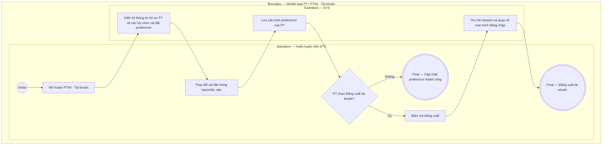

# PT04-US01 - Xem hồ sơ và tùy chọn tài khoản PT

## Preconditions
- PT đã đăng nhập ứng dụng Mobile PT bằng tài khoản hợp lệ.

## Trigger
- PT bấm chọn menu footer `PT04 · Tài khoản` trên ứng dụng Mobile PT.
- Màn hình liên quan: Mobile App PT — Tab `PT04 · Tài khoản`.

## Main Flow

1. PT mở menu footer **PT04 · Tài khoản**.
2. Hệ thống hiển thị thông tin hồ sơ cá nhân của PT (Họ tên, Mã PT, Chi nhánh phụ trách) và các tùy chọn cài đặt thông báo/nhắc việc.
3. PT thực hiện bật/tắt các tùy chọn cài đặt (Nhận thông báo lịch mới, Nhắc ghi kết quả buổi học, Hiển thị SĐT cho học viên).
4. PT bấm `[ Lưu cài đặt ]` (hoặc hệ thống tự động lưu trạng thái switch khi PT thao tác).
5. Hệ thống lưu cấu hình preference của PT và thông báo cập nhật thành công.

### Field-level specification — Màn hình Tài khoản & Cài đặt PT
| Field / control | State | Required | Conditional / dynamic | Source / validation |
|---|---|---|---|---|
| Họ và tên PT | `READONLY` | required | `DYNAMIC`: nạp từ hồ sơ tài khoản PT | Profile PT |
| Mã PT | `READONLY` | required | `DYNAMIC`: nạp mã định danh PT | Mã PT duy nhất |
| Chi nhánh phụ trách | `READONLY` | required | `DYNAMIC`: nạp chi nhánh phân công của PT | Branch scope |
| Nhận thông báo lịch mới | `USER-INPUT` + `PREFILL` | optional | `DYNAMIC`: Bật/Tắt | Preference PT |
| Nhắc ghi kết quả buổi học | `USER-INPUT` + `PREFILL` | optional | `DYNAMIC`: Bật/Tắt | Preference PT |
| Hiển thị SĐT cho học viên | `USER-INPUT` + `PREFILL` | optional | `DYNAMIC`: Bật/Tắt | Preference PT |
| Nút `[ Đăng xuất ]` | `USER-INPUT` | optional | `DYNAMIC`: bấm để đăng xuất phiên làm việc | Thao tác session |

- **Business rules / logic:**
  - PT chỉ được xem hồ sơ và chỉnh sửa tùy chọn cài đặt cá nhân của chính mình.
  - PT không có quyền tự thay đổi mã PT, chi nhánh làm việc, phân quyền hoặc mật khẩu tài khoản hệ thống trên màn hình này.

## Alternate Flows

### AF-01 — Đăng xuất tài khoản
1. PT bấm nút `[ Đăng xuất ]`.
2. SYS kết thúc phiên làm việc (session) và đưa PT về màn hình đăng nhập.

## Exception Flows

- Lỗi kết nối mạng: SYS hiển thị thông báo không thể lưu tùy chọn cài đặt và giữ nguyên trạng thái cũ.

## Activity Diagram — Swimlane
**Trigger:** PT chọn menu footer PT04 · Tài khoản trên ứng dụng Mobile.

