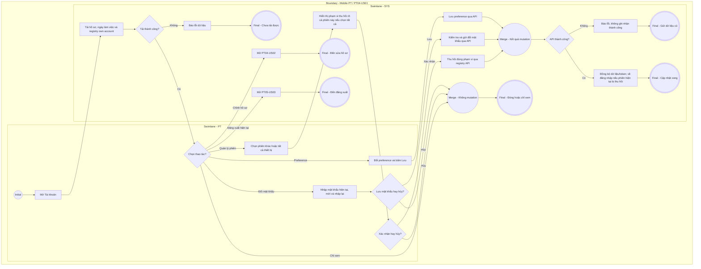

# PT04-US01 - Xem hồ sơ và tùy chọn tài khoản PT

## Preconditions
- HLV (PT) đã đăng nhập ứng dụng Mobile PT bằng tài khoản hợp lệ.

## Trigger
- PT bấm chọn menu footer `PT04 · Tài khoản` trên ứng dụng Mobile PT.
- Màn hình liên quan: Mobile App PT — Tab `PT04 · Tài khoản`.

## Main Flow

1. PT mở menu footer **PT04 · Tài khoản**.
2. Hệ thống hiển thị thông tin hồ sơ nhân sự của PT (Ảnh đại diện, Họ tên, Mã PT, Chi nhánh phụ trách, SĐT, Email) và các tùy chọn cài đặt thông báo, bảo mật.
3. PT thực hiện điều chỉnh các công tắc bật/tắt (Toggle Switch):
   - Nhận thông báo lịch mới: Bật/Tắt.
   - Nhắc ghi kết quả buổi học: Bật/Tắt.
   - Hiển thị SĐT cho học viên: Bật/Tắt.
   - Xác thực 2 lớp (2FA khi đăng nhập): Bật/Tắt (Khi bật, mỗi lần đăng nhập bằng mật khẩu sẽ yêu cầu thêm mã OTP gửi về SĐT).
4. PT bấm nút **`[ Lưu cài đặt ]`**.
5. Hệ thống lưu cấu hình preference và bảo mật của PT, đồng thời hiển thị thông báo cập nhật thành công.

- **Business rules / logic:**
  - PT chỉ được xem hồ sơ và chỉnh sửa tùy chọn cài đặt cá nhân của chính mình.
  - PT không có quyền tự thay đổi mã PT, chi nhánh làm việc, phân quyền hoặc thông tin nhân sự cốt lõi trên màn hình này (phải do Admin/Lễ tân cập nhật trên Web).
  - Khi PT bấm `[ Đăng xuất ]`, hệ thống mở Popup xác nhận đăng xuất theo luồng `PT05-US03`.

### Field-level specification — Màn hình PT04 · Tài khoản
| Field / control | Loại UI Control | State | Required | Conditional / dynamic | Source / validation |
| :--- | :--- | :--- | :--- | :--- | :--- |
| **Ảnh đại diện HLV** | `Avatar Image View` | `READONLY` | optional | Không | API `GET /mobile/profile`, từ `accounts.avatar_url`; thiếu ảnh thì dùng icon mặc định, không dùng ảnh chân dung mẫu |
| **Họ và tên HLV** | `Readonly Text` | `READONLY` | required | Không | API hồ sơ cá nhân, từ `pt_profiles.full_name`; không thay bằng tên mẫu khi tải lỗi |
| **Mã nhân sự PT** | `Readonly Badge / Tag` | `READONLY` | required | Không | API hồ sơ cá nhân, từ `pt_profiles.pt_code` do hệ thống cấp |
| **Chi nhánh làm việc** | `Readonly Text` | `READONLY` | required | Không | API hồ sơ cá nhân nối `pt_profiles.branch_id` với `branches.branch_name` |
| **Số điện thoại liên hệ** | `Readonly Text` | `READONLY` | required | Không | API hồ sơ cá nhân, từ `pt_profiles.phone`; PT luôn xem được SĐT của chính mình |
| **Email liên hệ** | `Readonly Text` | `READONLY` | optional | Không | API hồ sơ cá nhân, từ `pt_profiles.email`; rỗng thì hiển thị chưa cập nhật |
| **Nhận thông báo lịch mới** | `Toggle Switch` | `USER-INPUT (PREFILL)` | optional | Không | Toggle `Bật` / `Tắt`, nạp/lưu qua `GET/PUT /mobile/preferences`, từ `accounts.notify_new_bookings`; chỉ nhận sự kiện khi đồng thời thỏa cấu hình quy tắc ON và mẫu đang sử dụng của QTV |
| **Nhắc ghi kết quả buổi học** | `Toggle Switch` | `USER-INPUT (PREFILL)` | optional | Không | Toggle `Bật` / `Tắt`, nạp/lưu qua API tùy chọn, từ `accounts.notify_result_reminders`; không tự sinh thông báo tại frontend hoặc bỏ qua quy tắc QTV |
| **Hiển thị SĐT cho học viên** | `Toggle Switch` | `USER-INPUT (PREFILL)` | optional | Không | Toggle `Bật` / `Tắt`, nạp/lưu qua API tùy chọn, từ `pt_profiles.show_phone_to_members`; API chỉ trả SĐT cho hội viên đã được phân công PT đó khi giá trị là bật; tắt thì API che SĐT đối với hội viên |
| **Xác thực 2 lớp (2FA khi đăng nhập)** | `Toggle Switch` | `USER-INPUT (PREFILL)` | optional | Không | Toggle `Bật` / `Tắt`, nạp/lưu qua API tùy chọn, từ `accounts.is_two_factor_enabled`; áp dụng OTP khi đăng nhập bằng mật khẩu; không chỉ lưu cục bộ |
| **Nút [ Chỉnh sửa hồ sơ ]** | `Action Button` | `USER-INPUT` | optional | Không | Nút điều hướng; bấm để mở Màn hình / Modal Cập nhật hồ sơ cá nhân HLV (`PT04-US02`) |
| **Nút [ Đổi mật khẩu ]** | `Action Button` | `USER-INPUT` | optional | Không | Nút điều hướng; bấm để mở Modal Đổi mật khẩu tài khoản HLV |
| **Nút CTA [ Lưu cài đặt ]** | `Action Button (CTA)` | `USER-INPUT` | required | Không | Luôn hiển thị; chỉ enable khi đã nạp cài đặt từ API, có thay đổi hợp lệ và không đang gửi. Gọi `PUT /mobile/preferences`; chỉ báo thành công sau khi API xác nhận lưu; lỗi thì giữ trạng thái đã lưu trước đó |
| **Nút [ Đăng xuất ]** | `Action Button (Danger)` | `USER-INPUT` | required | Không | Nút màu đỏ ở cuối trang; bấm để kích hoạt Popup Xác nhận Đăng xuất (`PT05-US03`) |

### Field-level specification — Hồ sơ và phiên thiết bị
| Field / control | UI | State | Required | Conditional / dynamic | Source / validation |
| --- | --- | --- | --- | --- | --- |
| Chuyên môn | Text | READONLY | optional | Không | API hồ sơ specialties; rỗng ghi Chưa cập nhật |
| Giới thiệu | Text | READONLY | optional | Không | API hồ sơ bio đã tồn tại; không thêm cột DB |
| Ngày làm việc | Text | READONLY | required | Không | API work_days: ALL_WEEK = Cả tuần, MON_TO_FRI = Thứ 2–Thứ 6; diễn giải giá trị thực, thiếu ghi Chưa cập nhật; không hardcode T2–T6 |
| Khung giờ làm việc | Text | READONLY | optional | Không | Chỉ hiển thị cấu hình thực từ API; chưa có thì không tự đặt 08:00–18:00 |
| Nút Thiết bị | Icon + text button | USER-INPUT | required | Không | Mở popup và GET /auth/sessions own account |
| Tên thiết bị, IP, lần hoạt động gần nhất | List fields | READONLY | required | Không | Popup Thiết bị: GET /auth/sessions của chính tài khoản, chỉ phiên chưa thu hồi/chưa hết hạn; device_name, IP, last_active_at đã lưu |
| Nhãn Phiên hiện tại | Badge | READONLY | conditional | CONDITIONAL: hiện khi is_current=true; ẩn khi false | Registry API |
| Thu hồi phiên | Icon + text button | USER-INPUT | conditional | CONDITIONAL: hiện với phiên khác chưa thu hồi; ẩn với phiên hiện tại/đã thu hồi | DELETE /auth/sessions/:id; server kiểm tra chủ sở hữu |
| Đăng xuất phiên hiện tại | Button | USER-INPUT | required | Không | PT05-US03, POST /auth/logout-current |
| Đăng xuất tất cả thiết bị | Button | USER-INPUT | required | Không | POST /auth/logout-all thu hồi cả phiên hiện tại; không gắn nhãn chỉ các thiết bị khác |
| Làm mới danh sách phiên | Icon button | USER-INPUT | optional | Không | GET /auth/sessions; lỗi không được hiện thành danh sách rỗng thành công |

Nút Đóng chỉ đóng popup, không thu hồi phiên. Registry lấy is_current từ API.

### Field-level specification — Modal Đổi mật khẩu
| Field | UI | State | Required | Conditional / dynamic | Source / validation |
| --- | --- | --- | --- | --- | --- |
| Mật khẩu hiện tại | Password input | USER-INPUT | required | Không | Server kiểm tra; không ghi log/plaintext |
| Mật khẩu mới | Password input | USER-INPUT | required | Không | Tối thiểu 8 ký tự, tối đa 72 byte, có hoa/thường và số hoặc ký tự đặc biệt theo auth API |
| Nhập lại mật khẩu mới | Password input | USER-INPUT | required | Không | Phải khớp; không gửi như một trường DB |

### Field-level specification — Modal xác nhận thu hồi phiên
| Field | UI | State | Required | Conditional / dynamic | Source / validation |
| --- | --- | --- | --- | --- | --- |
| Phạm vi thu hồi | Text | READONLY | required | Không | Một phiên được chọn hoặc tất cả phiên, từ thao tác PT |
| Thiết bị mục tiêu | Text | READONLY | conditional | CONDITIONAL: hiện khi thu hồi một phiên; ẩn khi tất cả | Bản ghi registry đã chọn |
| Thông báo kết thúc phiên hiện tại | Text | READONLY | conditional | CONDITIONAL: hiện khi chọn tất cả; ẩn khi thu hồi một phiên khác | Giải thích kết quả thực của logout-all |

Không có chứng chỉ: đã gỡ theo yêu cầu và migration 005 ngày 18/09/2026. Không khôi phục bảng/field/UI chứng chỉ. 2FA/SMS và nhận push phụ thuộc cấu hình provider; lưu preference không chứng minh SMS/push đã giao.

## Alternate Flows

### AF-01 — Điều hướng sang Đăng xuất tài khoản
1. PT bấm nút `[ Đăng xuất ]` ở cuối màn hình.
2. SYS kích hoạt luồng Đăng xuất tài khoản PT (`PT05-US03`).

- AF-02: Chỉnh sửa hồ sơ → PT04-US02; bio/chuyên môn ở màn hình xem vẫn READONLY.
- AF-03: Đổi mật khẩu → mở modal, nhập ba trường, kiểm tra khớp rồi xác nhận → gọi auth/change-password. Server vô hiệu phiên cũ, tạo registry session mới cho thiết bị hiện tại và trả token gắn session đó; đồng bộ token trước khi báo thành công.
- AF-04: Thu hồi một phiên khác → xác nhận → gọi DELETE đúng ID → tải registry lại; giữ phiên hiện tại.
- AF-05: Đăng xuất tất cả → xác nhận rõ bao gồm thiết bị này → logout-all → xóa phiên cục bộ → PT05-US01.
- AF-06: Hủy modal đổi mật khẩu/thu hồi → không gửi mutation; xem hồ sơ mà không chỉnh → không lưu.

## Exception Flows

- Lỗi kết nối mạng: SYS hiển thị thông báo không thể lưu tùy chọn cài đặt và giữ nguyên trạng thái cũ.

- API phiên/đổi mật khẩu lỗi hoặc mật khẩu hiện tại sai: báo đúng lỗi, không báo đã thu hồi/đổi thành công; 401 yêu cầu đăng nhập lại.
- Thiếu/lỗi registry: server từ chối phiên không kiểm chứng được (fail closed); UI hiển thị lỗi/đăng nhập lại, không tiếp tục bằng token ngoài registry. Provider thiếu thì không tạo OTP mẫu.

## Activity Diagram — Swimlane
**Trigger:** PT chọn menu footer PT04 · Tài khoản trên ứng dụng Mobile.

