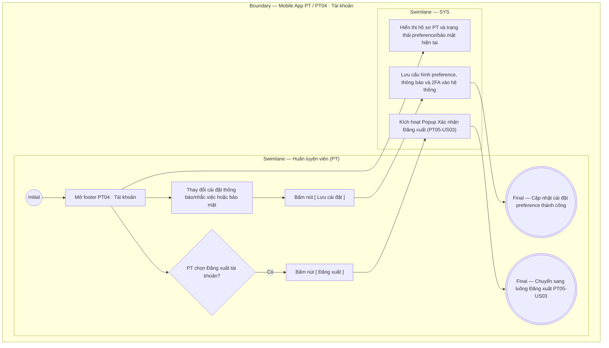

# PT04-US01 - Xem hồ sơ và tùy chọn tài khoản PT

## Preconditions
- HLV (PT) đã đăng nhập ứng dụng Mobile PT bằng tài khoản hợp lệ.

## Trigger
- PT bấm chọn menu footer `PT04 · Tài khoản` trên ứng dụng Mobile PT.
- Màn hình liên quan: Mobile App PT — Tab `PT04 · Tài khoản`.

## Main Flow

1. PT mở menu footer **PT04 · Tài khoản**.
2. Hệ thống hiển thị thông tin hồ sơ nhân sự của PT (Ảnh đại diện, Họ tên, Mã PT, Chi nhánh phụ trách, SĐT, Email) và các tùy chọn cài đặt thông báo, bảo mật.
3. PT thực hiện điều chỉnh các công tắc bật/tắt (Toggle Switch):
   - Nhận thông báo lịch mới: Bật/Tắt.
   - Nhắc ghi kết quả buổi học: Bật/Tắt.
   - Hiển thị SĐT cho học viên: Bật/Tắt.
   - Xác thực 2 lớp (2FA khi đăng nhập): Bật/Tắt (Khi bật, mỗi lần đăng nhập bằng mật khẩu sẽ yêu cầu thêm mã OTP gửi về SĐT).
4. PT bấm nút **`[ Lưu cài đặt ]`** (hoặc hệ thống tự động lưu trạng thái khi PT thay đổi switch).
5. Hệ thống lưu cấu hình preference và bảo mật của PT, đồng thời hiển thị thông báo cập nhật thành công.

- **Business rules / logic:**
  - PT chỉ được xem hồ sơ và chỉnh sửa tùy chọn cài đặt cá nhân của chính mình.
  - PT không có quyền tự thay đổi mã PT, chi nhánh làm việc, phân quyền hoặc thông tin nhân sự cốt lõi trên màn hình này (phải do Admin/Lễ tân cập nhật trên Web).
  - Khi PT bấm `[ Đăng xuất ]`, hệ thống mở Popup xác nhận đăng xuất theo luồng `PT05-US03`.

### Field-level specification — Màn hình PT04 · Tài khoản
| Field / control | Loại UI Control | State | Required | Conditional / dynamic | Source / validation |
| :--- | :--- | :--- | :--- | :--- | :--- |
| **Ảnh đại diện HLV** | `Avatar Image View` | `READONLY` | optional | Không | API `GET /mobile/profile`, từ `accounts.avatar_url`; thiếu ảnh thì dùng icon mặc định, không dùng ảnh chân dung mẫu |
| **Họ và tên HLV** | `Readonly Text` | `READONLY` | required | Không | API hồ sơ cá nhân, từ `pt_profiles.full_name`; không thay bằng tên mẫu khi tải lỗi |
| **Mã nhân sự PT** | `Readonly Badge / Tag` | `READONLY` | required | Không | API hồ sơ cá nhân, từ `pt_profiles.pt_code` do hệ thống cấp |
| **Chi nhánh làm việc** | `Readonly Text` | `READONLY` | required | Không | API hồ sơ cá nhân nối `pt_profiles.branch_id` với `branches.name` |
| **Số điện thoại liên hệ** | `Readonly Text` | `READONLY` | required | Không | API hồ sơ cá nhân, từ `pt_profiles.phone`; PT luôn xem được SĐT của chính mình |
| **Email liên hệ** | `Readonly Text` | `READONLY` | optional | Không | API hồ sơ cá nhân, từ `pt_profiles.email`; rỗng thì hiển thị chưa cập nhật |
| **Nhận thông báo lịch mới** | `Toggle Switch` | `USER-INPUT (PREFILL)` | optional | Không | Toggle `Bật` / `Tắt`, nạp/lưu qua `GET/PUT /mobile/preferences`, từ `accounts.notify_new_bookings`; chỉ nhận sự kiện khi đồng thời thỏa cấu hình quy tắc ON và mẫu đang sử dụng của QTV |
| **Nhắc ghi kết quả buổi học** | `Toggle Switch` | `USER-INPUT (PREFILL)` | optional | Không | Toggle `Bật` / `Tắt`, nạp/lưu qua API tùy chọn, từ `accounts.notify_result_reminders`; không tự sinh thông báo tại frontend hoặc bỏ qua quy tắc QTV |
| **Hiển thị SĐT cho học viên** | `Toggle Switch` | `USER-INPUT (PREFILL)` | optional | Không | Toggle `Bật` / `Tắt`, nạp/lưu qua API tùy chọn, từ `pt_profiles.show_phone_to_members`; API chỉ trả SĐT cho hội viên đã được phân công PT đó khi giá trị là bật; tắt thì API che SĐT đối với hội viên |
| **Xác thực 2 lớp (2FA khi đăng nhập)** | `Toggle Switch` | `USER-INPUT (PREFILL)` | optional | Không | Toggle `Bật` / `Tắt`, nạp/lưu qua API tùy chọn, từ `accounts.is_two_factor_enabled`; áp dụng OTP khi đăng nhập bằng mật khẩu; không chỉ lưu cục bộ |
| **Nút [ Chỉnh sửa hồ sơ ]** | `Action Button` | `USER-INPUT` | optional | Không | Nút điều hướng; bấm để mở Màn hình / Modal Cập nhật hồ sơ cá nhân HLV (`PT04-US02`) |
| **Nút [ Đổi mật khẩu ]** | `Action Button` | `USER-INPUT` | optional | Không | Nút điều hướng; bấm để mở Modal Đổi mật khẩu tài khoản HLV |
| **Nút CTA [ Lưu cài đặt ]** | `Action Button (CTA)` | `USER-INPUT` | required | Không | Luôn hiển thị; chỉ enable khi đã nạp cài đặt từ API, có thay đổi hợp lệ và không đang gửi. Gọi `PUT /mobile/preferences`; chỉ báo thành công sau khi API xác nhận lưu; lỗi thì giữ trạng thái đã lưu trước đó |
| **Nút [ Đăng xuất ]** | `Action Button (Danger)` | `USER-INPUT` | required | Không | Nút màu đỏ ở cuối trang; bấm để kích hoạt Popup Xác nhận Đăng xuất (`PT05-US03`) |

## Alternate Flows

### AF-01 — Điều hướng sang Đăng xuất tài khoản
1. PT bấm nút `[ Đăng xuất ]` ở cuối màn hình.
2. SYS kích hoạt luồng Đăng xuất tài khoản PT (`PT05-US03`).

## Exception Flows

- Lỗi kết nối mạng: SYS hiển thị thông báo không thể lưu tùy chọn cài đặt và giữ nguyên trạng thái cũ.

## Activity Diagram — Swimlane
**Trigger:** PT chọn menu footer PT04 · Tài khoản trên ứng dụng Mobile.

