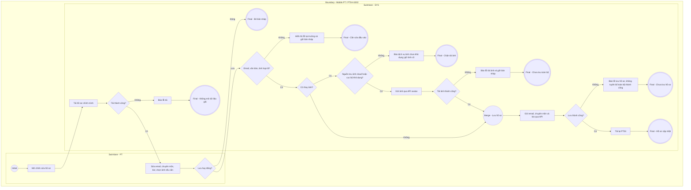

# PT04-US02 - Cập nhật hồ sơ cá nhân PT

## Preconditions
- HLV (PT) đã đăng nhập ứng dụng Mobile PT bằng tài khoản hợp lệ.
- HLV truy cập tab `PT04 · Tài khoản` và chọn mục `Chỉnh sửa hồ sơ`.

## Trigger
- HLV bấm chọn nút hoặc biểu tượng `Chỉnh sửa hồ sơ` tại màn hình Tài khoản.
- Màn hình liên quan: Mobile App PT — Tab `PT04 · Tài khoản`, màn hình Cập nhật hồ sơ cá nhân PT.

## Main Flow

1. HLV bấm chọn **`[ Chỉnh sửa hồ sơ ]`** tại màn hình Tài khoản PT.
2. Hệ thống hiển thị form cập nhật hồ sơ cá nhân với dữ liệu hiện tại của HLV (Ảnh đại diện, Họ tên, Mã PT, Chi nhánh làm việc, SĐT, Chuyên môn và Giới thiệu bản thân, Email).
3. HLV thực hiện điều chỉnh các thông tin cho phép:
   - Tải lên ảnh đại diện mới từ thư viện thiết bị hoặc chụp ảnh trực tiếp từ camera.
   - Chỉnh sửa nội dung Chuyên môn và Giới thiệu bản thân (`bio` / `specialties`).
   - Cập nhật Email liên hệ cá nhân.
4. HLV bấm nút **`[ Lưu thay đổi ]`**.
5. Client và server kiểm tra: ảnh PNG/JPEG/WebP <= 5MB; email hợp lệ tối đa 150 ký tự; chuyên môn tối đa 500; bio tối đa 1.000 ký tự. Không chỉ dựa maxlength phía client.
6. SYS lưu qua API hồ sơ và dịch vụ avatar hiện có; chỉ báo thành công sau API xác nhận. Backend dùng cloud nếu cấu hình hoặc lưu trữ ảnh cục bộ; thiếu cloud không tự chặn chức năng. Nếu lưu ảnh thất bại thì giữ bản nháp, không tuyên bố ảnh đã lưu. Nếu ảnh đã lưu nhưng API hồ sơ thất bại, báo rõ ảnh đã cập nhật còn thông tin hồ sơ chưa lưu.
7. Hệ thống điều hướng quay trở lại màn hình chính của `PT04 · Tài khoản` với thông tin mới nhất vừa được cập nhật.

- **Business rules / logic:**
  - HLV chỉ được xem và chỉnh sửa thông tin hồ sơ của chính mình.
  - Ảnh đại diện chỉ chấp nhận định dạng ảnh PNG, JPEG hoặc WebP với dung lượng tệp tối đa 5MB.
  - Các thông tin nhân sự cốt lõi bao gồm: Họ và tên chính thức, Mã nhân sự PT, Chi nhánh làm việc chính và Số điện thoại liên hệ là thông tin do ban quản lý phòng gym quản lý và ký kết hợp đồng lao động, HLV không được tự ý chỉnh sửa tại màn hình này (muốn thay đổi phải liên hệ QTV/Lễ tân trên Web Admin).

### Field-level specification — modal Cập nhật hồ sơ cá nhân PT
| Field / control | Loại UI Control | State | Required | Conditional / dynamic | Source / validation |
| :--- | :--- | :--- | :--- | :--- | :--- |
| **Ảnh đại diện (Avatar)** | `Avatar Picker (File Upload)` | `USER-INPUT (PREFILL)` | optional | Không | Prefill ảnh hiện tại từ `accounts.avatar_url`; cho phép chọn tệp ảnh mới từ thư viện hoặc chụp camera; chỉ chấp nhận PNG, JPEG, WebP dung lượng <= 5MB |
| **Họ và tên HLV** | `Readonly Textbox` | `READONLY (PREFILL)` | required | Không | Prefill từ `pt_profiles.full_name`; hiển thị dạng chỉ đọc, không cho phép chỉnh sửa |
| **Mã nhân sự PT** | `Readonly Textbox` | `READONLY (PREFILL)` | required | Không | Prefill từ `pt_profiles.pt_code` do hệ thống cấp; hiển thị dạng chỉ đọc |
| **Chi nhánh làm việc** | `Readonly Textbox` | `READONLY (PREFILL)` | required | Không | Nối `pt_profiles.branch_id` với `branches.branch_name`; hiển thị dạng chỉ đọc |
| **Số điện thoại liên hệ** | `Readonly Textbox` | `READONLY (PREFILL)` | required | Không | Prefill từ `pt_profiles.phone`; hiển thị dạng chỉ đọc |
| **Email liên hệ** | `Textbox (Email Input)` | `USER-INPUT (PREFILL)` | optional | Không | Input text; prefill từ `pt_profiles.email`; kiểm tra định dạng email hợp lệ theo chuẩn RFC 5322; tối đa 150 ký tự |
| **Chuyên môn huấn luyện** | `Textbox` | `USER-INPUT (PREFILL)` | optional | Không | Input text; prefill từ `pt_profiles.specialties`; tối đa 500 ký tự (ví dụ: Tăng cơ giảm mỡ, Siết cơ, Boxing...) |
| **Giới thiệu bản thân (`bio`)** | `Textarea` | `USER-INPUT (PREFILL)` | optional | Không | Textarea đa dòng; prefill từ `pt_profiles.bio`; tối đa 1.000 ký tự mô tả thế mạnh huấn luyện (ví dụ: Tăng cơ giảm mỡ, Thể hình thi đấu, Boxing, Phục hồi chấn thương) |

## Alternate Flows

### AF-01 — HLV hủy thao tác chỉnh sửa
1. Tại màn hình Chỉnh sửa hồ sơ, HLV bấm nút `[ Hủy / Quay lại ]` hoặc icon `[ ← ]`.
2. SYS đóng màn hình chỉnh sửa, không lưu các thay đổi chưa xác nhận và hiển thị lại màn hình PT04 chính.

## Exception Flows

- **EF-01: Tệp ảnh vượt quá dung lượng cho phép hoặc sai định dạng**: HLV chọn tệp ảnh lớn hơn 5MB hoặc tệp không phải PNG/JPEG/WebP $\rightarrow$ SYS hiển thị thông báo lỗi `Ảnh đại diện phải thuộc định dạng PNG, JPEG hoặc WebP và có dung lượng tối đa 5MB` và không gửi yêu cầu lên máy chủ.
- **EF-02: Định dạng email không hợp lệ**: HLV nhập email sai định dạng $\rightarrow$ SYS hiển thị thông báo lỗi `Email liên hệ không hợp lệ` tại trường nhập liệu và chặn thao tác lưu.
- **EF-03: Lỗi kết nối máy chủ hoặc gián đoạn mạng**: SYS hiển thị thông báo lỗi `Không thể lưu thay đổi hồ sơ, vui lòng kiểm tra kết nối mạng` và giữ nguyên trạng thái dữ liệu trên form để HLV thử lại.

- **EF-04: Dịch vụ lưu ảnh không khả dụng:** khi cả nguồn lưu ảnh thực tế không ghi được, báo lỗi và giữ bản nháp; không thay avatar cũ. Nếu ảnh lưu thành công nhưng email/bio/chuyên môn lưu lỗi, báo cập nhật một phần và giữ nội dung để thử lại, không khẳng định toàn bộ thành công.

## Activity Diagram — Swimlane
**Trigger:** HLV chọn Chỉnh sửa hồ sơ tại menu footer PT04 · Tài khoản trên ứng dụng Mobile PT.

