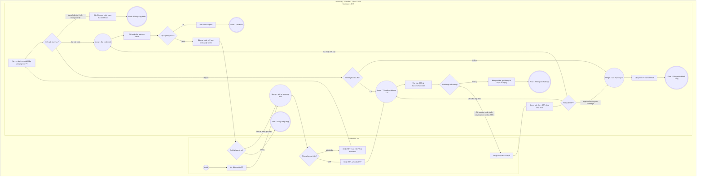

# PT05-US01 - Đăng nhập đa phương thức và xác thực 2 lớp PT

## Preconditions
- HLV (PT) đã cài đặt ứng dụng Mobile PT Paradise Gym.
- HLV đã được Lễ tân hoặc Quản trị viên cấp hồ sơ nhân sự hợp lệ trên hệ thống.

## Trigger
- HLV mở ứng dụng Mobile PT khi chưa đăng nhập hoặc phiên làm việc đã hết hạn.
- Màn hình liên quan: Mobile App PT — Màn hình Đăng nhập PT & Màn hình Xác thực 2FA.

## Trạng thái tích hợp
- OTP phụ thuộc provider: delivery=DEVELOPMENT_ONLY nghĩa là chưa gửi SMS; PROVIDER_ACCEPTED chỉ xác nhận provider nhận yêu cầu, không chứng minh điện thoại đã nhận.
- Production thiếu cấu hình SMS hoặc provider từ chối → SMS_UNAVAILABLE; không bỏ qua 2FA, không hiển thị mã phát triển hoặc bổ sung social login/OTP giả.
- TTL và lượt gửi lại lấy server: quy tắc hiện có 60 giây, tối đa 3 lần gửi lại; 5 lần sai khóa 15 phút, không khóa ngay lần sai đầu.
- Thiết bị mới/tin cậy theo challenge backend; client không tự bỏ 2FA. Xem PT-OQ-01.

## Main Flow

### Trường hợp 1: Đăng nhập bằng Mật khẩu (có Xác thực 2 lớp - 2FA)
1. HLV chọn tab **`Bằng Mật khẩu`** trên màn hình Đăng nhập PT.
2. HLV nhập Số điện thoại (hoặc Mã nhân viên PT) và Mật khẩu.
3. HLV bấm nút **`[ ĐĂNG NHẬP ]`**.
4. SYS xác thực thông tin đăng nhập (Lớp xác thực 1 thành công).
5. SYS kiểm tra: Tài khoản có bật 2FA hoặc phát hiện đăng nhập trên thiết bị mới $\rightarrow$ SYS gửi mã OTP 6 số qua SMS tới SĐT của HLV và chuyển sang màn hình **Xác thực 2 lớp (2FA)**.
6. HLV nhập đúng 6 chữ số OTP.
7. SYS xác thực mã OTP (Lớp xác thực 2 thành công) $\rightarrow$ Khởi tạo phiên truy cập (Session Mobile PT) và điều hướng vào màn hình `PT06 · Tổng quan`.

### Trường hợp 2: Đăng nhập bằng Mã OTP (Không dùng mật khẩu)
1. HLV chọn tab **`Bằng mã OTP`** trên màn hình Đăng nhập.
2. HLV nhập Số điện thoại và bấm **`[ Nhận mã OTP ]`**.
3. SYS gửi mã OTP 6 số tới SĐT HLV qua tin nhắn SMS (thời hạn 60 giây).
4. HLV nhập mã OTP nhận được và bấm **`[ Xác nhận đăng nhập ]`**.
5. SYS xác thực mã OTP thành công $\rightarrow$ Khởi tạo session và mở `PT06 · Tổng quan`.

- **Business rules / logic:**
  - **Bảo mật tốt & Chống dò quét (Account Lockout):** Nếu nhập sai mật khẩu hoặc OTP từ 5 lần liên tiếp, hệ thống tự động khóa tạm thời tài khoản PT trong 15 phút.
  - **Thời hạn mã OTP:** Mã OTP có hiệu lực tối đa trong vòng 60 giây; tối đa 3 lần yêu cầu gửi lại mã trong 1 phiên.
  - **Bảo mật dữ liệu:** Tuyệt đối không lưu mật khẩu hoặc mã OTP dạng rõ (plaintext) trong bộ nhớ tạm hoặc nhật ký audit hệ thống.
  - **Quyền hạn tài khoản:** Ứng dụng không hỗ trợ tự đăng ký tài khoản PT. Tài khoản HLV bắt buộc phải do Lễ tân hoặc Quản trị viên khởi tạo hồ sơ nhân sự trên hệ thống Web trước.

### Field-level specification — Màn hình Đăng nhập PT
| Field / control | Loại UI Control | State | Required | Conditional / dynamic | Source / validation |
| :--- | :--- | :--- | :--- | :--- | :--- |
| **Tab chọn phương thức đăng nhập** | `Tab Segmented Control` | `USER-INPUT` | required | `TRIGGER`: Chuyển đổi giữa 2 form nhập | 2 tab lựa chọn: `Bằng Mật khẩu` (mặc định) và `Bằng mã OTP` |
| **Số điện thoại / Mã PT** | `Textbox (Phone/Code Input)` | `USER-INPUT` | required | Không | Nhập số điện thoại đăng ký hoặc Mã định danh PT (ví dụ `PT001`) |
| **Mật khẩu** | `Password Input (with Toggle Eye)` | `USER-INPUT` | conditional | `CONDITIONAL`: Phụ thuộc tab đăng nhập | - **Hiện khi:** Chọn tab `Bằng Mật khẩu`. - **Ẩn khi:** Chọn tab `Bằng mã OTP`. |
| **Nút [ Nhận mã OTP ]** | `Action Button` | `USER-INPUT` | conditional | `CONDITIONAL`: Phụ thuộc tab đăng nhập | - **Hiện khi:** Chọn tab `Bằng mã OTP` (nút kích hoạt gửi mã SMS). - **Ẩn khi:** Chọn tab `Bằng Mật khẩu`. |
| **Mã OTP đăng nhập** | `OTP Input (6 Digits)` | `USER-INPUT` | conditional | `CONDITIONAL`: Phụ thuộc tab đăng nhập và trạng thái gửi mã | - **Hiện khi:** Chọn tab `Bằng mã OTP` và hệ thống đã gửi OTP (nhập 6 chữ số). - **Ẩn khi:** Chọn tab `Bằng Mật khẩu` hoặc chưa bấm nhận mã. |
| **Nút CTA [ ĐĂNG NHẬP ]** | `Action Button (CTA)` | `USER-INPUT` | required | Không: Enable khi đã điền đủ thông tin theo phương thức tương ứng | Nút màu xanh lá bo góc; bấm để gửi thông tin xác thực lên hệ thống |
| **Text link [ Kích hoạt tài khoản PT ]** | `Text Link / Button` | `USER-INPUT` | optional | Không | Text link điều hướng bên dưới; bấm để mở Màn hình Kích hoạt tài khoản PT (`PT05-US02`) dành cho HLV đã được Lễ tân tạo hồ sơ nhân sự |

### Field-level specification — Bước Xác thực 2 lớp (2FA Verification)
| Field / control | Loại UI Control | State | Required | Conditional / dynamic | Source / validation |
| :--- | :--- | :--- | :--- | :--- | :--- |
| **Tiêu đề màn hình 2FA** | `Header Title` | `READONLY` | required | Không | Tiêu đề: `Xác thực 2 bước (2FA) - PT` |
| **Trạng thái gửi mã 2FA** | `Text Paragraph (Info)` | `READONLY` | required | Không | Hiển thị masked_phone và delivery từ API: provider đã nhận yêu cầu hoặc OTP phát triển chưa gửi SMS; không điền SĐT mẫu |
| **Ô nhập mã OTP 2FA** | `Pin Code Input (6 Boxes)` | `USER-INPUT` | required | Không | 6 ô nhập chữ số OTP (tự động nhảy sang ô tiếp theo khi nhập) |
| **Đếm ngược thời gian (Countdown)** | `Countdown Timer Text` | `READONLY` | required | Không | Đếm ngược hiệu lực mã: `Gửi lại mã sau (60s)` |
| **Nút [ Gửi lại mã OTP ]** | `Action Button (Secondary)` | `USER-INPUT` | optional | Không: Enable khi bộ đếm về 0s, Disable khi đang đếm ngược | Bấm để gửi lại mã OTP mới (tối đa 3 lần) |
| **Nút CTA [ Xác nhận 2FA ]** | `Action Button (CTA)` | `USER-INPUT` | required | Không: Enable khi đã nhập đủ 6 chữ số OTP | Nút màu xanh lá bo góc; bấm để hoàn tất xác thực 2 lớp và vào ứng dụng PT |

## Alternate Flows

### AF-01 — Nhập sai mật khẩu hoặc OTP đủ 5 lần
1. HLV nhập sai credential hoặc OTP liên tiếp 5 lần.
2. SYS tự động khóa tạm thời tính năng đăng nhập của tài khoản trong 15 phút và hiển thị thông báo cảnh báo bảo mật.

- AF-03: Server không yêu cầu 2FA sau xác thực hợp lệ → cấp phiên và mở PT06; nếu requires_2fa thì hoàn tất challenge trước khi vào app.
- AF-04: OTP sai/hết hạn dưới ngưỡng khóa → báo lỗi, cho nhập lại/gửi lại trong giới hạn server.

## Exception Flows

- Lỗi kết nối mạng: SYS hiển thị thông báo không thể kết nối tới máy chủ xác thực và hoàn tác phiên.

- Provider chưa cấu hình/từ chối gửi, mạng lỗi, hết lượt hoặc tài khoản khóa: báo đúng trạng thái, không giả lập OTP hay tự kích hoạt.

## Activity Diagram — Swimlane
**Trigger:** HLV mở ứng dụng và thực hiện đăng nhập.

