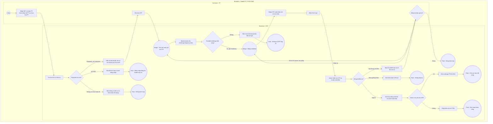

# PT05-US02 - Kích hoạt tài khoản PT bằng OTP

## Preconditions
- HLV (PT) đã được Lễ tân hoặc Quản trị viên tạo hồ sơ nhân sự HLV trên hệ thống ở trạng thái Chờ kích hoạt (`PENDING_ACTIVATION`).
- HLV đang ở màn hình Kích hoạt tài khoản trên ứng dụng Mobile PT.

## Trigger
- HLV bấm text link `Kích hoạt tài khoản PT` từ màn hình Đăng nhập PT (`PT05-US01`).
- Màn hình liên quan: Mobile App PT — Màn hình Kích hoạt tài khoản PT.

## Trạng thái tích hợp
- OTP phụ thuộc provider: delivery=DEVELOPMENT_ONLY nghĩa là chưa gửi SMS; PROVIDER_ACCEPTED chỉ xác nhận provider nhận yêu cầu, không chứng minh điện thoại đã nhận.
- Production thiếu cấu hình SMS hoặc provider từ chối → SMS_UNAVAILABLE; không bỏ qua 2FA, không hiển thị mã phát triển hoặc bổ sung social login/OTP giả.
- TTL và lượt gửi lại lấy server: quy tắc hiện có 60 giây, tối đa 3 lần gửi lại; 5 lần sai khóa 15 phút, không khóa ngay lần sai đầu.
- Thiết bị mới/tin cậy theo challenge backend; client không tự bỏ 2FA. Xem PT-OQ-01.

## Main Flow

1. HLV nhập Số điện thoại đã đăng ký nhân sự và chọn loại tài khoản `Huấn luyện viên (PT)`; nếu nhập Mã PT (ví dụ `PT001`), SYS tự chọn và khóa loại tài khoản PT.
2. SYS chuẩn hóa và tra cứu trạng thái hồ sơ nhân sự:
   - Nếu hồ sơ HLV tồn tại và ở trạng thái Chờ kích hoạt: SYS hiển thị tên và mã PT đã che từ API (`masked_name`, `masked_code`), cùng chi nhánh thực tế (`branch_name`). Thiếu dữ liệu thì ẩn dòng tương ứng, không gán chi nhánh mặc định.
3. HLV bấm nút **`[ Nhận mã OTP ]`**.
4. SYS tạo mã OTP 6 chữ số ngẫu nhiên và gửi tới số điện thoại của HLV qua tin nhắn SMS (thời hạn 60 giây).
5. HLV nhập mã OTP nhận được (6 chữ số).
6. HLV thiết lập Mật khẩu mới và nhập lại vào ô Xác nhận mật khẩu.
7. HLV bấm nút **`[ Kích hoạt & Đăng nhập ]`**.
8. SYS kiểm tra:
   - Mã OTP hợp lệ và còn trong thời hạn hiệu lực.
   - Mật khẩu mới đáp ứng tiêu chuẩn bảo mật (tối thiểu 8 ký tự, gồm chữ hoa, chữ thường, số/ký tự đặc biệt) và 2 ô mật khẩu trùng khớp 100%.
9. SYS cập nhật trạng thái tài khoản sang ACTIVE, băm mật khẩu và xử lý challenge còn lại nếu server yêu cầu; chỉ cấp phiên đầy đủ rồi mở PT06 · Tổng quan.

- **Business rules / logic:**
  - **Quy tắc phân quyền nhân sự:** PT tuyệt đối không có quyền tự tạo hồ sơ nhân sự cho mình trên ứng dụng. Bất kỳ hồ sơ/tài khoản nào tự đăng ký trực tiếp trên ứng dụng đều 100% thuộc role Hội viên (`ROLE_MEMBER`).
  - HLV muốn có tài khoản làm việc bắt buộc phải được Lễ tân hoặc Quản trị viên phòng gym tạo hồ sơ nhân sự trên hệ thống Web trước, sau đó mới vào App để Kích hoạt tài khoản lần đầu.
  - Tài khoản PT chỉ kích hoạt 1 lần duy nhất; nếu tài khoản đã được kích hoạt trước đó (`ACTIVE`), hệ thống thông báo tài khoản đã hoạt động và yêu cầu quay lại màn hình Đăng nhập.
  - Mã OTP có hiệu lực trong 60 giây; tối đa 3 lần yêu cầu cấp lại mã OTP trong một phiên kích hoạt.
  - Sau khi kích hoạt, chỉ vào ứng dụng khi backend trả phiên đầy đủ; requires_2fa phải hoàn tất challenge. Không tự đánh dấu thiết bị tin cậy trên client.

### Field-level specification — Màn hình Kích hoạt tài khoản PT
| Field / control | Loại UI Control | State | Required | Conditional / dynamic | Source / validation |
| :--- | :--- | :--- | :--- | :--- | :--- |
| **Số điện thoại / Mã PT** | `Textbox (Phone/Code Input)` | `USER-INPUT` | required | `TRIGGER`: Nhập thông tin để hệ thống kiểm tra hồ sơ nhân sự | Nhập số điện thoại đăng ký nhân sự (10 số) hoặc Mã PT được cấp (ví dụ `PT001`) |
| **Loại tài khoản** | `Select` | `USER-INPUT` / `AUTO-FILL` | required | `TRIGGER`: Luôn hiển thị; mã PT tự chọn và khóa PT, SĐT cho chọn | MEMBER/PT; kích hoạt nhân sự phải chọn PT. Tra cứu, OTP và kích hoạt dùng cùng loại tài khoản. Đổi định danh/loại tài khoản phải xóa preview và trạng thái OTP cũ, tra cứu lại. |
| **Tên HLV đã che** | `Text` | `READONLY` | conditional | `CONDITIONAL`: Hiện khi tra cứu hợp lệ và có dữ liệu; ẩn khi đổi định danh, chưa tra cứu hoặc không hợp lệ | `masked_name` từ API; không công khai tên đầy đủ trước xác thực |
| **Mã PT đã che** | `Text` | `READONLY` | conditional | `CONDITIONAL`: Hiện khi preview hợp lệ và API có mã; ẩn khi thiếu mã hoặc preview không hợp lệ | `masked_code` từ API |
| **Chi nhánh làm việc** | `Text` | `READONLY` | conditional | `CONDITIONAL`: Hiện khi preview hợp lệ và API có chi nhánh; ẩn khi thiếu chi nhánh hoặc preview không hợp lệ | `branch_name` từ API; không gán cứng |
| **Nút [ Nhận mã OTP ]** | `Action Button` | `USER-INPUT` | conditional | `CONDITIONAL`: Phụ thuộc trạng thái tra cứu | - **Hiện khi:** Hồ sơ PT hợp lệ và sẵn sàng nhận OTP. - **Ẩn khi:** Chưa nhập SĐT/Mã PT hoặc hồ sơ không hợp lệ. |
| **Mã xác thực OTP** | `OTP Input (6 Digits)` | `USER-INPUT` | conditional | `CONDITIONAL`: Phụ thuộc trạng thái gửi mã OTP | - **Hiện khi:** Hệ thống đã gửi mã OTP thành công (nhập 6 chữ số). - **Ẩn khi:** Chưa bấm nhận mã OTP. |
| **Mật khẩu mới** | `Password Input (with Toggle Eye)` | `USER-INPUT` | required | Không | Nhập mật khẩu mới (tối thiểu 8 ký tự, gồm chữ hoa, chữ thường, số/ký tự đặc biệt); hỗ trợ icon ẩn/hiện |
| **Xác nhận mật khẩu** | `Password Input (with Toggle Eye)` | `USER-INPUT` | required | Không | Nhập lại mật khẩu mới; yêu cầu trùng khớp 100% với ô Mật khẩu mới |
| **Nút CTA [ Kích hoạt & Đăng nhập ]** | `Action Button (CTA)` | `USER-INPUT` | required | Không: Enable khi đã nhập đủ SĐT/Mã PT, OTP 6 số và 2 ô mật khẩu trùng khớp | Nút màu xanh lá bo góc; bấm để hoàn tất kích hoạt tài khoản và mở giao diện ứng dụng PT |

## Alternate Flows

### AF-01 — Tài khoản đã được kích hoạt trước đó
1. HLV nhập SĐT/Mã PT đã được kích hoạt thành công trước đó (`ACTIVE`).
2. SYS hiển thị thông báo: *"Tài khoản HLV đã được kích hoạt. Vui lòng quay lại màn hình Đăng nhập để truy cập ứng dụng."*
3. HLV bấm nút quay lại màn hình Đăng nhập (`PT05-US01`).

### AF-02 — Mã OTP hết hạn hoặc nhập sai
1. HLV nhập sai mã OTP hoặc nhập mã đã quá hạn 60 giây.
2. SYS hiển thị thông báo lỗi và cho phép bấm `[ Nhận mã OTP ]` để nhận lại mã mới (tối đa 3 lần).

- AF-03: Server không yêu cầu 2FA sau xác thực hợp lệ → cấp phiên và mở PT06; nếu requires_2fa thì hoàn tất challenge trước khi vào app.
- AF-04: OTP sai/hết hạn dưới ngưỡng khóa → báo lỗi, cho nhập lại/gửi lại trong giới hạn server.

## Exception Flows

- **Lỗi không tìm thấy hồ sơ nhân sự:** SĐT hoặc Mã PT chưa được Lễ tân tạo trên hệ thống $\rightarrow$ SYS báo lỗi: *"Không tìm thấy thông tin hồ sơ HLV. Vui lòng liên hệ Lễ tân hoặc Quản lý chi nhánh để được tạo hồ sơ nhân sự trước khi kích hoạt."*
- **Lỗi mất kết nối mạng:** SYS hiển thị thông báo lỗi đường truyền và giữ nguyên dữ liệu form đã nhập.

- Provider chưa cấu hình/từ chối gửi, mạng lỗi, hết lượt hoặc tài khoản khóa: báo đúng trạng thái, không giả lập OTP hay tự kích hoạt.

## Activity Diagram — Swimlane
**Trigger:** HLV bấm Kích hoạt tài khoản PT từ màn hình Đăng nhập.

