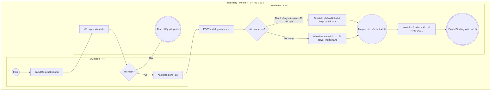

# PT05-US03 - Đăng xuất tài khoản PT Mobile

## Preconditions
- HLV (PT) đang đăng nhập và có phiên làm việc (Session) Mobile PT hợp lệ.

## Trigger
- HLV bấm nút `[ Đăng xuất ]` tại màn hình `PT04 · Tài khoản`.
- Màn hình liên quan: Mobile App PT — Tab `PT04 · Tài khoản` $\rightarrow$ Popup Xác nhận Đăng xuất.

## Main Flow

1. Tại màn hình Tài khoản PT (`PT04 · Tài khoản`), HLV cuộn xuống cuối màn hình và bấm nút màu đỏ **`[ Đăng xuất ]`**.
2. SYS hiển thị **Popup Xác nhận Đăng xuất**.
3. HLV bấm nút **`[ Xác nhận đăng xuất ]`** trên Popup.
4. SYS thu hồi mã phiên làm việc (Session Token / JWT), xóa dữ liệu xác thực lưu trên thiết bị và hủy trạng thái đăng nhập.
5. SYS điều hướng HLV về màn hình Đăng nhập PT (`PT05-US01`).

- **Business rules / logic:**
  - Thao tác đăng xuất chỉ hủy phiên làm việc trên thiết bị hiện tại, tuyệt đối không làm thay đổi trạng thái hồ sơ nhân sự, lịch dạy hay danh sách học viên của HLV.
  - Để tiếp tục sử dụng ứng dụng, HLV bắt buộc phải đăng nhập lại bằng mật khẩu (kèm 2FA nếu bật) hoặc mã OTP qua SMS.
  - Không lưu thông tin phiên nhạy cảm trong bộ nhớ đệm sau khi đã đăng xuất.

### Field-level specification — Popup Xác nhận Đăng xuất
| Field / control | Loại UI Control | State | Required | Conditional / dynamic | Source / validation |
| :--- | :--- | :--- | :--- | :--- | :--- |
| **Tiêu đề Popup** | `Popup Title` | `READONLY` | required | Không | Tiêu đề hộp thoại: `Xác nhận đăng xuất` |
| **Thông báo xác nhận** | `Text Paragraph (Message)` | `READONLY` | required | Không | Đoạn text: *"Bạn có chắc chắn muốn đăng xuất khỏi ứng dụng PT Paradise Gym không? Phiên làm việc hiện tại trên thiết bị này sẽ kết thúc."* |

## Alternate Flows

### AF-01 — Hủy thao tác đăng xuất
1. HLV bấm nút `[ Hủy ]` hoặc bấm vùng mờ bên ngoài Popup xác nhận.
2. SYS đóng Popup và duy trì nguyên vẹn phiên làm việc hiện tại của HLV.

### AF-02 — Phiên làm việc đã hết hạn trước khi đăng xuất
1. Phiên làm việc trên máy chủ đã hết hạn từ trước.
2. Khi HLV bấm đăng xuất, SYS thông báo phiên đã kết thúc và tự động điều hướng an toàn về màn hình Đăng nhập (`PT05-US01`).

## Exception Flows

- **Lỗi kết nối mạng:** Hệ thống vẫn xóa token và dữ liệu cache cục bộ trên thiết bị để đảm bảo an toàn, sau đó chuyển HLV về màn hình Đăng nhập.

- Mất mạng chỉ xác nhận đã xóa phiên tại thiết bị, chưa xác minh thu hồi server. Thu hồi phiên khác/tất cả theo PT04-US01.

## Activity Diagram — Swimlane
**Trigger:** HLV bấm nút Đăng xuất tại màn hình Tài khoản PT.

